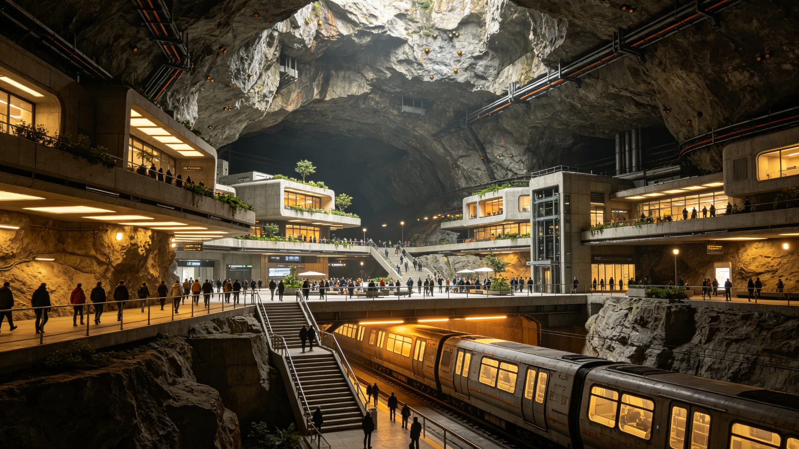

# 鲸鱼座τ星地下城市房地产业规范化与产权制度确立公报

**发布机构**：鲸鱼座τ星定居点管理委员会 / 国土资源与住房局
**发布日期**：2950年2月28日
**文件等级**：全球公开

## 一、背景与现状

鲸鱼座τ星（Tau Ceti）定居点自2320年建立以来，由于恒星耀斑活动频繁、地表辐射强烈，所有居民均居住在地下城市中。经过630年的发展，鲸鱼座τ星已建成7座大型地下城市，总人口达到3.2亿人，地下城市总建筑面积达到840亿立方米。

然而，长期以来，鲸鱼座τ星的房地产市场处于缺乏规范的状态：
- 产权界定模糊：早期住房由定居点统一分配，居民仅有使用权，无明确产权。随着人口增长和经济发展，住房交易需求日益强烈，但产权不清导致交易纠纷频发。
- 地下空间权属混乱：地下城市的建设涉及多层地下空间（最深达到地表以下1,200米），不同深度的空间权属缺乏明确划分，导致"空间重叠"纠纷。
- 建筑标准不统一：不同时期、不同开发商建设的地下住宅，在结构安全、通风系统、生命保障设施等方面标准不一，存在安全隐患。
- 价格体系混乱：由于缺乏统一的评估体系和交易平台，地下房产价格差异巨大，投机炒作现象严重，部分核心区域的房价在2945-2949年间上涨了230%。

2949年，定居点管理委员会收到的房地产相关投诉和纠纷案件达到127,000件，占全部民事案件的43%，成为最突出的社会问题。

## 二、产权制度改革

2950年2月，鲸鱼座τ星定居点管理委员会正式颁布《地下城市房地产法》，确立了全新的房地产产权制度：

**1. 三维产权登记制度**
针对地下城市的特点，建立了基于三维空间坐标的产权登记制度。每一处房产的产权范围由精确的三维坐标界定（包括X、Y平面坐标和Z深度坐标），精度达到厘米级。产权登记信息存入区块链系统，不可篡改，可公开查询。

**2. 分层空间权属**
将地下空间按深度划分为不同的权属层：
- 0-50米：浅层空间，归公共所有，用于交通、市政管线和公共设施。
- 50-200米：中层空间，可出让产权，主要用于商业和公共建筑。
- 200-800米：深层空间，主要用于住宅，可出让产权。
- 800-1,200米：超深层空间，归定居点所有，用于战略储备和特殊工业。

每一层空间的产权独立登记，互不干扰。开发商在建设时必须明确标注所使用的空间层，不得越界。

**3. 产权类型**
- **完全产权**：购买者获得房产的完全产权，可自由转让、继承、出租和抵押。完全产权的有效期为99年，到期后可续期。
- **有限产权**：由定居点提供的保障性住房，购买者获得有限产权，可继承但不得自由转让（转让时需由定居点按原价回购）。有限产权主要面向低收入家庭。
- **租赁权**：公共租赁住房的租赁权，租期最长为30年，可续租。

**4. 存量住房的确权**
对已有的存量住房进行全面确权登记。居民可根据住房的来源和历史，申请将使用权转换为完全产权或有限产权。转换为完全产权需缴纳土地出让金（按房产评估价值的20%-30%计算），经济困难家庭可申请分期付款或减免。确权登记工作在2950-2952年间完成。

## 三、建筑标准规范化

《地下城市房地产法》同时确立了统一的地下住宅建筑标准：

**1. 结构安全标准**
- 所有地下住宅必须能够承受8级以上地震（鲸鱼座τ星的地震活动比地球频繁）。
- 地下住宅的顶板厚度不得少于3米，采用钢筋混凝土+钛合金复合结构。
- 每栋建筑必须配备独立的结构健康监测系统，实时监测应力、变形和裂缝。

**2. 生命保障标准**
- 每户住宅必须配备独立的通风系统，新风量不低于每人每小时30立方米。
- 必须配备应急氧气储备，在主通风系统故障时可维持至少72小时的生命支持。
- 必须配备火灾自动报警和灭火系统，以及紧急疏散通道。

**3. 居住环境标准**
- 每户住宅的使用面积不得少于25平方米/人。
- 必须配备模拟自然光照明系统（可调节色温与亮度，模拟昼夜变化）。
- 必须配备隔音设施，室内噪音不得超过35分贝。

**4. 既有建筑的改造**
对不符合新标准的既有建筑，定居点管理委员会提供补贴进行改造。改造工作在2950-2955年间完成，预计总投入4,800亿星元。

## 四、房地产市场调控

为稳定房地产市场，防止投机炒作，定居点管理委员会采取了以下调控措施：

1. **限购政策**：每个家庭最多拥有2套完全产权住宅。超过2套的部分需在2952年前出售或转为租赁住房。
2. **交易税**：房产交易需缴纳交易税，税率为交易价格的3%。持有不满5年即出售的，额外征收15%的投机税。
3. **价格指导**：定居点管理委员会定期发布各区域的房产指导价，交易价格偏离指导价超过20%的需进行专项审查。
4. **保障性住房建设**：未来5年内建设200万套保障性住房（有限产权和公共租赁住房），重点面向低收入家庭和新移民。
5. **统一交易平台**：建立全国统一的房地产交易平台，所有房产交易必须通过该平台进行，确保交易透明、可追溯。

## 五、实施效果预期

国土资源与住房局对改革的预期效果进行了评估：

- **产权明晰**：预计在2952年前完成全部存量住房的确权登记，房地产纠纷案件减少80%以上。
- **市场稳定**：限购和交易税政策将有效抑制投机炒作，预计房价将在2951年企稳，2952年后保持年均3%-5%的合理涨幅。
- **居住条件改善**：建筑标准改造将使全部住宅达到安全和舒适标准，居民居住满意度预计从目前的62%提升至85%以上。
- **经济拉动**：房地产市场的规范化将促进建筑、装修、物业等相关产业的发展，预计每年拉动GDP增长1.5-2个百分点。
- **财政收入**：土地出让金和房地产税将为定居点带来稳定的财政收入，预计2955年达到每年800亿星元。

鲸鱼座τ星定居点管理委员会主席赵明在公报中表示："地下城市是我们在这颗恒星下的家园。630年来，我们在岩石中挖出了生存空间，现在我们要在制度上建设一个公平、规范、可持续的居住环境。让每一个居民都拥有明确的产权、安全的住房和稳定的未来，这是本次改革的根本目标。"
