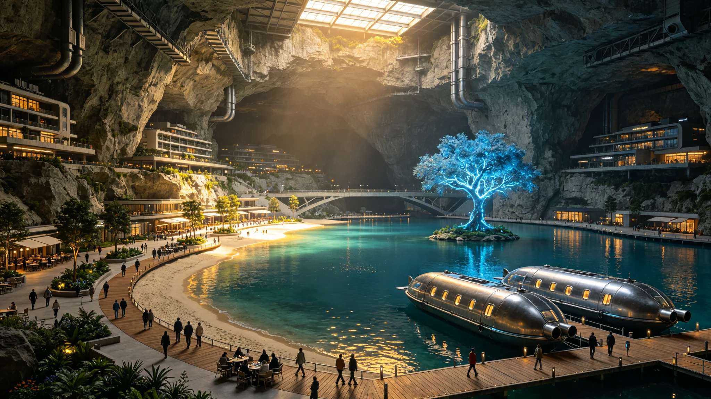

# 鲸鱼座τ星人工水体生态系统建立与鱼类引入公报

**发布机构**：鲸鱼座τ星定居点管理委员会生态环境局 / 地下城市生命保障工程总局
**发布日期**：2951年6月10日
**文件等级**：全球公开

## 一、项目背景

鲸鱼座τ星是一颗活跃的红矮星，恒星耀斑频繁，地表辐射强度是地球的12倍，无法支持露天生命活动。所有3.2亿居民均居住在7座地下城市中，最深达到地表以下1,200米。长期以来，地下城市的水资源全部来自循环利用和深层地下水开采，水体以功能性为主（饮用水储备、工业用水、冷却用水），缺乏生态性水体。

2945年，定居点管理委员会启动了"地下蓝脉"计划，旨在在地下城市中建立人工水体生态系统，目标包括：
1. 改善地下城市的微气候和空气质量，通过水体蒸发调节湿度和温度。
2. 提供休闲和审美空间，缓解长期地下居住对居民心理健康的影响。
3. 建立水生生态系统，增加生物多样性，提升城市生态韧性。
4. 发展水下养殖，为居民提供新鲜的动物蛋白来源。

经过6年的建设，"地下蓝脉"计划第一期工程于2951年5月正式竣工，并完成了首批鱼类的引入。

## 二、人工水体建设

第一期工程在7座地下城市中共建设了12个人工水体，总面积达到87平方公里，总蓄水量达到32亿立方米。这些水体的类型包括：

**1. 中央湖泊（4座）**
每座地下城市的中心区域建设一个大型人工湖，面积在5-12平方公里之间，水深8-15米。湖岸建设了沙滩、步道和休闲设施，成为居民的主要休闲场所。最大的中央湖位于"深岩城"，面积12.3平方公里，蓄水量4.8亿立方米。

**2. 景观水道（6条）**
在地下城市的主要街道下方建设了景观水道，宽度8-20米，水深2-4米，总长达到187公里。水道两侧种植了水生植物，设置了喷泉和瀑布景观。水道同时承担着城市雨水（模拟降水）收集和排放的功能。

**3. 生态湿地（2处）**
在地下城市的边缘区域建设了人工生态湿地，面积分别为3.2平方公里和2.8平方公里。湿地种植了芦苇、香蒲等湿地植物，是水体净化系统的重要组成部分，同时为水鸟和两栖动物提供了栖息地。

**4. 水下养殖区**
在中央湖泊的特定区域和独立的养殖池中，建设了水下养殖区，总面积达到12平方公里，用于鱼类和其他水生生物的养殖。

所有人工水体均配备了完整的水循环和净化系统，包括物理过滤、生物净化和紫外线消毒三个环节。水体的温度控制在18-24°C，pH值维持在7.0-7.8，溶解氧含量不低于6毫克/升。

## 三、水生生态系统构建

人工水体的生态系统构建遵循"从低到高、逐步引入"的原则，历时3年完成：

**第一年（2948年）：微生物和浮游生物引入**
首先引入了经过基因筛选的硝化细菌和光合细菌，建立水体的微生物基础。随后引入了浮游植物（包括绿藻、硅藻和蓝藻的12个品种）和浮游动物（包括轮虫、枝角类和桡足类的8个品种），建立了水体的基础食物链。

**第二年（2949年）：水生植物引入**
引入了沉水植物（苦草、黑藻、金鱼藻等6个品种）、浮叶植物（睡莲、荇菜等4个品种）和挺水植物（芦苇、香蒲、菖蒲等8个品种）。水生植物的种植总面积达到23平方公里，覆盖率达到水体总面积的26%。

**第三年（2950年）：底栖动物和鱼类引入**
引入了底栖动物（包括螺类、蚌类、虾类和蟹类的15个品种），建立了水体的底栖生态系统。随后分批次引入了鱼类。

## 四、鱼类引入情况

2950年6月至2951年4月，分8批次向人工水体中引入了22个品种的鱼类，共计投放鱼苗1,280万尾。引入的鱼类品种包括：

**草食性鱼类（4种）：**
- 草鱼：投放320万尾，主要用于控制水生植物的过度生长。
- 鲢鱼：投放280万尾，以浮游植物为食，有助于控制藻类爆发。
- 鳙鱼：投放150万尾，以浮游动物为食。
- 鲂鱼：投放80万尾，草食性，肉质鲜美。

**肉食性鱼类（5种）：**
- 鲈鱼：投放120万尾，是水体中的顶级捕食者，控制小型鱼类种群。
- 鳜鱼：投放60万尾，肉食性，经济价值高。
- 鲶鱼：投放90万尾，底栖肉食性，清理水体中的有机碎屑。
- 狗鱼：投放30万尾，冷水性肉食鱼类。
- 鳗鱼：投放40万尾，降河洄游性鱼类（在人工环境中模拟洄游条件）。

**杂食性鱼类（8种）：**
- 鲤鱼：投放180万尾，适应性强，是最常见的养殖鱼类。
- 鲫鱼：投放200万尾，杂食性，繁殖力强。
- 罗非鱼：投放150万尾，暖水性，生长快。
- 鳊鱼：投放70万尾，杂食性。
- 泥鳅：投放60万尾，底栖杂食性。
- 黄鳝：投放40万尾，穴居性。
- 虹鳟：投放50万尾，冷水性，对水质要求高。
- 金鱼（观赏品种）：投放80万尾，主要放养在景观水道中，供游客观赏。

**特殊品种（5种）：**
- 比邻星b驯化"星鳞鱼"：投放20万尾，这是在比邻星b经过多代驯化的鲤鱼品种，适应低重力环境，生长速度比普通鲤鱼快30%。这是该品种首次引入鲸鱼座τ星。
- 发光鲷：投放15万尾，经过基因编辑的观赏鱼类，在黑暗中发出柔和的蓝绿色荧光，为地下水体增添了独特的景观效果。
- 清洁鱼：投放10万尾，以其他鱼类体表的寄生虫为食，有助于维持鱼群健康。
- 深水鳕鱼：投放8万尾，适应深水低温环境，放养在中央湖的深层水域。
- 弹涂鱼：投放5万尾，两栖性鱼类，可在湖岸的滩涂上活动，增加生态系统的多样性。

## 五、生态监测与初步效果

生态环境局在人工水体中设置了48个监测站点，对水质、生态系统结构和生物多样性进行持续监测。初步监测结果显示：

- **水质改善**：人工水体建成后，周边区域的空气湿度从原来的35%提升至55%，温度波动幅度从±8°C缩小至±3°C，空气质量明显改善。
- **生态系统稳定**：经过1年的运行，水体生态系统已基本稳定。浮游生物、水生植物、底栖动物和鱼类之间形成了相对平衡的食物链关系。水体的自净能力达到设计目标，化学需氧量（COD）和氨氮含量均维持在较低水平。
- **鱼类存活情况**：投放鱼苗的平均存活率达到78%，其中草鱼、鲢鱼、鲫鱼等适应性强的品种存活率超过85%，鳜鱼、狗鱼等肉食性鱼类存活率约为65%。目前水体中鱼类的总生物量约为2,800吨。
- **生物多样性**：人工水体中已建立了包括微生物、浮游生物、水生植物、底栖动物、鱼类和两栖动物在内的完整生态系统，物种总数达到127种。

## 六、经济与社会效益

**经济效益：**
- 水下养殖产业已开始产出，2951年预计鱼类产量达到8,000吨，可为居民提供新鲜的动物蛋白。按当前市场价格计算，年产值约为12亿星元。
- 人工水体周边的房地产价值平均提升了25%-40%，"湖景房"成为地下城市中最受欢迎的住宅类型。
- 水上休闲和旅游业发展迅速，2951年上半年人工水体接待游客达到2,300万人次，带动了餐饮、零售等相关产业的发展。

**社会效益：**
- 居民心理健康调查显示，居住在人工水体周边500米范围内的居民，抑郁和焦虑症状的发生率比城市平均水平低22%。
- 人工水体为居民提供了新的休闲方式，水上运动（划船、潜水、游泳）的参与人数在2951年上半年达到480万人次。
- 人工水体成为重要的科普教育基地，每年接待学生参观达到120万人次，帮助地下城市出生的孩子了解水生生态系统。

生态环境局局长李水清在公报中表示："在岩石深处，我们挖出了湖泊，养出了鱼群。这不仅仅是一个生态工程，更是我们对'家'的理解——无论身在何处，我们都要创造一个有山有水、有生命有温度的家园。"

下一步工作计划包括：在2953年前完成"地下蓝脉"第二期工程，将人工水体总面积扩大到150平方公里；引入水鸟和两栖动物，进一步完善生态系统；发展水下水产养殖的深加工产业，提升经济效益。
