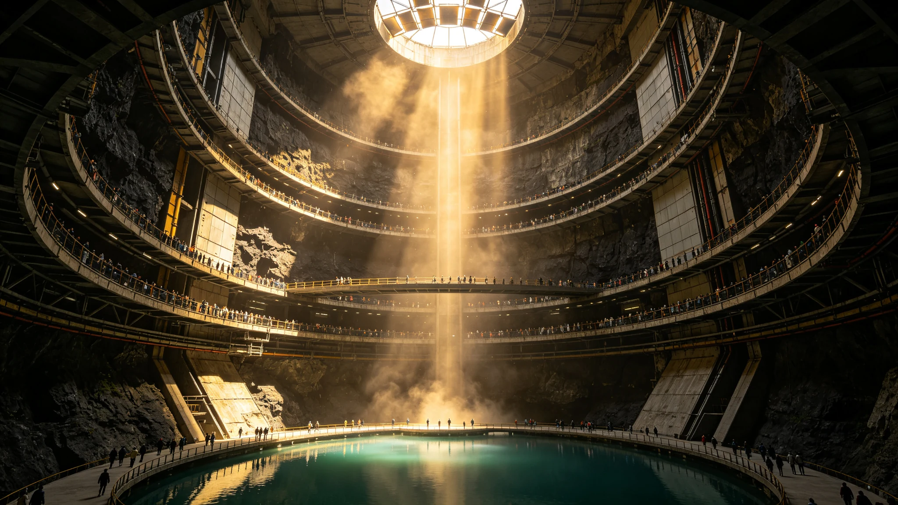

# 鲸鱼座τ星地下城市总建筑师生平与建筑作品集

**发布机构**：鲸鱼座τ星定居点管理委员会文化事务局 / 建筑师协会 / 地下城市建设史研究所
**发布日期**：2960年12月10日
**文件等级**：全球公开

## 一、传主概况

本传记的传主是鲸鱼座τ星地下城市建设史上最具影响力的建筑师——岩深（2815年-2908年）。岩深是鲸鱼座τ星本土出生的第一代建筑师，他一生设计了7座地下城市中的4座（"深岩城"、"北境城"、"东渊城"和"南窟城"），并主持制定了《鲸鱼座τ星地下城市建筑规范》，对整个定居点的城市建设产生了深远影响。

岩深的建筑哲学被称为"岩居主义"——主张建筑应与地下岩层融为一体，而非在岩石中挖出一个"仿地上"的空间。他的设计强调岩层的自然美感、空间的纵深尺度和光线的精心运用，创造出了独特的地下城市美学。

2960年是岩深逝世52周年，建筑师协会决定出版这部完整的生平与建筑作品集，以纪念这位伟大的建筑师。

## 二、生平

**早年与教育（2815-2838年）**

岩深于2815年7月3日出生于鲸鱼座τ星"老窟城"（最早的地下城市，建于2320年）的一个矿工家庭。父亲岩刚是一名地下采矿工程师，母亲林清是一名小学教师。岩深从小在地下城市的狭窄巷道中长大，对岩石和空间有着天生的敏感。

他在后来的口述中回忆道："我小时候最喜欢做的事情，就是在放学之后跑到还在建设的新巷道里，看工人们如何在岩石中挖出空间。我觉得那不是在挖洞，那是在创造世界。每一次爆破之后，新的空间就出现了，就像岩石在呼吸一样。"

2833年，岩深以优异成绩考入"老窟城"工程学院建筑系，成为该系最年轻的学生之一（18岁）。大学期间，他系统学习了地下工程、结构力学、岩石力学和建筑学。他的毕业设计《深层地下城市的空间组织研究》获得了校级优秀论文奖，其中提出的"多层纵深空间组织"理论后来成为他建筑设计的核心思想。

2838年，岩深本科毕业，获得建筑学学士学位。他的毕业设计导师、著名建筑师陈矿评价说："岩深是我教过的最有天赋的学生。他不只是在设计建筑，他是在与岩石对话。他的设计有一种来自地下深处的力量。"

**职业生涯早期（2838-2860年）**

毕业后，岩深进入"老窟城"建设局工作，从助理建筑师做起。他参与了"老窟城"的多个扩建项目，包括中央大厅改造、新居住区建设和交通系统升级。

2845年，岩深设计了他的第一个独立作品——"老窟城"中央公园的"光井"设计。这是一个直径30米、深200米的垂直竖井，通过一系列反射镜将地表的自然光引入地下城市深处。光井的内壁采用了抛光的玄武岩饰面，光线在井内多次反射，形成了壮观的"光柱"效果。这个设计获得了当年的"最佳公共建筑奖"，使岩深一举成名。

2850年，岩深被任命为"老窟城"建设局总建筑师，时年35岁。在接下来的10年里，他主持了"老窟城"的大规模改造和扩建，将城市面积扩大了一倍，人口从800万增加到1,500万。

**职业生涯巅峰（2860-2900年）**

2860年，定居点管理委员会决定建设第三座地下城市——"深岩城"，岩深被任命为总建筑师。这是他职业生涯中最重要的作品，也是他"岩居主义"建筑哲学的集中体现。

"深岩城"的建设历时22年（2860-2882年），最终建成了一座可容纳800万人口的巨型地下城市。城市深度达到地表以下800米，分为12层，每层高度在8-15米之间。城市的核心是一个直径200米、高600米的中央天井，天井顶部通过光井系统引入自然光，底部是一个人工湖（参见GS-2951-01）。

"深岩城"建成后，获得了广泛的赞誉，被认为是人类地下城市建设的里程碑。岩深因此获得了"跨恒星系建筑最高奖"——"方舟建筑奖"，是首位获得该奖项的鲸鱼座τ星建筑师。

2885年，岩深开始主持第四座地下城市"北境城"的设计。"北境城"位于行星的北极地区，地下岩层以花岗岩为主，地质条件与"深岩城"的玄武岩不同。岩深针对花岗岩的特点，设计了以"大跨度拱顶"为特色的城市空间，最大的拱顶跨度达到120米。

2895年，岩深开始主持第五座城市"东渊城"的设计。此时他已80岁高龄，但仍坚持亲自到施工现场指导。"东渊城"的特色是"阶梯式空间组织"——城市沿着一个天然的地下斜坡建设，形成了层层递进的空间效果。

2900年，岩深完成了他的最后一座城市设计——"南窟城"。此时他已85岁，将大部分具体设计工作交给了他的学生，但仍亲自把控整体规划和建筑哲学。"南窟城"的特色是"水网城市"——城市内部建设了密集的人工水道，将各个功能区连接起来。

**晚年与逝世（2900-2908年）**

2900年，岩深从建设局退休，时年85岁。退休后，他致力于建筑教育和理论研究，培养了大批建筑师。他的学生后来成为了鲸鱼座τ星建筑界的中坚力量，被称为"岩派"建筑师。

2903年，岩深出版了他的理论著作《岩居：地下城市的建筑哲学》，系统阐述了他的建筑思想。这本书成为了地下城市建筑学的经典教材，至今仍在使用。

2908年11月15日，岩深在"深岩城"的家中安详去世，享年93岁。按照他的遗愿，他的骨灰被安放在"深岩城"中央天井的岩壁中，与他最爱的岩石永远相伴。

## 三、建筑哲学：岩居主义

岩深的建筑哲学被称为"岩居主义"，其核心思想包括：

**1. 与岩石共生**
岩深认为，地下城市的建筑不应是在岩石中挖出一个"洞"然后在里面建造"仿地上"的建筑，而应该是与岩石融为一体的空间。他的设计尽量保留岩石的自然表面，将岩壁作为建筑的一部分。在他的建筑中，你经常可以看到未经修饰的天然岩壁与精心设计的人工空间并置，形成强烈的对比和美感。

他常说："岩石已经存在了数十亿年，我们只是在其中短暂地居住。我们不应该去'征服'岩石，而应该去'倾听'岩石，让岩石告诉我们空间应该是什么样子。"

**2. 纵深尺度**
岩深强调地下城市的"纵深"美感。他认为，地上城市的美感来自于水平方向的展开，而地下城市的美感应该来自于垂直方向的纵深。他的设计总是尽量利用地下空间的垂直维度，创造出高耸、深邃、令人震撼的空间效果。

"深岩城"的中央天井就是这一思想的典型体现——600米高的垂直空间，顶部的光线倾泻而下，底部的湖面反射着光芒，人站在其中会感到自己的渺小和空间的宏大。

**3. 光线的艺术**
虽然生活在地下，但岩深认为光线是建筑设计中最重要的元素之一。他创造性地使用了光井、反射镜、导光管等技术，将地表的自然光引入地下深处。同时，他也精心设计了人工照明，用不同色温、亮度和角度的光线营造出不同的空间氛围。

在他的建筑中，光线不是均匀地洒满每个角落，而是有重点、有层次地分布——有的区域明亮如昼，有的区域幽暗如夜，光影交错，形成了丰富的空间体验。

**4. 功能与美学的统一**
岩深坚持认为，好的建筑应该是功能与美学的统一。他的设计从不为了美学而牺牲功能，也从不因为功能而放弃美学。在他的建筑中，每一根管道、每一个通风口、每一盏灯都经过精心设计，既是功能性的构件，也是美学的元素。

他常对学生说："在地下城市里，没有什么是可以隐藏的。所有的管道、线路、结构都暴露在外。所以我们的任务不是把它们藏起来，而是把它们设计得好看。当每一根管道都成为艺术品的时候，整个城市就是一件艺术品。"

## 四、建筑作品集

本作品集收录了岩深的12个代表性建筑作品：

**1. "老窟城"光井（2845年）**
- 类型：公共空间
- 规模：直径30米，深200米
- 特色：首次大规模使用反射镜导光技术，创造了"光柱"效果
- 现状：仍在使用，已被列为历史保护建筑

**2. "老窟城"中央大厅改造（2848年）**
- 类型：公共建筑
- 规模：面积12万平方米，高35米
- 特色：将原来的低矮空间改造为大跨度拱顶空间，保留了部分原始岩壁
- 现状：仍在使用

**3. "老窟城"南区居住区（2853年）**
- 类型：居住区
- 规模：面积8平方公里，可容纳200万人
- 特色：采用"院落式"空间组织，每个居住院落有独立的采光井和小公园
- 现状：仍在使用

**4. "深岩城"总体规划（2860-2882年）**
- 类型：城市总体规划
- 规模：面积60平方公里，12层，可容纳800万人
- 特色：中央天井+环形放射状空间组织，是岩居主义的集大成之作
- 现状：仍在使用，是鲸鱼座τ星的首都

**5. "深岩城"中央天井（2875年）**
- 类型：公共空间
- 规模：直径200米，高600米
- 特色：人类有史以来最大的地下人工空间，顶部光井引入自然光，底部有人工湖
- 现状：仍在使用，是鲸鱼座τ星最著名的地标

**6. "深岩城"国家图书馆（2878年）**
- 类型：公共建筑
- 规模：面积8万平方米，藏书1,200万册
- 特色：书架沿着岩壁建造，从地面一直延伸到天花板，高40米，读者通过悬浮平台取书
- 现状：仍在使用

**7. "深岩城"音乐厅（2880年）**
- 类型：文化建筑
- 规模：可容纳3,000人
- 特色：利用天然岩洞的声学特性，经过精密的声学设计，被认为是人类音质最好的音乐厅之一
- 现状：仍在使用

**8. "北境城"总体规划（2885-2905年）**
- 类型：城市总体规划
- 规模：面积45平方公里，可容纳500万人
- 特色：大跨度拱顶空间，最大拱顶跨度120米，适应花岗岩地质条件
- 现状：仍在使用

**9. "北境城"拱顶公园（2895年）**
- 类型：公共空间
- 规模：面积2平方公里，拱顶高50米
- 特色：在120米跨度的拱顶下建设了完整的公园，包括草坪、树木、溪流和休闲设施
- 现状：仍在使用

**10. "东渊城"总体规划（2895-2920年）**
- 类型：城市总体规划
- 规模：面积35平方公里，可容纳400万人
- 特色：阶梯式空间组织，沿着天然地下斜坡层层递进
- 现状：仍在使用

**11. "东渊城"阶梯广场（2910年）**
- 类型：公共空间
- 规模：面积1平方公里，高差80米
- 特色：沿着斜坡建设的阶梯式广场，每级平台都有不同的功能和景观
- 现状：仍在使用

**12. "南窟城"总体规划（2900-2925年）**
- 类型：城市总体规划
- 规模：面积40平方公里，可容纳500万人
- 特色：水网城市，内部有人工水道网络，水上交通是主要交通方式之一
- 现状：仍在使用

## 五、历史地位与影响

岩深逝世后，他的建筑思想和作品得到了越来越高的评价。2920年，建筑师协会设立了"岩深建筑奖"，以表彰在地下城市建筑领域做出杰出贡献的建筑师。2935年，"深岩城"中央天井被列入"人类文明历史地标"名录。

岩深的影响不仅限于鲸鱼座τ星。他的著作《岩居》被翻译成多种语言，在比邻星b、火星和地球的建筑界广泛传播。他的"岩居主义"建筑哲学影响了整个跨恒星系的地下城市建设。比邻星b的地下城市（在大气改造前建设的部分）和火星的地下城市，都可以看到岩深建筑思想的影响。

建筑师协会会长、岩深的学生李明石在本作品集的序言中写道："岩深老师用一生的时间告诉我们，地下不是黑暗的代名词，地下可以有光、有水、有树、有美。他不是在岩石中挖洞，他是在岩石中创造世界。52年过去了，他设计的城市仍然是我们最美的家园。他的建筑将和岩石一样，永恒。"

2960年12月10日，在岩深逝世52周年之际，"深岩城"中央天井举行了隆重的纪念仪式。仪式上，岩深的半身铜像（用从中央天井岩壁上开采的玄武岩雕刻而成）被安放在天井底部的人工湖畔。铜像面朝天井顶部，仿佛在仰望他亲手引入的光芒。
