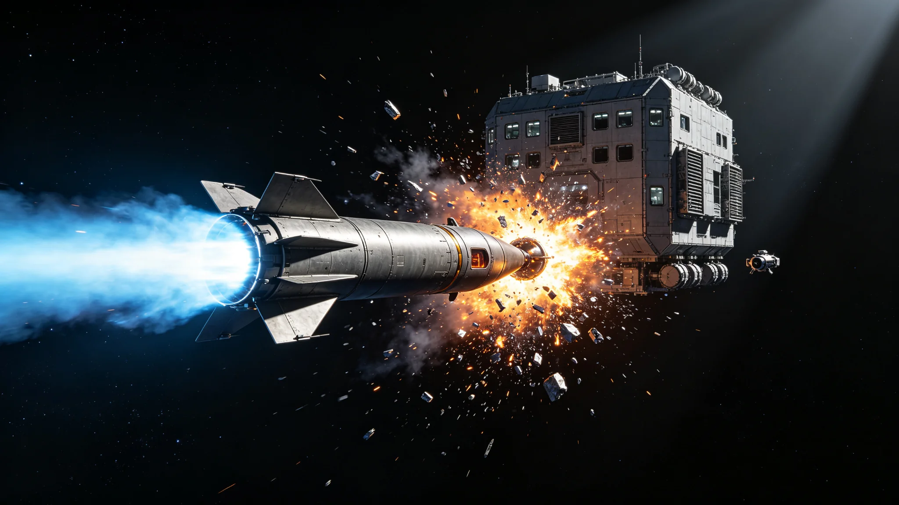

# 三恒星系联合反导系统首次实弹拦截测试成功公报

**发布机构**：三恒星系联合安全理事会 / 联合空间防御司令部 / 武器装备发展局
**发布日期**：2967年11月2日
**文件等级**：跨星系公开（部分技术细节保密）

## 一、测试成功确认

2967年10月28日15时00分（联合标准时），三恒星系联合反导系统在太阳系外缘空域进行了首次全系统实弹拦截测试。测试中，一枚从火星轨道发射的模拟弹道导弹（靶弹）在飞行约22分钟后，被部署在木星轨道附近的"天盾"拦截平台发射的动能拦截弹在距靶弹约1,200公里处成功命中拦截。

联合空间防御司令部司令周振国上将在测试后的新闻发布会上宣布："此次实弹拦截测试取得圆满成功。靶弹在中段飞行阶段被精确拦截，拦截弹以每秒18公里的相对速度直接命中靶弹的战斗部舱段，验证了三恒星系联合反导系统的远程探测、跟踪、指挥和拦截全链路能力。这是三恒星系联合防御体系建设的里程碑。"

## 二、联合反导系统构成

三恒星系联合反导系统（正式名称为"三恒星系联合弹道导弹防御系统"，代号"天网"）是人类文明史上规模最大的防御工程，自2935年启动建设，历时32年，总投资约8.6万亿信用点。系统由以下子系统构成：

**（一）预警探测子系统**

1. **深空预警卫星星座**：在三恒星系各行星的拉格朗日点部署了24颗大型预警卫星，配备红外望远镜和量子雷达，可在导弹发射后30秒内探测到尾焰红外信号，2分钟内完成弹道初判。
2. **分布式光学传感网络**：在星际航道和行星轨道部署了超过2,000个小型光学传感器节点，形成覆盖三恒星系主要空域的探测网络。
3. **量子雷达阵列**：在比邻星b和鲸鱼座τ星轨道部署了6座量子雷达站，可对隐身目标进行有效探测，探测距离达4,000万公里。

**（二）指挥控制子系统**

联合反导指挥中心位于比邻星b地下300米的加固指挥设施内，配备量子加密通信链路和AI辅助决策系统。指挥中心可在5秒内完成威胁评估、拦截方案生成和火力分配，10秒内下达拦截指令。由于三恒星系之间存在光速通信时延（比邻星4.2年、鲸鱼座τ11.9年），各恒星系设有前沿指挥中心，在通信时延窗口内可自主决策。

**（三）拦截武器子系统**

1. **动能拦截弹（KKV）**：本次测试使用的"天盾-III"型动能拦截弹，弹长6.2米，直径0.8米，质量1,800 kg，最大拦截距离1,500万公里，最大速度25 km/s。采用红外+毫米波雷达复合导引头，命中精度（CEP）小于0.5米。
2. **定向能拦截器**：在关键节点部署了12座兆瓦级化学激光拦截平台，用于末端拦截和软杀伤（致盲导引头）。
3. **轨道炮拦截系统**：在行星轨道部署了8座电磁轨道炮，可发射高速动能弹丸进行近程拦截。

## 三、测试过程详情

本次测试的想定为：一枚中远程弹道导弹从火星轨道的模拟发射平台发射，目标为地球轨道的模拟城市空间站。测试全程如下：

- T+0秒：靶弹从火星轨道发射，发动机工作180秒后关机，进入中段惯性飞行。
- T+25秒：L4点预警卫星探测到靶弹尾焰，向指挥中心发送初始预警信息。
- T+90秒：量子雷达阵列捕获并稳定跟踪靶弹，精度达到米级。
- T+120秒：指挥中心完成威胁评估，判定为"高危目标"，生成拦截方案。
- T+150秒：木星轨道"天盾-7"号拦截平台收到拦截指令，发射动能拦截弹。
- T+18分钟：拦截弹在距靶弹1,200公里处启动末段导引头，自主寻的。
- T+22分14秒：拦截弹直接命中靶弹战斗部舱段，靶弹解体为约3,400块碎片。
- T+25分钟：光学传感器确认靶弹完全失效，无碎片进入模拟目标区域。

测试中，靶弹采用了机动变轨和箔条干扰等突防手段，但反导系统的AI目标识别算法成功从干扰中识别出真实弹头，验证了系统对抗复杂突防的能力。

## 四、系统部署现状

截至2967年10月，联合反导系统的部署进度如下：

| 子系统 | 计划数量 | 已部署 | 完成率 |
|---|---|---|---|
| 预警卫星 | 36颗 | 24颗 | 67% |
| 量子雷达站 | 12座 | 6座 | 50% |
| 动能拦截平台 | 48座 | 31座 | 65% |
| 定向能平台 | 20座 | 12座 | 60% |
| 轨道炮站 | 16座 | 8座 | 50% |
| 指挥中心 | 4座 | 3座 | 75% |

系统预计2972年全部部署完成，届时将具备对三恒星系范围内任意弹道导弹目标的多层拦截能力，拦截成功率预计达到95%以上。

## 五、战略意义与国际反应

联合安全理事会秘书长在公报中表示："联合反导系统的建成，不是为了威胁任何人，而是为了确保三恒星系近50亿人口的安全。在一个拥有跨恒星打击能力的时代，没有有效的防御，就没有真正的和平。"

太阳系、比邻星系和鲸鱼座τ星系的民众对测试成功普遍表示欢迎。民意调查显示，78%的受访者支持联合反导系统建设，认为这是"文明生存的必要保障"。

军事学派分析人士指出，此次测试成功标志着三恒星系的防御能力从"单星自保"进入"联合全域防御"时代。在星际通信存在光速时延的物理约束下，分布式、自主化的防御体系是唯一可行的方案。

司令部在公报末尾强调："天网系统的每一颗卫星、每一座拦截平台，都承载着三恒星系人民对和平的期望。我们将继续完善系统，确保它永远不需要被真正使用——但如果有一天必须使用，它必将不辱使命。"
