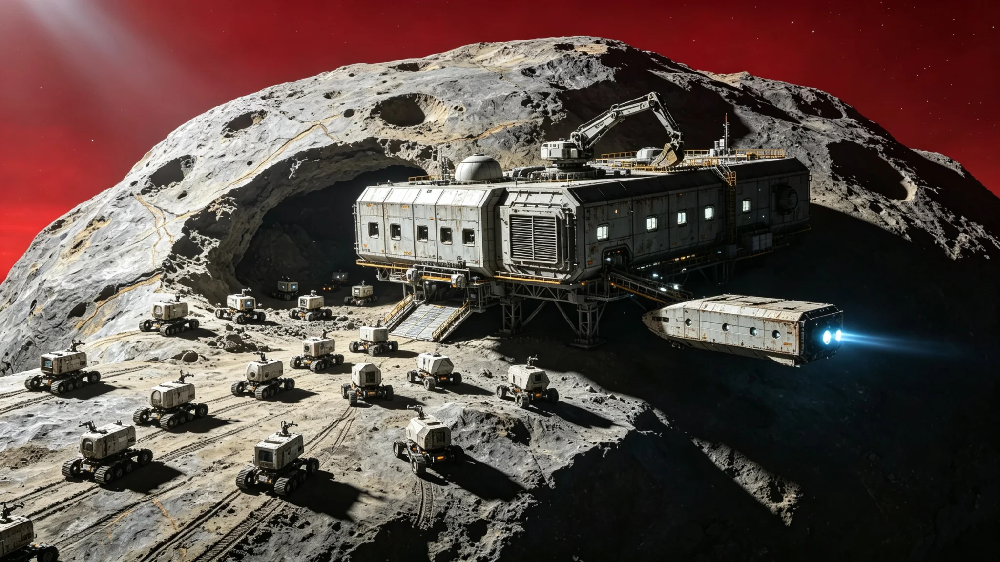

# 深空自主采矿机器人集群协作算法升级公报

**发布机构**：三恒星系资源开发管理局 / 深空采矿技术研究院 / 自主系统工程实验室
**发布日期**：2970年10月15日
**文件等级**：跨星系公开

## 一、升级背景

深空自主采矿是三恒星系资源供应的核心产业。截至2970年，主小行星带已部署自主采矿机器人集群47个，各类采矿机器人总数超过12万台，年开采矿石总量达8.7亿吨，支撑着三恒星系78%的工业金属需求。

然而，随着采矿规模扩大和作业环境复杂化，原有集群协作算法逐渐暴露出局限性。原算法（"蜂群-III"系统）采用中心化调度架构，由主控计算机统一分配任务。在机器人数量超过5,000台的大型矿场，中心化调度的通信延迟和单点故障问题日益突出。2968年，"铁砧-7"矿场因主控计算机故障导致整个集群停工36小时，直接经济损失达12亿信用点。

此外，小行星带的采矿环境具有高度动态性——小行星自转、碎片云漂移、太阳风暴干扰等因素要求机器人具备更强的自主决策和协同能力。机器人工程学派的研究表明，去中心化的集群协作算法在动态环境中的效率比中心化算法高30-50%。

## 二、新一代算法"星群-I"核心架构

2970年10月，深空采矿技术研究院正式发布新一代自主采矿机器人集群协作算法"星群-I"（SwarmConstellation-I）。该算法历时6年研发，是三恒星系首个完全去中心化的大规模采矿机器人集群协作系统。

**（一）去中心化任务分配**

"星群-I"采用基于市场机制的分布式任务分配算法。每个机器人都是自主决策主体，通过局部通信（机器人间直接通信，距离不超过50公里）交换任务信息和资源状态。任务分配通过"拍卖-竞标"机制完成：

1. 矿场管理系统将采矿任务分解为子任务（勘探、挖掘、运输、分选、维护），发布到集群通信网络。
2. 各机器人根据自身状态（位置、能源、设备状况、能力等级）自主计算完成该任务的成本和收益，提交竞标。
3. 任务分配给综合评分最高的机器人，分配结果在局部网络中广播。
4. 当环境变化或机器人故障时，未完成的任务自动重新拍卖，实现动态再分配。

该机制消除了中心化单点故障，单个机器人或局部网络故障不影响整体集群运行。测试表明，在30%机器人随机故障的极端情况下，集群仍能维持65%的产能。

**（二）多智能体强化学习**

"星群-I"引入了多智能体强化学习（MARL）框架。每个机器人配备独立的强化学习模型，通过与环境和其他机器人的交互持续优化决策策略。关键设计包括：

1. **共享经验池**：所有机器人的操作经验汇入分布式经验池，每个机器人可从中学习其他机器人的成功和失败经验。经验池采用联邦学习架构，原始数据不离开机器人本地，仅交换模型梯度。
2. **分层决策**：机器人决策分为三层——战略层（选择采矿区域，更新周期1小时）、战术层（任务执行规划，更新周期1分钟）、操作层（具体运动控制，更新周期10毫秒）。不同层级使用不同的学习算法和状态空间。
3. **安全约束**：所有学习决策必须满足硬安全约束（最小安全距离、能源下限、设备温度上限等），通过控制屏障函数（CBF）确保学习过程不会导致危险操作。

**（三）集群形态自适应**

"星群-I"支持集群形态的动态自适应。根据采矿任务需求，机器人可自主组织成不同的协作形态：

1. **勘探形态**：机器人分散为稀疏网格，间距2-5公里，使用探地雷达和光谱仪进行区域扫描。发现高品位矿脉后，自动聚集为开采形态。
2. **开采形态**：挖掘机器人、运输机器人和分选机器人按最优比例（约4:5:1）在矿脉区域组织流水线作业。机器人间距缩小至50-200米，形成高效的连续采矿流。
3. **防御形态**：当检测到碎片云或太阳风暴预警时，机器人自动聚集为密集防护阵列，利用集群的集体护盾（电磁偏转场）保护关键设备。
4. **维护形态**：定期（每720小时）机器人自主组织为维护集群，故障机器人由维护机器人进行现场维修，无需返回基地。

## 三、升级性能数据

"星群-I"算法在"铁砧-3"矿场进行了为期6个月的对比测试，与原"蜂群-III"算法相比，核心性能指标提升如下：

| 指标 | 蜂群-III | 星群-I | 提升幅度 |
|---|---|---|---|
| 单位时间采矿量 | 100（基准） | 147 | +47% |
| 能源效率（吨/兆瓦时） | 2.3 | 3.1 | +35% |
| 故障恢复时间 | 36小时 | 12分钟 | -99.9% |
| 设备利用率 | 72% | 89% | +17pp |
| 人工干预频率 | 每日4.2次 | 每周0.8次 | -97% |
| 矿石品位稳定性（标准差） | 8.3% | 3.1% | -63% |

测试期间，"星群-I"集群成功应对了3次碎片云预警和1次太阳风暴事件，均实现了自主防护和快速恢复，无需人工干预。

## 四、部署计划

资源开发管理局宣布，"星群-I"算法将分阶段部署到所有深空采矿集群：

- 第一阶段（2970-2971）：部署到10个大型矿场（机器人数量>3,000台），覆盖40%的采矿产能。
- 第二阶段（2972-2973）：部署到全部47个矿场，实现全行业覆盖。
- 第三阶段（2974-2975）：将算法扩展到深空冶炼和运输机器人集群，实现采矿-冶炼-运输全链路自主协同。

升级总投资约280亿信用点，包括算法授权、机器人硬件升级（部分老旧机器人需更换计算模块）和人员培训。预计升级完成后，全行业年产能提升35%，年增加矿石产量约3亿吨，相当于新增12个中型矿场的产能。

## 五、安全与伦理考量

"星群-I"的完全去中心化架构引发了关于自主系统安全的讨论。机器人工程学派首席科学家吴剑锋在发布会上回应："自主不等于失控。'星群-I'的每一个决策都在严格的安全约束内运行，集群的最高目标函数是'安全优先于效率'。我们设置了三重人工接管机制——远程紧急停机、局部集群隔离和全局模式切换，确保人类始终掌握最终控制权。"

此外，算法设计中纳入了"资源可持续性约束"——机器人集群不得开采已标记为生态保护区的小行星，不得过度开采导致小行星结构失稳。每个矿场的开采速率受动态上限约束，确保小行星资源的可持续利用。

研究院在公报末尾写道："从第一台遥控采矿机器人到今天的12万台自主集群，深空采矿的历史就是人类不断拓展能力边界的历史。'星群-I'不是让机器取代人，而是让机器去做那些危险、枯燥、遥远的工作，让人类可以站在更高的地方，指挥星辰。"
