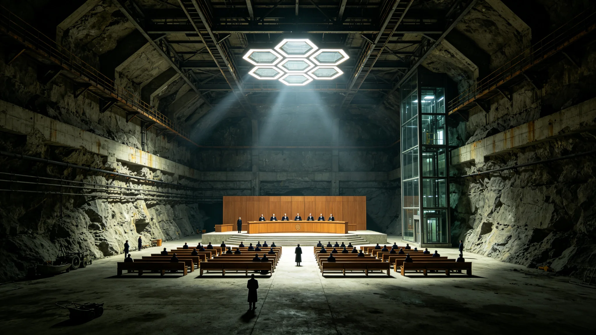

# 鲸鱼座τ星司法体系独立化改革公报

**发布机构**：鲸鱼座τ星定居点自治政府 / 司法改革委员会
**发布日期**：2981年3月15日
**文件等级**：定居点公开

## 一、改革背景与动因

鲸鱼座τ星定居点自2487年首批着陆以来，司法体系长期沿用"行政—司法合一"的早期拓荒治理模式。定居点总督府下设法务局，同时承担行政执法、检察起诉和审判裁决职能，法官由总督任命且可随时撤换。这一模式在拓荒初期人口不足两万、社会结构简单的条件下尚能运转，但随着定居点人口在2980年突破1,200万，地下城市扩展至七层、地表工业带覆盖三个大陆架，原有司法体系的弊端日益凸显。

2978年至2980年间，定居点法务局受理案件量从年均14.2万件激增至31.7万件，案件积压周期从平均47天延长至112天。更为严重的是，多起涉及总督府直属企业的合同纠纷和劳动争议案件中，出现了审判结果明显偏向行政方的情况，引发定居点议会和公众的强烈质疑。2980年11月，定居点议会以68%的多数通过《司法独立化改革动议》，授权组建司法改革委员会，由前跨星系仲裁法庭资深法官苏明远担任委员会主席。

## 二、改革核心内容

**（一）司法权与行政权彻底分离**

改革后，鲸鱼座τ星设立独立的"定居点最高法院"作为最高司法机关，下设三个上诉法院和十二个地区法院。最高法院由七名大法官组成，大法官经定居点议会司法委员会提名、议会全体三分之二多数通过后任命，任期十五年，非经法定弹劾程序不得罢免。总督府不再拥有任何法官任免权，原法务局的审判职能全部移交新法院体系。

**（二）检察系统独立建制**

设立"定居点总检察署"，与行政系统完全脱钩。总检察长由最高法院提名、议会任命，任期十年。检察署负责所有刑事案件的审查起诉，并对行政机关的违法行为提起公益诉讼。2981年第一季度，检察署已对三起涉及行政机关滥用职权的案件立案调查。

**（三）陪审团制度全面推行**

所有刑事案件和标的额超过50万信用点的民事案件，均须由七人陪审团参与审理。陪审团成员从定居点年满二十五岁、无犯罪记录的公民中随机抽取，参审期间享受每日120信用点的误工补贴。司法改革委员会在公报中指出："陪审团制度是防止司法专断和行政干预的最后一道防线。"

**（四）跨星系司法协作机制**

鲸鱼座τ星最高法院与比邻星b行星法院、火星联邦法院签署《跨星系司法协助与判决互认协议》。协议规定，三方法院在民商事判决的承认与执行、证据调取、证人远程作证等方面相互提供协助。涉及跨星系当事人的案件，可申请由三地法官组成联合合议庭审理。

## 三、过渡期安排与人员配置

改革设定十八个月过渡期（2981年3月至2982年9月）。过渡期内，原法务局的审判人员经资格审查后转入新法院体系。司法改革委员会公布的数据显示：

- 原法务局共有法官287名，其中241名通过资格审查转入新法院，46名因专业能力不足或存在利益冲突记录未获转任；
- 新法院体系计划编制法官420名，缺口179名将通过跨星系司法人才招募计划填补，已收到来自比邻星b和火星的申请3,200余份；
- 最高法院七名大法官中，四名来自鲸鱼座τ星本地，两名来自比邻星b，一名来自火星，体现了跨星系司法人才的融合。

司法改革委员会主席苏明远在就职演说中表示："司法独立不是对行政权的对抗，而是对所有公民权利的平等保护。一个定居点能否被称为文明，不在于它有多少座穹顶和反应堆，而在于它的法官能否在不受干预的情况下做出公正的判决。"

## 四、社会反响与后续监督

改革公报发布后，鲸鱼座τ星定居点议会以82%的高票通过了《司法独立保障法》，将改革成果以法律形式固定。定居点总工会、工商联合会和律师协会均发表声明支持改革。比邻星b行星管理委员会和火星联邦政府也分别发来贺电，表示将积极落实跨星系司法协作协议。

为确保改革不流于形式，定居点议会设立"司法独立监督委员会"，由五名民间代表和两名法学学者组成，每半年发布一次司法独立评估报告。任何公民如认为法官受到行政干预或判决存在明显不公，均可向监督委员会投诉，监督委员会有权调阅案卷并启动调查程序。

苏明远主席在公报结语中写道："我们的祖先在鲸鱼座τ星的岩石下挖出了第一个容身之所，他们用双手建立了这座地下城市。今天，我们要为这座城市建立一样看不见却同样坚固的东西——一个独立、公正、值得信赖的司法体系。这是给子孙后代最好的遗产。"
