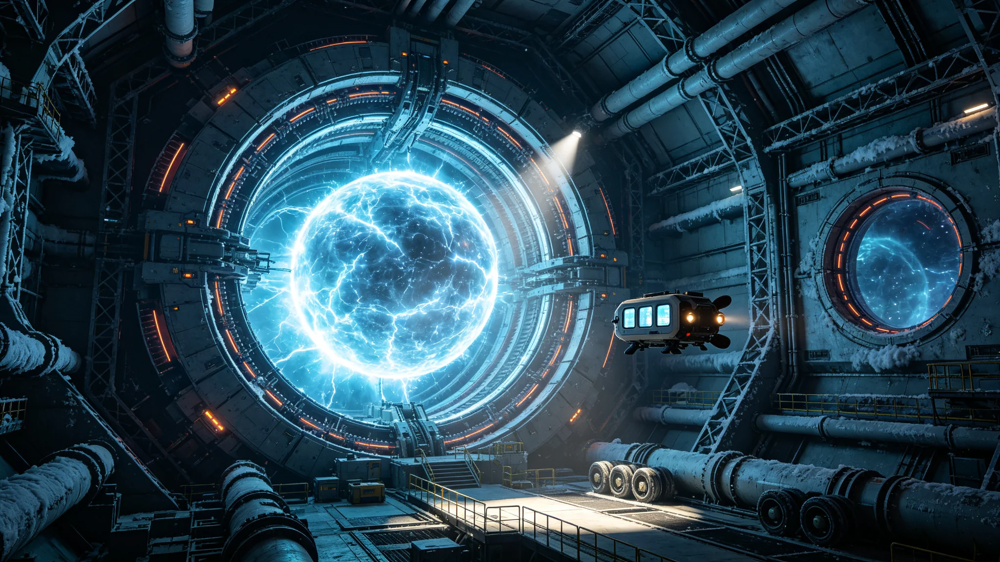

# 第五代反物质储能装置实验室原型测试报告

**发布机构**：跨恒星系能源工程联合研究院 / 反物质储能实验室
**发布日期**：2982年6月20日
**文件等级**：技术公开（核心参数保密）

## 一、项目概述

第五代反物质储能装置（代号"潘多拉-V"）实验室原型于2982年4月至6月在跨恒星系能源工程联合研究院深空实验站（位于地月L4拉格朗日点）完成了为期72天的连续测试。本报告由项目首席科学家、能源工程学派院士叶知秋教授领衔撰写，测试团队包括来自比邻星b、鲸鱼座τ星和火星的47名工程师和物理学家。

反物质储能技术的核心原理是利用正电子与电子湮灭产生的纯能量进行高密度存储。与第四代装置相比，第五代的关键突破在于：采用了新型"彭宁—保罗复合阱"磁光约束系统，将反物质存储密度提升了一个数量级；同时发明了"梯度湮灭释放阀"，使能量输出可以从微瓦级到太瓦级连续可调。

## 二、核心技术参数

测试期间，原型装置实现了以下关键性能指标：

- **反物质存储量**：单次充注正电子12.4纳克（约6.7×10¹⁵个正电子），是第四代装置的11.3倍；
- **能量密度**：2.8×10¹⁷焦耳/千克（理论上限为9×10¹⁶焦耳/千克，因采用正反物质对存储模式，实际有效能量密度为湮灭能的一半），相当于同等质量化学电池的约7,000万倍；
- **存储时长**：在72天连续测试中，反物质约束损失率为0.003%/天，预计满充状态下可稳定存储超过50年；
- **能量释放效率**：湮灭能量转化为可用电能的效率为78.4%，较第四代的61.2%提升显著；
- **输出功率范围**：最小稳定输出1.2微瓦，最大脉冲输出4.7太瓦（持续0.1毫秒）；
- **装置总质量**：含约束磁体、真空腔、冷却系统和屏蔽层共14.2吨，较第四代的38吨减重62.6%。

## 三、关键技术突破

**（一）彭宁—保罗复合阱约束系统**

传统彭宁阱利用电场和磁场组合约束带电粒子，但在高密度下存在等离子体不稳定性问题。第五代装置创新性地将彭宁阱的静态约束与保罗阱的射频动态约束叠加，形成"复合阱"结构。实验数据表明，复合阱可将正电子等离子体的稳定密度从10¹²个/立方厘米提升至10¹⁴个/立方厘米，同时将约束损耗降低两个数量级。

**（二）梯度湮灭释放阀**

能量释放的可控性一直是反物质储能的技术瓶颈。第五代装置采用"梯度湮灭释放阀"——通过精密控制正电子束流注入普通物质靶的速率，实现湮灭反应速率的线性调节。释放阀由128个独立控制的纳米级喷嘴组成，每个喷嘴的正电子通量可在10⁶至10¹²个/秒范围内调节。测试中，释放阀成功实现了从维持实验站待机功耗的12千瓦连续输出，到模拟深空推进脉冲的4.7太瓦瞬态输出的全范围切换。

**（三）辐射屏蔽与安全冗余**

反物质湮灭产生的高能伽马射线是主要安全隐患。第五代装置采用"钨—聚乙烯—硼化锂"三层复合屏蔽结构，外层为15厘米厚钨合金吸收伽马射线，中层为20厘米厚聚乙烯慢化中子，内层为5厘米厚硼化锂吸收热中子。屏蔽层外表面的辐射剂量率测试值为0.02毫西弗/小时，低于跨恒星系辐射安全标准规定的0.05毫西弗/小时限值。装置配备三重独立的约束失效安全机制：一旦磁约束系统故障，正电子将被自动引导至装置底部的"湮灭终止腔"，在厚达2米的钨合金屏蔽腔内安全湮灭，不会对外部造成危害。

## 四、应用前景与工程化路线

实验室原型测试的成功，为反物质储能技术的工程化应用奠定了基础。联合研究院已规划三阶段工程化路线：

**第一阶段（2985-2990）——深空探测器应用**：研制轻量化反物质储能模块（质量≤500千克，存储量≥1纳克正电子），用于深空探测器的主电源。反物质储能可使深空探测器在远离恒星的黑暗区域持续运行数十年，无需依赖放射性同位素热电发生器。

**第二阶段（2990-2995）——星际航行辅助动力**：研制兆瓦级反物质储能单元，作为星际飞船的辅助动力和应急电源。一艘典型的跨恒星系客运飞船配备4个兆瓦级单元，可在主推进系统故障时提供长达6个月的生命保障电力。

**第三阶段（2995-3010）——行星级储能调峰**：在比邻星b和鲸鱼座τ星建设吉瓦级反物质储能调峰站，用于平衡全球电网的昼夜和季节负荷波动。单个吉瓦级调峰站的反物质存储量约为1微克正电子，可在满功率下持续放电约24小时。

## 五、风险评估与伦理审查

反物质储能技术的巨大能量密度同时意味着巨大的安全风险。联合研究院伦理委员会对本项目进行了严格审查，要求：

1. 所有反物质生产和存储设施必须位于深空轨道，严禁在行星表面或大气层内进行反物质充注操作；
2. 单次反物质运输量不得超过0.1纳克，运输飞船必须配备双重独立约束系统和全程远程监控；
3. 建立跨恒星系反物质监管机构，对所有反物质的生产、存储、运输和使用进行统一登记和实时追踪；
4. 反物质储能技术严禁用于武器化开发，相关禁令已纳入《三恒星系非军事化公约》草案。

叶知秋教授在报告结语中写道："反物质是宇宙中最纯净的能量形式，也是最危险的力量。我们掌握了约束它的技术，更要掌握约束自己的智慧。第五代装置的成功不是终点，而是一个新的起点——人类文明第一次拥有了可以支撑跨星系远征的能量密度。"
