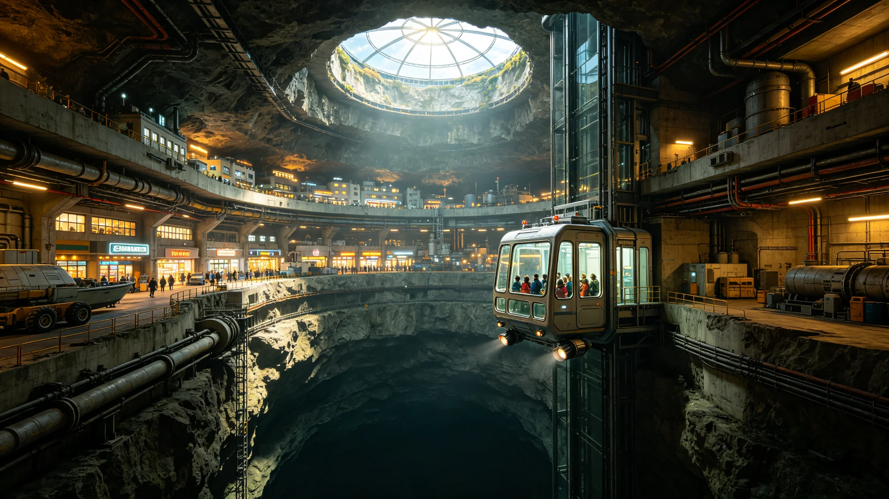

# 鲸鱼座τ星旅游业起步与地下城市观光产业公报

**发布机构**：鲸鱼座τ星定居点经济发展局 / 旅游产业促进委员会
**发布日期**：2984年4月10日
**文件等级**：定居点公开

## 一、产业起步背景

鲸鱼座τ星定居点自2487年建立以来，长期以矿业、冶金和地下城市建设为经济支柱。至2980年，定居点人口突破1,200万，地下城市扩展至七层，总建筑面积超过800平方公里。随着基础设施日趋完善和居民生活水平的提高，定居点经济发展局开始探索产业多元化路径。

2982年，跨恒星系客运航线"比邻星b—鲸鱼座τ星"实现每周三班常态化运营，单程航行时间约14天（使用第四代聚变推进系统）。航线的开通为鲸鱼座τ星带来了首批非移民类访客。2982年全年，到访鲸鱼座τ星的非移民旅客为12,400人次；2983年增至38,700人次，同比增长212%。经济发展局据此判断，鲸鱼座τ星具备发展特色旅游业的潜力。

鲸鱼座τ星的旅游资源具有独特性：红矮星恒星系统的奇异天象、地下七层城市的宏大建筑奇观、稀有金属矿坑的工业遗迹、以及异星地表的极端地貌，这些都是比邻星b（已完成大气改造、以露天自然景观为主）和火星（以红色荒漠和地下温室为主）所不具备的。

## 二、核心旅游产品规划

旅游产业促进委员会经过一年调研，规划了以下五大核心旅游产品：

**（一）"深渊之城"地下城市观光**

这是鲸鱼座τ星最具特色的旅游产品。游客可乘坐透明观光电梯从地表入口 descending 至地下七层，在45分钟的下降过程中逐层观赏：

- 第一层（地表下50-200米）：商业与公共服务层，拥有定居点最大的中央广场和人工天空穹顶（模拟地球蓝天效果）；
- 第二层（200-500米）：居住层，展示异星地下城市的日常生活场景；
- 第三层（500-900米）：工业与制造层，可参观稀有金属冶炼厂的自动化生产线；
- 第四层（900-1,400米）：能源与生命保障层，展示聚变反应堆和水循环系统的运行；
- 第五至七层（1,400-3,000米）：深层采矿与科研层，仅限预约参观。

观光线路全长约12公里，配备多语言自动导览系统。2984年第一季度，"深渊之城"观光线路已接待游客8,200人次，游客满意度调查达94.7%。

**（二）红矮星地表探险**

在专业向导带领下，游客穿着全封闭加压服乘坐地表漫游车，前往距最近城市入口约80公里的"红岩峡谷"自然保护区。游客可在安全区域观赏鲸鱼座τ星独特的红色天空和岩石地貌，体验红矮星柔和的暗红色光照。每条线路限6名游客，配备全程生命保障监控和应急返回系统。

**（三）矿业遗产之旅**

参观定居点最早的"一号矿坑"（已于2960年停产，现为工业遗产保护区）。游客可乘坐矿用轨道车深入已废弃的矿洞，观看早期采矿设备的复原展示，了解拓荒者在极端环境下开采稀有金属的历史。一号矿坑的"拓者大厅"保留了25世纪矿工们用矿石拼贴的壁画，是定居点重要的文化遗产。

**（四）地下生态公园体验**

鲸鱼座τ星的地下城市拥有总面积约15平方公里的人工生态系统，包括人工湖泊、森林步道和水培农场。游客可在生态公园中漫步，体验在地下300米深处被绿色植被环绕的独特感受。生态公园内的"星光餐厅"利用光纤将地表的红矮星光引入室内，营造出在异星星光下用餐的浪漫氛围。

**（五）跨星系天文观测**

鲸鱼座τ星位于距地球约11.9光年的位置，是观测银河系结构和邻近星系的绝佳地点。定居点天文台面向游客开放夜间观测项目，游客可通过口径4米的光学望远镜观测从鲸鱼座τ星视角看到的星空——包括地球方向的微弱光点（太阳）和比邻星双星系统。

## 三、产业经济数据

2983年，鲸鱼座τ星旅游业直接收入为1.27亿信用点，占定居点GDP的0.8%。经济发展局预测：

- 2985年：游客量突破10万人次，旅游收入达3.5亿信用点；
- 2990年：游客量突破50万人次，旅游收入达20亿信用点，占GDP的3.5%；
- 3000年：游客量突破200万人次，旅游收入达80亿信用点，占GDP的8%，成为定居点第三大产业。

旅游业已创造直接就业岗位4,200个，间接就业岗位约12,000个。旅游产业促进委员会预计，到2990年旅游业相关就业岗位将达到5万个。

## 四、基础设施建设

为支撑旅游业发展，定居点已启动以下基础设施项目：

- **星际客运港扩建**：将现有客运港的年旅客吞吐能力从50万人次提升至200万人次，新增4个星际飞船泊位和配套的入境检查设施；
- **地下观光交通系统**：建设专用观光轨道交通线路，连接各主要景点，避免与居民日常交通混行；
- **游客住宿设施**：在第一层商业区内规划建设3家星级酒店（共1,200间客房）和20家特色民宿；
- **多语言服务体系**：建立覆盖汉语、英语、西班牙语和比邻星b本土通用语的多语言导览和服务体系。

经济发展局局长林婉清在公报中表示："鲸鱼座τ星长期以来被外界视为一个只有矿工和工程师的重工业定居点。但我们的地下城市是人类工程史上的奇迹，我们的红矮星天空是宇宙中独一无二的风景。旅游业不是要改变鲸鱼座τ星的工业本色，而是要让更多人看到这座深渊之城的壮美与温度。"
