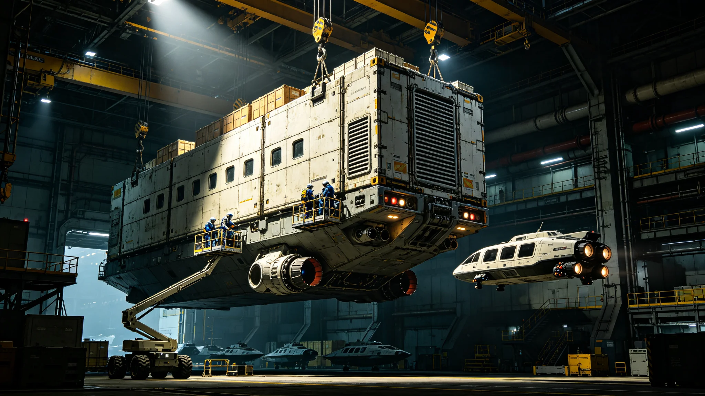

# 星际航行安全标准修订与船舶强制检查制度公报

**发布机构**：三恒星系星际航行安全管理局 / 船舶检验中心
**发布日期**：2986年2月28日
**文件等级**：跨星系公开

## 一、修订背景

截至2985年底，三恒星系（太阳系—比邻星系—鲸鱼座τ星系）之间的常态化星际航线已达17条，在役星际飞船共342艘，其中客运飞船78艘、货运飞船214艘、多功能工程船50艘。2980年至2985年间，三恒星系间累计完成星际航行12,847航次，运送旅客约1,860万人次、货物约4.2亿吨。

随着航行密度的大幅提升，航行安全问题日益突出。2980年至2985年间，共发生星际航行事故47起，其中重大事故7起，造成143人死亡、直接经济损失约68亿信用点。事故调查显示，其中29起（占61.7%）与船舶设备老化、维护不到位或安全标准执行不严直接相关。

现行的《星际航行安全标准》制定于2945年，已运行41年，部分技术指标和管理要求已无法适应当前的航行规模和技术水平。2985年3月，三恒星系星际航行安全管理局启动标准修订工作，由航行安全学派资深专家、船舶检验中心总工程师赵铁山担任修订委员会主席。

## 二、新标准核心内容

**（一）船舶分级与适航认证**

新标准将星际船舶按用途和吨位分为四个等级：

- **A级**：载客量超过500人或载货量超过50万吨的大型船舶，每6个月进行一次全面适航检查；
- **B级**：载客量100-500人或载货量10-50万吨的中型船舶，每12个月检查一次；
- **C级**：载客量少于100人或载货量少于10万吨的小型船舶，每18个月检查一次；
- **D级**：特种工程船和科研船，按任务性质定制检查周期，但最长不超过24个月。

所有船舶必须在船身显著位置张贴适航认证标志，未通过检查或认证过期的船舶禁止出港。港口管理局有权在船舶离港前进行抽查，发现问题可立即扣船。

**（二）强制检查项目清单**

新标准规定了12大类、86小项强制检查项目，核心包括：

1. **推进系统**：聚变反应堆运行状态、推进剂储备量、推进器喷口磨损程度、冷却系统完整性；
2. **生命保障系统**：氧气生成效率、水循环闭合率、二氧化碳清除能力、应急氧气储备（不少于全船人员90天用量）；
3. **辐射防护**：船体屏蔽层完整性、舱内辐射剂量率（不得超过0.5毫西弗/天）、太阳风暴应急避难所密封性；
4. **导航与通信**：星载导航系统校准、量子通信终端状态、中微子通信备份链路、应急信标有效性；
5. **结构完整性**：船体微陨石撞击损伤检测、焊缝疲劳评估、加压舱室密封性测试；
6. **消防系统**：火灾探测器覆盖率、灭火系统响应时间、阻燃材料合规性；
7. **应急逃生**：逃生艇数量（不少于全船人员120%容量）、逃生艇推进系统状态、紧急撤离通道畅通性；
8. **冬眠系统**（如配备）：冬眠舱温控精度、唤醒系统可靠性、医疗监护设备状态。

**（三）船舶强制报废制度**

新标准首次引入船舶强制报废制度。星际船舶的设计服役年限为80年，超过年限的船舶必须进行全面结构疲劳评估，评估不合格的强制报废。对于达到100年船龄的船舶，无论评估结果如何，一律强制退出客运航线，可改装为货运船或工程船继续使用，但船龄上限为120年。

据统计，目前在役的342艘船舶中，有23艘船龄已超过60年，其中3艘超过70年。新标准实施后，这3艘船舶将在2987年底前完成全面评估。

**（四）黑匣子与航行数据记录**

所有星际船舶必须配备符合新标准的"航行数据记录仪"（俗称"黑匣子"），实时记录船舶的位置、速度、航向、推进系统参数、生命保障系统参数、舱内语音通信和关键操作指令。黑匣子需能承受10,000g的冲击和1,100°C的高温，并在深海或深空环境中发出持续90天的定位信号。黑匣子数据归航行安全管理局所有，事故调查时可依法调取。

## 三、船舶检查制度实施

船舶检验中心在三恒星系共设立12个检查站点（太阳系4个、比邻星系4个、鲸鱼座τ星系4个），配备专业检查人员1,200名和检查设备240套。检查流程包括：

1. **船舶申报**：船舶在预计到达检查港前72小时提交检查申请和船舶技术档案；
2. **文件审查**：检查人员审查船舶的维护记录、上次检查报告和船员资质证书；
3. **实船检查**：按12大类86小项逐项检查，使用便携式超声波探伤仪、红外热像仪、气体分析仪等设备；
4. **问题整改**：发现一般问题的，船舶须在30天内整改并提交整改报告；发现严重安全隐患的，立即扣船，整改完成并经复检合格后方可离港；
5. **检查报告**：每次检查生成详细报告，录入船舶安全档案，公开可查。

2986年第一季度，船舶检验中心已完成87艘船舶的检查，其中12艘因存在严重安全隐患被扣船整改，扣船率为13.8%。被扣船舶的主要问题包括：推进器冷却管道腐蚀、生命保障系统氧气传感器失准、逃生艇电池过期等。

## 四、船员资质与培训

新标准同时提高了星际航行船员的资质要求。船长须持有"星际航行 master 级"证书，具备至少15年星际航行经验和5年以上大副资历。所有船员每两年须接受一次强制性安全复训，包括应急撤离演练、火灾扑救、生命保障系统故障处置等科目。

航行安全管理局还建立了"船员安全信用档案"，对违反安全操作规程的船员进行记录和处罚。一年内累计三次违规的船员将被吊销航行资质，五年内不得重新申请。

赵铁山总工程师在公报中强调："星际航行的距离以光年计，一次事故的代价就是上百条生命和数十亿信用点。安全不是成本，而是最基本的投资。新标准的每一条规定，都是用过去的事故和教训换来的。我们宁可让一艘船在港口多停三天整改，也不能让它带着隐患出发。"
