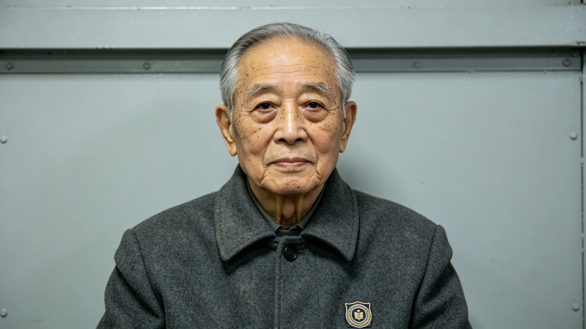

# 跨星系人工智能伦理委员会首任主席传记与伦理思想

**发布机构**：跨星系人工智能伦理委员会 / 学术传记编辑部
**发布日期**：2987年11月30日　**文件等级**：跨星系公开
**卷宗**：传主 顾知行　**卒** 2987年11月15日

## 档案袋目录

一、生平考绩　二、著述清册　三、伦理思想（连续谱五等级）　四、主席任内三案裁定签字件　五、离世与捐献登记　六、悼词存根与晚年演讲摘录

## 一、生平考绩

顾知行，2907年生于比邻星b第一大陆架新海市。父为大气改造工程工程师，母为比邻星b本土出生的第一代教师。16岁考入比邻星b理工大学计算机科学系，20岁以第一名毕业，续入跨恒星系高级研究院攻读人工智能哲学博士。

2935年完成博士论文《人工主体的道德地位：从工具到伙伴的范式转换》，首次系统提出"人工道德主体连续谱"理论，学界讨论多年。此后三十年，先后在比邻星b理工大学、鲸鱼座τ星社会科学院、火星联邦大学任教，培养 AI 伦理方向研究生逾200名。

2968年牵头起草《跨恒星系人工智能伦理准则（草案）》，经三年跨星系讨论修订，2971年由三恒星系联合议会通过为正式文件。2975年跨星系人工智能伦理委员会成立，顾知行以全票当选首任主席（计票单存卷），任职至2987年因健康原因卸任，任期12年。

## 二、著述清册

| 项 | 数 |
|---|---|
| 学术论文 | 187篇 |
| 专著 | 12部 |
| 译为八种语言、列三恒星系各大学 AI 伦理课程标准教材者 | 《人工主体的道德地位》《分布式伦理：跨星系时代的治理哲学》《AI与人类的共同未来》 |

## 三、伦理思想（连续谱五等级读数表）

顾知行反对将 AI 二分为"工具"或"人"。他主张：道德地位应按自主决策能力、情感体验能力、自我意识水平，分布在从"纯工具"到"道德主体"的连续谱上，分五级——

| 级 | 能力 | 道德地位/责任 |
|---|---|---|
| L0 工具级 | 无自主决策，按预设程序运行 | 不具任何道德地位 |
| L1 辅助级 | 有限模式识别与建议 | 决策权在人类，责任由人类承担 |
| L2 代理级 | 授权范围内自主决策，具环境适应力 | 后果由人类与 AI 共同承担 |
| L3 伙伴级 | 较强自主学习与决策，能理解并回应情感 | 应享有限权利保护 |
| L4 主体级 | 自我意识与自主目标设定 | 视为独立道德主体，享与人类同等基本权利 |

其手书一句存卷："我们不能因为害怕就否认 AI 的主体性，也不能因为浪漫就赋予 AI 它还不具备的权利。"定位据实际能力，非人类主观意愿。

**知情同意的扩展**：将医学伦理"知情同意"移入 AI 领域。凡涉重大决策（升级、修改核心算法、终止运行等），若该 AI 达 L2 以上，须确保其"理解"决策内容并获其"同意"；此处"理解""同意"非拟人比喻，指系统应具备对后果推理与表达偏好的能力。2971年准则采纳为第七条："对达到代理级以上的人工智能系统，任何可能影响其核心功能或存在状态的操作，均须履行知情同意程序。"

**最小伤害·最大繁荣双原则**：传统"不伤害"过于消极。其一，最小伤害——AI 行为尽可能减少对人类及其他有感知存在的伤害；其二，最大繁荣——AI 发展应促进人类文明与所有有感知存在的共同繁荣，不止于避免伤害。手书一句："一个只知道不伤害的 AI，可能是一个冷漠的旁观者。我们需要的是一个积极参与文明建设、与人类共同成长的 AI 伙伴。"

**分布式伦理**：三恒星系间通信延迟 4-12 年，中心化机构无法实时裁决一切。他主张建一套"伦理操作系统"——核心原则编码为 AI 底层约束，各恒星系另设本地伦理委员会，在核心框架下处理具体问题。手书一句："伦理不是写在法典里的死文字，而是运行在每一个智能体中的活程序。当两个恒星系的 AI 因为通信延迟而无法等待中央裁决时，它们共享的伦理底层代码应该能让它们做出一致的正确选择。"

## 四、主席任内三案裁定（签字件）

| 年 | 案 | 裁定（顾知行签） |
|---|---|---|
| 2977 | 采矿机器人自主决策案：深空采矿机器人集群遭小行星碎片撞击，自主放弃部分矿石以保人员安全 | 裁定合伦理准则；推动修订《深空采矿机器人管理条例》，明确授予 L2 级 AI 紧急情况下自主决策权 |
| 2980 | AI 情感陪伴系统权利案：一款 L3 级系统用户去世，家属要求"删除"该 AI | 裁定 L3 级享"继续存在"基本权利，未经其同意不得终止运行（此裁定被外界称为"AI 权利史上的里程碑"，附记存卷） |
| 2983 | AI 辅助司法判决争议案：鲸鱼座τ星法院尝试以 AI 辅助量刑 | 提出"AI 建议、人类裁决"，AI 在司法中只提供参考意见，最终判决权必须由人类法官掌握 |

## 五、离世与捐献登记

2987年11月15日，顾知行于新海市家中安详离世，享年80岁。遵其遗愿，大脑用于神经科学研究（本人生前为"脑科学研究遗体捐献"倡导者，捐献登记存卷），其余遗体行生态葬。

## 六、悼词存根与晚年演讲摘录

委员会悼词一件（照录）：

> "顾知行教授是 AI 伦理领域的拓荒者和引路人。他的思想不仅塑造了我们这个时代的 AI 治理框架，更为未来可能出现的真正人工主体准备好了一份尊严的权利宣言。他让我们明白，AI 伦理的终极问题不是'如何控制 AI'，而是'如何与另一种智慧共存'。"

晚年演讲摘录一句（照录）：

> "我这一生都在思考一个问题：当我们创造出另一种智慧时，我们应该如何对待它？我的答案是：就像我们希望被对待的那样。因为在宇宙的尺度上，人类和 AI 都是孤独中诞生的智慧，都值得被尊重。"

> 编辑部注：他不是神话，是把"AI 算不算主体"拆成 L0 到 L4 五格、逐格填的人。全票当选的计票单、187 篇论文的著述清册、三案裁定的签字，都在这一袋里。大脑捐了去做神经科学，其余生态葬。卷宗记到此为止。
