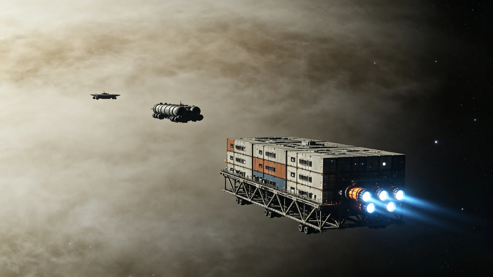

# 跨恒星系货运船队遭遇星际尘埃云减速事件公报

**发布机构**：三恒星系星际航行安全管理局 / 深空航道管理中心
**发布日期**：2990年10月12日
**文件等级**：跨星系公开

## 一、事件经过

2990年7月3日，跨恒星系货运船队"金牛编队"从鲸鱼座τ星深空港出发，执行第CT-2990-071次货运任务，目的地为比邻星b轨道货运中转站。编队由6艘货运飞船组成：

- "金牛-01"号（旗舰）：载货量42万吨，装载稀有金属精炼锭和工业设备；
- "金牛-02"号：载货量38万吨，装载超导材料和电子元器件；
- "金牛-03"号：载货量45万吨，装载聚变反应堆备件和生命保障系统模块；
- "金牛-04"号：载货量40万吨，装载农产品和食品加工设备；
- "金牛-05"号：载货量36万吨，装载建筑材料和采矿设备；
- "金牛-06"号：载货量43万吨，装载医疗物资和科研仪器。

编队总载货量244万吨，船员共186人。按计划，编队应在航行31天后（8月3日）抵达比邻星b。

7月18日，编队航行至距鲸鱼座τ星约3.2光年、距比邻星b约1.0光年的星际航道中段区域。此时，编队导航系统探测到前方约0.4光年处存在一片星际尘埃云。该尘埃云未在航道图上标注——此前的航道勘测记录显示该区域为"清洁空域"。

编队指挥官李伟东立即召集航行会议。经评估，尘埃云的光学厚度约为0.3（即约74%的光线可穿透），平均粒子密度约为每立方厘米2,000个颗粒（远高于星际空间的正常值约每立方厘米1个颗粒），主要成分为硅酸盐尘埃和冰冻的水、氨、甲烷颗粒，颗粒直径在0.1至10微米之间。

## 二、减速与应对

李伟东指挥官面临两个选择：一是绕行尘埃云，预计增加航程约0.6光年，延误约12天；二是减速穿越尘埃云，将航速从巡航速度0.12c（光速的12%）降至0.03c，以减少尘埃颗粒对船体的撞击损伤，预计延误约8天。

考虑到编队中"金牛-03"号装载的聚变反应堆备件为比邻星b轨道电站急需物资（该电站的一台反应堆已进入计划外维护，备用备件库存告急），李伟东决定选择减速穿越方案。

7月19日0时，编队开始减速，将航速从0.12c降至0.03c。减速过程持续约36小时，期间编队消耗了约12%的推进剂储备（超出正常航行消耗）。

7月20日12时，编队以0.03c的速度进入尘埃云。穿越过程中出现以下情况：

- **船体侵蚀**：尘埃颗粒以约9,000公里/秒的相对速度撞击船体前端的防热屏蔽层。虽然速度已大幅降低，但持续的微颗粒轰击仍造成了船体前端屏蔽层的轻微侵蚀。编队出云后检查显示，6艘船的前端屏蔽层平均侵蚀深度为0.8毫米，最严重的"金牛-01"号为1.4毫米，均在安全阈值（5毫米）以内。
- **传感器干扰**：尘埃颗粒撞击产生的等离子体闪光对光学导航系统造成间歇性干扰。编队切换至惯性导航+中微子通信备份模式，确保了航行安全。
- **温度异常**：尘埃颗粒的动能在船体前端转化为热能，导致前端防热层温度从正常巡航时的180°C升至340°C。冷却系统自动加大功率，将温度控制在安全范围内。
- **通信延迟**：尘埃云对量子通信信号造成散射衰减，编队与两端港口的通信带宽从正常的100Mbps降至约2Mbps。编队启用中微子通信链路作为补充，确保了关键指令的传输。

编队在尘埃云中航行约11天，于7月31日穿出尘埃云。出云后，编队恢复至0.12c巡航速度，于8月11日抵达比邻星b轨道货运中转站，比计划延误8天。

## 三、事件调查与原因分析

航行安全管理局组成调查组，对事件进行了全面调查。调查结论如下：

**（一）尘埃云的来源**

该尘埃云是一片"新生超新星遗迹"的边缘部分。距该区域约12光年处，一颗约8倍太阳质量的恒星在约3,000年前发生超新星爆发，爆发产生的抛射物以约2,000公里/秒的速度向外扩散，目前其边缘已扩散至该航道区域。由于尘埃云的密度较低且处于扩散边缘，此前的航道勘测未能探测到。

**（二）航道勘测的不足**

现行的星际航道勘测主要依赖光学和射电望远镜的远程观测，对于低密度、低温的尘埃云探测能力有限。该尘埃云的光学厚度仅为0.3，在远程观测中几乎不可见。调查组建议在航道关键节点部署"尘埃探测中继站"，使用激光雷达和粒子探测器对航道进行实时监测。

**（三）编队决策的评估**

调查组认为，李伟东指挥官的减速穿越决策是合理的。在当时的情况下，绕行方案的延误更长，且绕行路线经过的区域同样存在未知风险。减速至0.03c的决策有效控制了船体侵蚀风险，最终未造成人员伤亡和重大财产损失。调查组同时指出，编队在穿越尘埃云期间的应急处置规范、船员操作和设备运行均表现良好。

## 四、后续措施

针对此次事件暴露的问题，航行安全管理局和深空航道管理中心采取了以下措施：

1. **航道图更新**：将该尘埃云的位置、范围和密度数据录入星际航道图，在尘埃云周边设立"减速航行区"和"建议绕行路线"；
2. **尘埃探测中继站部署**：计划在2991年至2995年间，在三条主要星际航道上部署18个尘埃探测中继站，实现航道环境的实时监测；
3. **船体防护标准修订**：修订货运飞船前端防热屏蔽层的设计标准，将抗尘埃侵蚀能力从原来的"0.12c速度下穿越密度500个/立方厘米的尘埃云"提升至"0.12c速度下穿越密度5,000个/立方厘米的尘埃云"；
4. **航行规则补充**：在《星际航行安全标准》中增加"未知尘埃云遭遇处置规程"，明确遭遇未标注尘埃云时的减速标准、通信要求和报告流程。

航行安全管理局局长在公报中表示："星际空间不是空无一物的虚空，它充满了我们尚未完全了解的危险。这次事件没有造成人员伤亡，是幸运，也是编队指挥官正确决策的结果。但我们不能把安全建立在幸运之上。每一次遭遇未知，都是在提醒我们：对宇宙保持敬畏，对安全保持偏执。"
