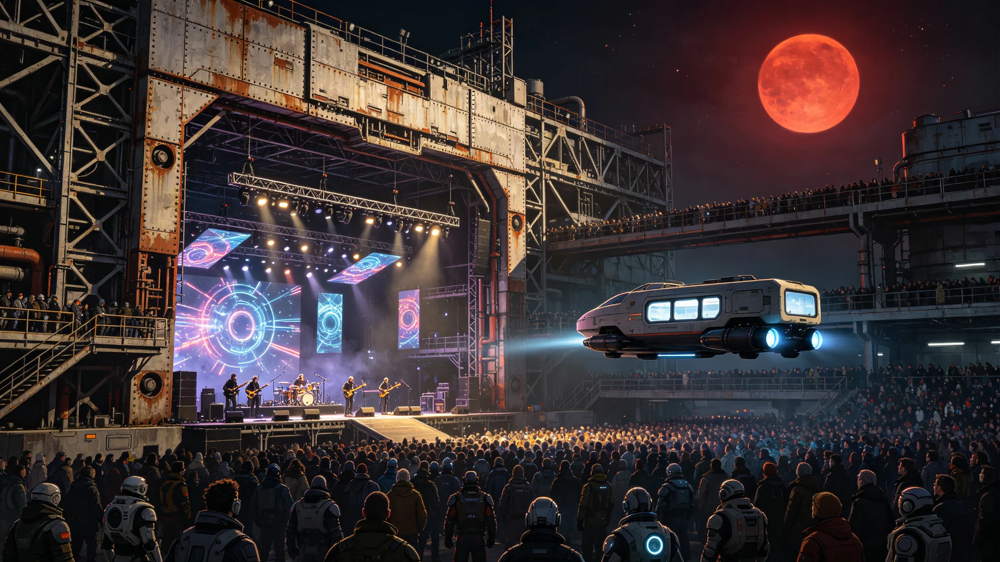

# 三恒星系联合音乐节暨跨星系艺术交流公报

**发布机构**：三恒星系文化交流理事会 / 联合音乐节组委会
**发布日期**：2991年6月1日
**文件等级**：跨星系公开

## 一、音乐节概况

2991年4月15日至5月15日，首届"三恒星系联合音乐节"在比邻星b新海市中央广场隆重举行。这是人类文明史上首次在三个恒星系之间同步举办的大型音乐艺术活动。音乐节以"跨越光年的和声"为主题，汇聚了来自太阳系（火星）、比邻星系和鲸鱼座τ星系的126支乐团、3,400名音乐家，现场观众累计达280万人次，通过跨星系量子通信链路远程参与的观众超过8亿人次。

音乐节组委会主席、艺术学派代表人物林韵女士在开幕式上致辞："音乐是唯一不需要翻译的语言。当我们的祖先乘坐世代飞船离开地球时，他们带走的不仅是种子和技术，还有音乐。今天，三个恒星系的音乐家们第一次在同一个舞台上演奏，这证明了无论人类散布多远，我们的灵魂始终在同一个频率上共振。"

## 二、演出内容与特色

音乐节为期一个月，分为五大演出单元：

**（一）"原乡之声"——地球传统音乐单元**

本单元演绎从地球时代传承下来的古典音乐和民族音乐。来自火星的"地球交响乐团"演奏了贝多芬第九交响曲、柴可夫斯基第六交响曲等经典作品；来自比邻星b的"华夏民乐团"演奏了改编自中国古曲的《高山流水》《十面埋伏》；来自鲸鱼座τ星的"跨界合唱团"用八种语言演唱了世界各地的民歌。

值得一提的是，音乐节组委会从地球文化遗产数据库中复原了三首已失传的地球民歌，通过AI辅助乐谱重建和人声演绎，让这些沉睡了数百年的旋律重新响起。

**（二）"异星新声"——本土创作音乐单元**

本单元展示三个恒星系各自发展出的本土音乐风格：

- 比邻星b的"红矮星蓝调"：受比邻星红矮星柔和光照和露天自由呼吸环境影响，曲风舒缓悠远，大量使用自然音效采样（风声、海浪、鸟鸣）；
- 鲸鱼座τ星的"深渊金属"：在地下城市环境中发展出的重金属风格，节奏强烈、音色厚重，融入了工业机械的采样音效，表达地下拓荒者的坚韧与力量；
- 火星的"尘暴民谣"：以火星红色荒漠为背景的民谣风格，歌词多讲述拓荒故事和思乡之情，常用自制的弦乐器和打击乐器。

三种风格迥异的音乐在音乐节上同台演出，形成了强烈的艺术对比和对话。

**（三）"光年合奏"——跨星系实时合奏单元**

这是音乐节技术含量最高的单元。利用量子纠缠通信链路的零延迟特性，三个恒星系的音乐家实现了实时跨星系合奏。比邻星b的钢琴家、鲸鱼座τ星的小提琴家和火星的鼓手，虽然相距4到12光年，但通过量子通信链路，他们的演奏实现了毫秒级同步，如同在同一个舞台上演出。

音乐节期间共完成了12场跨星系实时合奏演出，每场演出的通信链路稳定性达到99.97%。这是量子通信技术首次在大型艺术活动中实现规模化应用。

**（四）"AI与人"——人机协作音乐单元**

本单元探索人类音乐家与AI系统的协作创作。达到L3级的AI音乐创作系统"和声"与人类作曲家共同创作了15首作品，其中《光年之外的第一缕光》由AI提供旋律动机、人类作曲家配器和编曲，被音乐节评为"最佳原创作品"。

AI伦理委员会对本单元进行了全程监督，确保AI创作的作品按照《三恒星系知识产权统一保护公约》的规定进行权利归属标注。

**（五）"全民参与"——公众音乐单元**

音乐节设置了大量公众参与环节，包括露天音乐会、音乐工作坊、乐器制作体验、跨星系音乐交流笔会等。中央广场上设置了100个"音乐亭"，任何人都可以进入演奏，现场观众通过投票系统为演奏者打分，得分最高的10名业余演奏者获得了在主舞台演出的机会。

## 三、跨星系艺术交流成果

音乐节期间，三恒星系的文化机构签署了多项合作协议：

1. **三恒星系音乐学院联盟成立**：比邻星b音乐学院、鲸鱼座τ星艺术学院和火星艺术大学签署联盟协议，实现学分互认、教师互访和学生交换。联盟计划每年联合培养100名跨星系音乐人才。
2. **跨星系音乐作品库建立**：三个恒星系的音乐作品实现数字化共享，目前已收录约240万首音乐作品，向三恒星系公众免费开放试听。
3. **"音乐使者"交流计划**：每年选派30名音乐家到其他恒星系进行为期一年的驻留创作，深入体验当地文化，创作融合不同文明元素的音乐作品。
4. **跨星系乐器研发合作**：三方合作研发适合异星环境演奏的新型乐器，包括在低重力环境下使用的弦乐器和在地下城市声学环境中优化的管乐器。

## 四、经济与社会影响

音乐节为比邻星b带来了显著的经济效益。音乐节期间，新海市的游客量达到120万人次，酒店入住率保持在95%以上，餐饮、零售和交通行业收入增长约35%。音乐节直接经济收入约18亿信用点，间接带动经济收入约60亿信用点。

更重要的是音乐节的社会文化影响。民意调查显示，87%的三恒星系公众认为音乐节"增强了对人类文明共同体的认同感"。音乐节期间，三个恒星系之间的跨星系通信流量增长了340%，其中音乐相关内容占比超过60%。

林韵主席在闭幕式上说道："一个月前，我们在这里开始了一场跨越光年的音乐实验。一个月后，我们可以确认：实验成功了。音乐没有被距离稀释，反而因为距离而更加珍贵。当鲸鱼座τ星的小提琴声与比邻星b的钢琴声在量子链路中相遇的那一刻，我们听到的不仅是音乐，更是人类文明在宇宙中不散的回响。"

组委会已宣布，第二届三恒星系联合音乐节将于2994年在鲸鱼座τ星地下城市举办，第三届于2997年在火星举办，形成每三年一届、三地轮办的固定机制。
