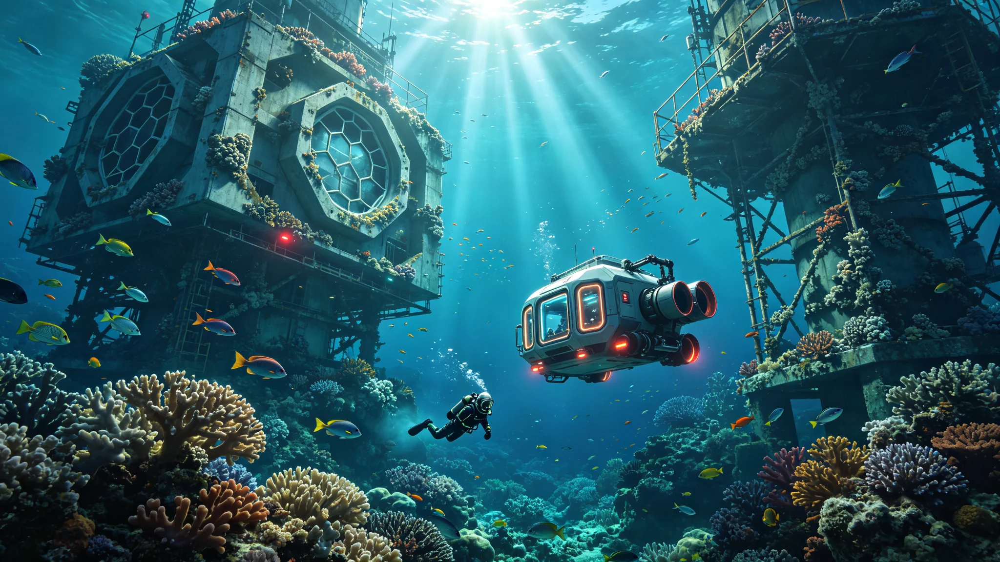

# 比邻星b海洋生态系统成熟度评估公报

**发布机构**：比邻星b行星管理委员会 / 全球海洋生态监测中心
**发布日期**：2993年9月18日
**文件等级**：全球公开

## 一、评估背景

比邻星b的海洋生态系统建设始于2680年。在大气改造工程的第三阶段（2701-2820年），随着液态水在赤道区域稳定存在，工程团队开始系统性地向海洋中引入地球海洋生物。经过约213年的建设和演化，比邻星b的海洋总面积已达到约1.8亿平方公里（占行星表面积的62%），平均水深约3,200米，最深处达8,400米。

2993年，全球海洋生态监测中心组织了一次全面的海洋生态系统成熟度评估，这是自2900年大气改造完成以来的第三次全面评估。评估团队由来自比邻星b、鲸鱼座τ星和火星的120名海洋生物学家、生态学家和环境工程师组成，历时8个月，对全球海洋的12个主要生态区域进行了采样调查。

评估中心主任、海洋生物学派院士苏海燕教授表示："海洋是行星的肺和血液。比邻星b的大气改造完成了，但海洋生态系统是否真正成熟、能否自我维持，还需要时间的检验。这次评估就是要回答一个问题：我们的海洋，是一个真正的生态系统，还是一个需要持续人工维护的大型鱼缸？"

## 二、评估方法与指标

评估采用"海洋生态系统成熟度指数"（Ocean Ecosystem Maturity Index, OEMI），从以下六个维度进行量化评估：

1. **生物多样性指数**：物种数量、种群结构、营养级完整性；
2. **生态系统稳定性**：种群波动幅度、抵抗干扰能力、恢复速度；
3. **生物地球化学循环**：碳循环、氮循环、磷循环的闭合程度；
4. **初级生产力**：浮游生物光合作用效率、海洋固碳能力；
5. **食物网完整性**：从生产者到顶级捕食者的营养级连接完整度；
6. **自我维持能力**：在无人工干预条件下生态系统的可持续运行能力。

每个维度满分100分，加权平均后得到OEMI总分。评估团队将成熟度分为四个等级：初级（<40分）、发展中（40-60分）、成熟（60-80分）、完全成熟（>80分）。

## 三、评估结果

**（一）总体评分**

本次评估的OEMI总分为72.4分，处于"成熟"等级区间，较2900年的58.6分和2950年的65.2分有显著提升。各维度得分如下：

| 维度 | 2900年 | 2950年 | 2993年 |
|---|---|---|---|
| 生物多样性 | 52 | 61 | 68 |
| 生态系统稳定性 | 55 | 63 | 74 |
| 生物地球化学循环 | 60 | 68 | 75 |
| 初级生产力 | 65 | 72 | 78 |
| 食物网完整性 | 48 | 58 | 67 |
| 自我维持能力 | 50 | 62 | 72 |
| **OEMI总分** | **58.6** | **65.2** | **72.4** |

**（二）生物多样性现状**

比邻星b海洋中已记录到引入物种约2,800种，其中：
- 浮游植物：约380种，全球海洋浮游植物生物量约为地球海洋的72%；
- 浮游动物：约620种；
- 鱼类：约1,200种，其中已建立稳定野生种群的约850种；
- 海洋哺乳动物：34种，包括鲸类12种、鳍足类15种、海牛类7种；
- 海洋无脊椎动物：约560种，包括珊瑚、贝类、甲壳类等。

评估发现，有47种引入物种在比邻星b海洋中发生了可观测的适应性进化，例如：部分鱼类的体型比地球祖先缩小了15%-20%（适应比邻星b略高的重力）；部分浮游植物的光合色素组成发生了变化，更适应红矮星的光谱特征。

**（三）食物网完整性**

比邻星b海洋的食物网已基本建立，但顶级捕食者层级仍不够完整。目前海洋中已建立种群的顶级捕食者包括鲨鱼（8种）、虎鲸和几种大型硬骨鱼，但与地球海洋相比，顶级捕食者的种类和数量仍偏少。评估团队建议在未来20年内继续引入5-8种大型海洋捕食者，以完善食物网的顶层结构。

**（四）生物地球化学循环**

海洋的碳循环已基本闭合。全球海洋每年吸收大气二氧化碳约24亿吨，与海洋生物的呼吸和分解作用释放的二氧化碳基本平衡。氮循环和磷循环的闭合度分别达到85%和78%，仍需通过人工补充少量磷矿石来维持海洋生产力。

**（五）自我维持能力评估**

评估团队进行了模拟实验：在完全停止人工干预（停止物种引入、停止营养物质补充、停止生态调控）的条件下，海洋生态系统能否持续运行。模拟结果显示，在无干预条件下，生态系统可稳定运行至少200年，但部分物种（特别是顶级捕食者和一些特化物种）的种群可能在50-100年内逐渐衰退。评估团队据此建议，在未来50年内仍需保持适度的人工生态调控，逐步减少干预强度，最终实现完全自我维持。

## 四、区域差异

评估发现，不同海域的生态成熟度存在显著差异：

- **赤道大陆架海域**：OEMI得分78分，是全球最成熟的海域。该区域水浅、光照充足、温度适宜，是最早引入海洋生物的区域，生态系统发育最充分；
- **开阔大洋海域**：OEMI得分71分，生态系统基本成熟，但浮游生物的季节波动幅度仍较大；
- **极地海域**：OEMI得分62分，处于"发展中"向"成熟"过渡阶段。极地海域的冰层覆盖和低温环境限制了生物多样性，生态系统发育较慢；
- **深海海域（2,000米以下）**：OEMI得分54分，是最不成熟的海域。深海生态系统的建设起步较晚，目前仅引入了约200种深海底栖生物，食物网结构简单。

## 五、后续行动计划

基于评估结果，全球海洋生态监测中心制定了以下行动计划：

1. **2993-2998年**：重点完善深海生态系统，引入约150种深海底栖生物和中层鱼类，将深海OEMI得分提升至65分以上；
2. **2998-3003年**：引入5-8种大型海洋捕食者，完善食物网顶层结构，将食物网完整性得分提升至75分以上；
3. **3003-3010年**：逐步减少人工生态干预，评估生态系统的完全自我维持能力，目标在3010年前将OEMI总分提升至80分以上，达到"完全成熟"等级。

苏海燕教授在公报结语中写道："213年前，我们的祖先把第一桶地球海水倒入了比邻星b的海洋。那时候，这片海洋是死寂的。今天，这片海洋里有鲸歌、有鱼群、有珊瑚礁、有潮起潮落。它还不够完美，还不够成熟，但它已经是一个活着的海洋。一个活着的海洋，意味着这颗行星真正活了。"
