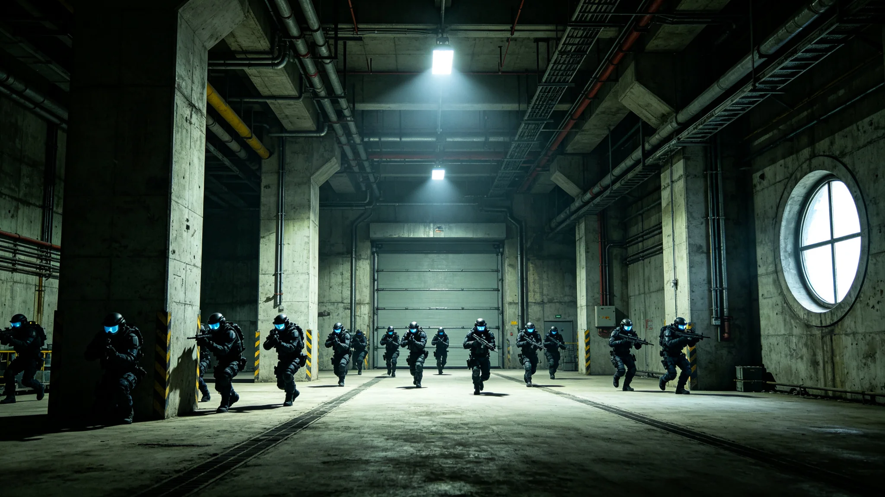

# 三恒星系联合反恐演习与极端组织打击行动公报

**发布机构**：三恒星系联合安全理事会 / 反恐协调中心
**发布日期**：2994年11月5日
**文件等级**：跨星系公开（部分行动细节保密）

## 一、安全形势背景

2990年以来，三恒星系范围内的极端组织活动呈现上升趋势。安全情报显示，一个名为"纯净之路"的极端组织在三个恒星系均建立了地下网络，其核心主张为"反对跨星系融合、回归单一恒星系封闭自治"，并通过暴力手段试图破坏三恒星系之间的交通、通信和经济联系。

2992年至2994年间，"纯净之路"组织策划并实施了多起恐怖袭击事件：
- 2992年6月：在比邻星b新海市轨道港制造爆炸事件，造成12人死亡、47人受伤；
- 2993年2月：在鲸鱼座τ星地下城市第三层的交通枢纽放置炸弹，造成8人死亡、23人受伤；
- 2993年9月：试图劫持一艘从火星飞往比邻星b的客运飞船，被机组人员和安保人员制服，未造成人员伤亡；
- 2994年3月：在火星奥林匹斯城的供水系统中投毒（未遂），被安全部门及时发现并拦截。

据反恐协调中心评估，"纯净之路"组织的核心成员约300-500人，外围支持者约3,000-5,000人，主要活动区域为鲸鱼座τ星地下城市的深层区域、火星的偏远矿区和比邻星b的部分边缘社区。该组织的资金来源包括非法采矿、走私和数字货币洗钱。

## 二、联合反恐演习

为提升三恒星系安全力量的协同作战能力，联合安全理事会于2994年8月至10月组织了代号为"深空之盾-2994"的大规模联合反恐演习。演习由三恒星系联合安全理事会反恐协调中心统一指挥，参演力量包括：

- 比邻星b：轨道安全部队2个中队（约600人）、地面反恐特警队4支（约400人）、情报分析人员80名；
- 鲸鱼座τ星：地下城市安全部队3个大队（约900人）、深空巡逻艇4艘；
- 火星：联邦安全部队1个旅（约1,200人）、轨道拦截飞船2艘；
- 联合指挥部：来自三方的指挥和参谋人员约120名。

演习设置了以下科目：

**科目一：跨星系情报共享与协同追踪**
模拟"纯净之路"组织成员在三个恒星系之间流窜，三方情报机构通过加密通信链路实时共享情报，协同追踪目标。演习中，情报从发现到三方同步的时间从平时的平均4小时缩短至23分钟。

**科目二：地下城市反恐突击**
在鲸鱼座τ星地下城市的一个废弃区域（已提前清空居民），模拟恐怖分子劫持人质并设置爆炸装置。参演部队进行了多层立体突击：从通风管道渗透、从正面破门强攻、从地下管道迂回，最终在18分钟内"击毙"6名"恐怖分子"、"解救"12名人质、拆除3枚"炸弹"。

**科目三：星际飞船反劫持**
模拟一艘客运飞船被恐怖分子劫持，三方安全力量协同进行星际追击和登船突击。演习中，火星的轨道拦截飞船首先追上"被劫持"飞船并进行威慑，比邻星b的特种部队通过对接舱登船，在12分钟内控制了全船。

**科目四：网络反恐与信息战**
模拟恐怖组织对三恒星系的关键基础设施（电网、通信网络、交通调度系统）发动网络攻击。三方网络安全部队协同进行防御和溯源，在45分钟内阻断了所有攻击，并溯源定位了攻击源。

**科目五：大规模伤亡应急响应**
模拟恐怖袭击造成大规模伤亡，三方医疗力量通过跨星系远程诊疗系统协同救治伤员。演习中，鲸鱼座τ星的伤员通过远程诊疗系统获得了比邻星b顶级外科专家的实时指导，手术成功率达到96%。

## 三、打击行动

在演习的同时，三恒星系安全力量根据演习中磨合的协同机制，对"纯净之路"组织发起了代号为"净化行动"的联合打击。行动从2994年9月15日开始，至10月20日结束，历时36天。

行动成果如下：

- **抓获核心成员**：在三个恒星系共抓获"纯净之路"组织成员187名，其中包括该组织的二号人物和三号人物（一号人物在行动中拒捕被击毙）；
- **摧毁据点**：捣毁该组织在鲸鱼座τ星地下城市深层的2个训练基地、在火星偏远矿区的1个武器藏匿点、在比邻星b边缘社区的3个安全屋；
- **缴获物资**：缴获爆炸物约2.3吨、各类武器420件、非法采矿设备15套、数字货币资产约1,200万信用点；
- **解救被胁迫人员**：解救被该组织胁迫参与活动的人员43名，其中包括12名未成年人。

行动中，三方安全力量有3人受伤（均为轻伤），无人员死亡。联合安全理事会对行动成果表示满意，认为"净化行动"是三恒星系安全合作的成功范例。

## 四、长效机制建设

基于演习和打击行动的经验，联合安全理事会决定建立以下长效反恐机制：

1. **三恒星系反恐情报共享平台**：建立实时情报共享系统，三方情报机构24小时不间断交换恐怖主义相关情报；
2. **联合反恐快速反应部队**：组建一支约500人的联合反恐快速反应部队，基地设在比邻星b轨道，可在24小时内部署至三恒星系任何地点；
3. **跨星系反恐法律协作**：完善恐怖主义犯罪的跨星系引渡和司法协助机制，确保恐怖分子无处可逃；
4. **反恐资金监控**：建立三恒星系统一的反恐资金监控网络，对可疑的资金流动进行实时监测和冻结；
5. **极端主义预防与去激进化**：在三个恒星系开展极端主义预防教育，建立去激进化中心，对已受极端思想影响的人员进行心理干预和社会回归辅导。

联合安全理事会秘书长在公报中表示："恐怖主义是人类文明的毒瘤，它不会因为我们跨越了光年就自动消失。'纯净之路'组织的存在提醒我们：文明的融合不是自然而然的，它需要我们去捍卫。三恒星系的安全力量今天证明了：无论恐怖分子躲在哪个恒星系、哪层地下城市、哪个小行星背后，我们都能找到他们、打击他们。安全不是理所当然的，它是每一个尽职的安全人员用汗水和勇气换来的。"
