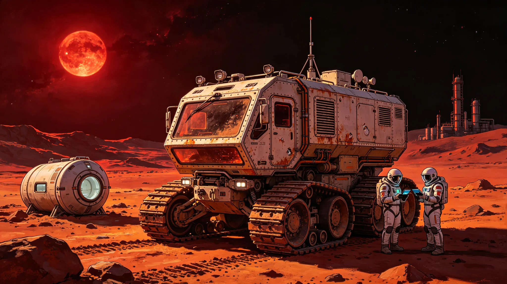

# 三恒星系文明联合体首任秘书长就职传记与施政纲领

**发布机构**：三恒星系文明联合体执行委员会 / 秘书长办公室
**发布日期**：3000年7月1日
**文件等级**：跨星系公开

## 一、就职典礼

3000年7月1日，三恒星系文明联合体首任秘书长就职典礼在比邻星b新海市"文明厅"隆重举行。联合体议会选举产生的首任秘书长——来自比邻星b的政治家韩星河——在联合体法院首席大法官的见证下宣誓就职。

就职典礼汇聚了来自三恒星系的约5,000名嘉宾，包括各成员政府的首脑、联合体议会议员、各界代表和国际观察员。通过量子通信和中微子通信链路，全球约30亿人观看了就职典礼的直播。

韩星河在就职演说中说："今天，我们站在一个新纪元的起点。3000年——这个数字本身就充满了象征意义。一千年前，人类还在地球上为了国界和信仰而战。五百年前，人类刚刚踏上星际航行的第一步。今天，我们在三个恒星系之间建立了一个统一的文明联合体。这不是终点，而是新的起点。从今天起，'我们'这个词，不再属于某一个国家、某一颗行星，而是属于散布在三恒星系的所有人类。"

## 二、个人传记

**（一）早年经历**

韩星河，2935年出生于比邻星b第一大陆架新海市的一个工程师家庭。父亲是轨道电梯工程的结构工程师，母亲是小学教师。韩星河自幼成绩优异，16岁考入比邻星b大学政治学系，20岁以第一名成绩毕业，随后进入跨恒星系高级研究院攻读国际关系博士学位。

2960年，韩星河博士毕业，进入比邻星b行星管理委员会外交部门工作，担任跨星系事务专员。在此期间，他参与了多项跨星系协议的谈判，包括《跨恒星系税收协定》（GS-2976-01）和《三恒星系联合发展银行成立协议》（GS-2973-01），展现出卓越的谈判能力和政治远见。

**（二）政治生涯**

2972年，韩星河当选比邻星b行星管理委员会议员，开始正式政治生涯。在议会中，他积极推动跨星系合作议题，是"三恒星系文明联合体"构想的早期支持者之一。2980年，他出任比邻星b行星管理委员会副主席，主管跨星系事务。

2985年，韩星河作为比邻星b的首席代表，参加了在新海市举行的"三恒星系发展峰会"，并在会上正式提出建立文明联合体的构想。此后14年间，他作为联合体筹备委员会的核心成员，全程参与了宪章的起草和谈判工作，被称为"联合体宪章的主要建筑师"。

2999年12月宪章签署后，韩星河被三方一致推举为联合体首任秘书长候选人。3000年4月，联合体议会首次全会以92%的高票选举韩星河为首任秘书长。

**（三）个人品格与政治理念**

熟悉韩星河的人普遍评价他为"务实的理想主义者"。他既有宏大的文明视野，又有脚踏实地的执行能力。在14年的宪章谈判中，他以耐心、包容和坚定著称——在原则问题上毫不动摇，在细节问题上灵活妥协。

韩星河的政治理念可以概括为"文明共同体主义"：他认为，人类文明已经进入跨恒星系时代，传统的民族国家和单一恒星系政府已无法应对跨星系的挑战，人类需要建立一个更高层次的政治共同体来维护共同利益。但他同时强调，联合体不应是一个集权的超级政府，而应是一个"多元一体"的政治架构——尊重各成员的多样性和自治权，同时在共同利益领域实现有效协调。

## 三、施政纲领

韩星河在就职典礼上公布了其六年任期（3000-3006）的施政纲领，核心包括以下五大领域：

**（一）机构建设与制度完善**

- 在3001年底前完成联合体所有行政部门的组建，建立高效的跨星系行政体系；
- 制定联合体的配套法律法规，包括《联合体预算法》《联合体公务员法》《跨星系人员自由流动法》等；
- 建立联合体的财政体系，联合体预算来源为各成员按GDP比例缴纳的会费（初期为各成员GDP的0.5%），未来逐步增加联合体自有财源（如跨星系贸易税、航天发射税等）。

**（二）跨星系基础设施建设**

- 推进"三恒星系通信骨干网"建设，在3005年前实现量子通信和中微子通信的全覆盖，将跨星系通信总带宽提升10倍；
- 推动"三恒星系航道升级计划"，在主要航道上部署尘埃探测中继站和导航信标，提升航行安全和效率；
- 支持鲸鱼座τ星行星磁场增强工程（GS-2989-01），将其列为联合体重点工程，提供资金和技术支持。

**（三）经济一体化**

- 推动建立"三恒星系自由贸易区"，在3004年前取消三恒星系之间的大部分贸易关税和非关税壁垒；
- 研究发行联合体统一货币"星元"的可行性，计划在3008年前完成可行性研究，3015年前逐步推行；
- 建立三恒星系劳动力自由流动机制，实现专业资质的跨星系互认。

**（四）科技与教育合作**

- 建立"三恒星系联合科研基金"，每年投入约200亿信用点，支持跨星系重大科研项目（包括深空探测、生命科学、人工智能等领域）；
- 推动建立"三恒星系联合大学"体系，实现学分互认、学位互授、师生自由流动；
- 加大对基础研究的投入，目标在3006年将三恒星系研发总投入占GDP的比例从目前的3.2%提升至4.5%。

**（五）安全与防务合作**

- 整合三恒星系的安全力量，建立"联合体安全协调机制"，统一协调反恐、反海盗、灾害应急等安全事务；
- 推进"三恒星系联合空间态势感知网络"的升级，实现对三恒星系空间的全时段、全覆盖监测；
- 重申三恒星系的和平发展承诺，联合体不设常备军，安全力量以各成员的安全部队为基础，通过联合演习和协调机制实现协同作战能力。

## 四、面临的挑战

韩星河在就职演说中也坦诚地指出了联合体面临的挑战：

1. **信任赤字**：部分民众对联合体的必要性和效率存在疑虑，担心联合体成为"官僚主义的巨兽"。韩星河承诺，联合体将坚持"最小政府"原则，只做各成员单独做不了的事；
2. **通信延迟**：三恒星系之间4-12年的通信延迟是联合体治理的根本性挑战。韩星河表示，联合体将充分利用量子通信的零延迟优势和中微子通信的大带宽优势，同时探索"分布式治理"模式，在通信延迟的约束下实现有效治理；
3. **发展不平衡**：三个恒星系的经济发展水平存在差距（比邻星b人均GDP最高，鲸鱼座τ星最低）。韩星河承诺，联合体将通过"联合发展基金"和技术转移机制，帮助欠发达成员加快发展；
4. **身份认同**：如何让48亿人建立"联合体公民"的身份认同，是一个长期挑战。韩星河表示，将通过文化交流、教育合作和共同的文明项目，逐步培育跨星系的文明认同。

## 五、历史定位

韩星河作为三恒星系文明联合体的首任秘书长，其历史地位已经注定。他不仅是一个政治人物，更是一个时代的象征——人类文明从"多恒星系分散"走向"跨恒星系一体"的标志性人物。

联合体议会首任议长在韩星河就职典礼上的致辞中说："韩星河秘书长的名字，将与'联合体'这个词永远联系在一起。他用14年的时间帮助建立了这个机构，现在他要用6年的时间让这个机构运转起来。历史给了他一个艰难的使命，也给了他一个不朽的机会。"

韩星河在就职演说的最后说道：

"我出生在比邻星b，但我的祖父母出生在地球。我的孩子可能会去鲸鱼座τ星工作，我的孙子可能会出生在我们尚未发现的某颗行星上。我们这一代人的使命，就是确保无论人类的后代走到哪里，他们都知道自己是谁、从哪里来、属于谁。

三恒星系文明联合体不是一个政府，而是一个承诺——承诺我们永远是一家人，永远不放弃彼此，永远在宇宙中作为一个整体而存在。

这个承诺的有效期，是永远。"
