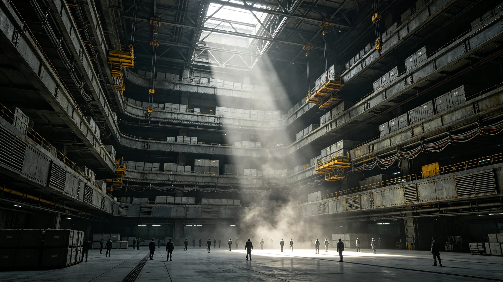

# 三恒星系文明联合体秘书处及八大部委正式挂牌与首批编制到位公报

**发布机构**：三恒星系文明联合体执行委员会 / 秘书处编制与交接办公室
**发布日期**：3001年1月15日
**文件等级**：跨星系公开
**主送**：联合体议会、各成员政府、各常设委员会

---

## 一、挂牌情形

依《三恒星系文明联合体宪章》及首任秘书长就职施政纲领中"于3001年底前完成联合体全部行政部门组建"之承诺，秘书处编制与交接办公室经与各成员人事主管部门逐轮核对，确认如下八部委已于3001年1月上旬在新海市联合体中枢东翼完成挂牌、接印、钥匙移交与门禁权限开通：

1. 综合事务部（文秘、礼宾、档案总目）；
2. 财政与预算部；
3. 跨星系贸易与产业部；
4. 通信与导航事务部；
5. 公共卫生与人口部；
6. 生态与环境事务部；
7. 安全与应急协调部；
8. 科技与教育合作部。

挂牌当日，各部委正职在交接办公室见证下签署《部门印章启用与首件公文签收单》。交接办公室存档的签收单共八份，其中财政与预算部签收时间较约定晚四十一个工作小时——原因系该部首笔办公账户开立需经三方开户行联签，联签报文须经量子纠缠信道往返确认。此事已在本公报附录《首月交接异常台账》第04项留痕，不视为延误违纪，仅作流程记录。

## 二、首批编制到位情况

截至3001年1月14日24时，八部委核定首批编制合计1,247名，实际到岗986名，到位率79.1%。各成员按《筹备协议》分摊的借调人员到位率分列如下：

| 成员 | 分摊编制 | 实际到岗 | 到位率 |
|---|---|---|---|
| 比邻星系（含新海市中枢） | 612 | 511 | 83.5% |
| 鲸鱼座τ星系（鲸港—绿原带） | 389 | 274 | 70.4% |
| 太阳系（地月—主带—火星） | 246 | 201 | 81.7% |

鲸鱼座τ星系到位率偏低，主因有二：其一，该星系首批拟调入人员中，21人仍在地下城市生命保障系统轮值岗位上，按《鲸鱼座τ星地下城市生命保障系统设计白皮书》（GS-2917-01）规定的最低在岗人数不得空岗，需待接班班组培训结业后方可离队；其二，跨星系通勤需乘定期航线班船，3000年第四季度舱位已被年末物资调运挤占，拟调入人员登船日期顺延至3001年2月上旬。交接办公室已将上述情况列入《跨星系通勤调度优先事项》提请通信与导航事务部协调，不追究鲸鱼座τ方违约。

## 三、未到位人员的过渡安排

对尚未到岗的261名拟调入人员，交接办公室采取如下过渡办法：

- **在岗留用**：原单位继续保留其岗位与薪酬，联合体不重复发放，以免出现"双薪空饷"；
- **远程暂代**：允许其在原驻地通过量子纠缠信道临时承担文稿起草、数据核对等不涉及涉密决策的辅助工作，暂不授予正式签章权限；
- **到岗核销**：以本人在新海市中枢门禁首次刷卡记录为到岗起算点，补领工作证、体检建档、指纹与虹膜二次录入。

交接办公室特别提醒：凡未完成联合体入职体检者，不得进入反应堆区、生物安全三级以上舱段及档案"文枢"核心机房。该项规定援引《跨恒星系医疗保障与远程诊疗制度标准化公报》（GS-2938-01）第11条。

## 四、首月即暴露的三处流程问题

挂牌不等于顺畅运行。交接办公室在首月跟班记录中如实登记三处问题，一并通报，供议会预算委员会与审计部门日后核查：

**（一）三系公文格式不统一。** 比邻星系来文用竖排、全角标点、落款加朱印；鲸鱼座τ星系因地下城市采光与显示习惯，公文多用横排紧凑式、省略敬语；太阳系来文附大量工程附件索引。同一份《季度报表》在三处汇总时格式不兼容，"文枢"数据录入环节返工两次。交接办公室已起草《联合体公文格式暂行通则（草案）》，拟于3001年第二季度提交议会常设委员会。

**（二）跨星系考勤钟面不一致。** 三系各自沿用本地星历与自转日长度，员工"到岗时间"无法直接对齐。通信与导航事务部已就此提出《三恒星系标准时统一》预研立项，见另件技术报告。本公报不展开。

**（三）借调人员身份认同过渡。** 首批到岗人员中，有人在原单位已任处长，到联合体后被定为"专员"，心理落差明显。公共卫生与人口部下属人事心理组已启动跟踪，未上报任何确诊案例，但已作匿名情绪抽样记录留档。

## 五、不设常备军与最小政府原则的重申

秘书处挂牌之际，社会上有"联合体是否将组建统一官僚机器"的疑问。执行委员会就此重申：依宪章及首任秘书长施政纲领，联合体不设常备军，安全事务以各成员安全部队为基础、通过安全与应急协调部实现协同（参见GS-3000-03所载施政纲领第五项）；联合体行政坚持"最小政府"原则，八部委仅承担各成员单独无力办理之跨星系事务，凡可由成员自行办理者一律不下放、不新增编制。

首批1,247名编制系"启动编制"，非"永久编制"。交接办公室声明：至3006年首届任期届满，秘书处将依据实际事务量对编制进行一次全面复核，冗余编制一律撤回各成员原单位，不以任何理由转固化。

## 六、附件清单（存"文枢"）

1. 八份《部门印章启用与首件公文签收单》（影印件）；
2. 《首月交接异常台账》（共17项，本公报摘录4项）；
3. 三系人员分摊与到岗统计表（原始考勤刷卡记录导出件）；
4. 《联合体公文格式暂行通则（草案）》第0稿。

**抄送**：联合体审计长办公室（备核）、监察专员筹备组（备核）。
**本公报原件**加盖联合体秘书处钢印，骑缝处由编制与交接办公室主任手书签字，签名后附本人虹膜核验码。
