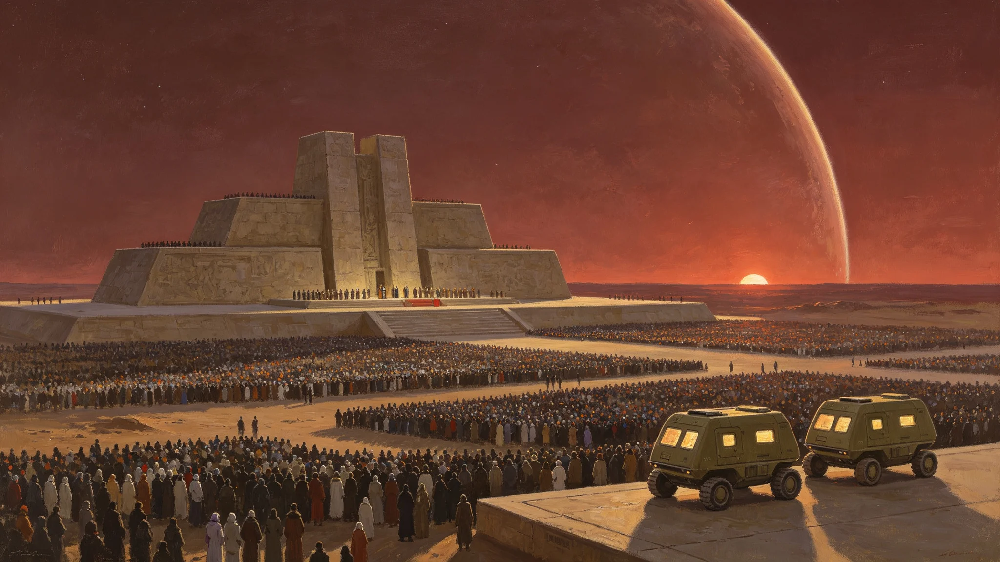

# 三恒星系文明联合体首个"联合体日"确立暨新海市升旗观礼典礼公报

**发布机构**：联合体秘书处文化与礼宾司
**发布日期**：3002年1月1日
**文件等级**：跨星系公开

---

## 一、纪念日的确立

依《三恒星系文明联合体宪章》附则授权，执行委员会于3001年11月7日常务会议决议：将每年1月1日定为"联合体日"，作为三恒星系共同的公共纪念日。选择该日，系因其为宪章签署日后首个完整公元纪年之元旦，取"一元复始、三方同轨"之意，无纪念任何个人之企图。

联合体日不取代三系各自既有节日：比邻星b之"深呼吸日"（GS-2905-01）、鲸鱼座τ星之"着陆纪念日"（GS-2919-01）与"红矮星日出节"（GS-2956-01）、太阳系各定居点之"出港纪念日"（GS-2949-01）等，均继续由各成员自行庆祝，本纪念日为叠加，不废黜旧俗。

## 二、新海市主典礼

首个联合体日主典礼于3002年1月1日上午在新海市中央合盟广场举行。礼宾司在册登记的现场观礼人数为12,417人，另通过量子纠缠信道同步观礼的远端注册观众合计2.7亿人（三系分布：比邻星系1.4亿、太阳系0.9亿、鲸鱼座τ星系0.4亿）。

典礼流程共九项，礼宾司实录如下：

1. 三方护旗队同时入场，护持三面旗——比邻星b旗、鲸鱼座τ星旗、太阳系旗，分列广场三级台基；
2. 合盟旗（蓝—金—灰三色横条，中央三颗相连恒星）由三方各一名护旗手共同升旗，不单独由某一方升旗，以符"三方共举"之意；
3. 秘书处宣读《宪章》序言首段（不读全文，以示纪念而非重复立法）；
4. 三方儿童代表（各一名，均系在本星系出生的第三代或以后公民）共同向广场中央"盟石"献花；
5. 一分钟静默，缅怀从地球启航至今历次为跨星系航行献身者；
6. 礼炮二十一响（联合体不鸣礼炮致敬个人，此二十一响系致敬宪章三方签署，每方七响）；
7. 三系青少年合唱队轮流演唱本星系代表性民谣一段，不演唱统一"盟歌"——联盟歌尚未起草，秘书处明确：不急于为共同情感立法；
8. 广场开放，观礼民众可自由进入献花、合影；
9. 典礼散场，环卫组登记垃圾清运量。

## 三、去个人化的几处安排

礼宾司在筹备中主动作了如下"去个人化"处理，特此记录，以备后世查考：

- 不设"首唱盟歌"，因盟歌尚未经文化委员会评议；
- 不在广场竖立任何在世人物半身像，仅立无铭文"盟石"一块，待五十年后再议是否镌刻文字；
- 秘书长出席观礼，但不发表长篇演说，仅致词三分钟，内容为请三方互相问好；
- 不发行"首日封"纪念邮品牟利，仅向现场观礼者免费发放无面额纪念册页一页。

礼宾司认为，一个尚在襁褓中的联合体，最忌把纪念日办成某个人的生日。故宁可朴素，不事铺张。

## 四、三系远端同步观礼的技术说明

鲸鱼座τ星系距新海市约11光年，其现场观礼者无法与新海市"同时"升旗——光信号需11年才能到达。礼宾司与通信与导航事务部协商后采取如下安排：

- 新海市主典礼按本地时间举行；
- 鲸鱼座τ星与太阳系各设"同步观礼点"，播放新海市主典礼的量子纠缠信道实时录传（量子信道瞬时无延迟，故可真正同步）；
- 同时在各观礼点保留一段"光程提示"字幕，注明"此刻你所见之光，若走普通光束，自出发至今已历若干年"。

礼宾司刻意保留这行提示，是希望首次联合体日就让公民习惯一个事实：三系并非一个"邻里"，而是被光年分开、却被制度缝合的共同体。

## 五、首个纪念日的不完美

礼宾司不讳言首个联合体日的瑕疵，实录如下：

- 广场观礼区第三排水点因零下露点凝结，地面湿滑，一名观礼老人滑倒，所幸仅皮肉伤，公共卫生与人口部现场处置，无后续；
- 三系民谣合唱时，鲸鱼座τ星代表因地下城市出身，习惯了较长的回声，其演唱节奏在新海市露天场地上偏慢半拍，现场有轻微哄笑，随即鼓掌；
- 散场后广场遗留可回收垃圾1.2吨，环卫组次日完成清运，未造成任何公共卫生事件。

礼宾司将上述三事一并入档，意在说明：这是联合体的第一个元旦，办得并不完美，也不需要完美。

## 六、附：次年安排预告

经执行委员会决议，第二个联合体日（3003年1月1日）主典礼改在太阳系地月系某轨道城市举行，以体现"轮流主礼、不锁死一城"之原则。此后每年主礼地由三系轮值。
