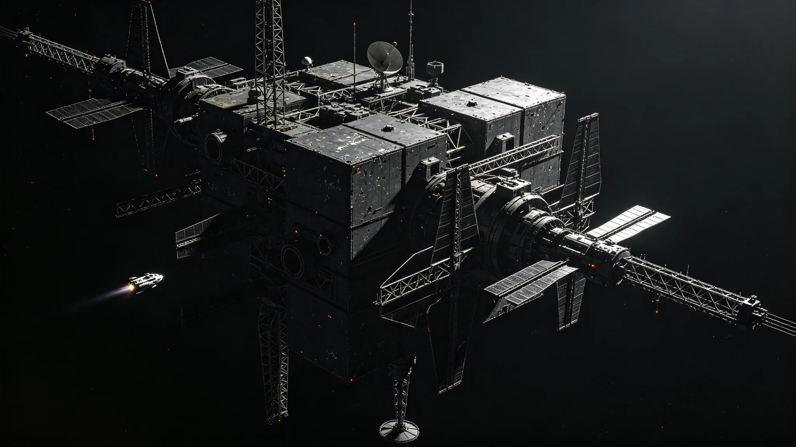

# 跨星系政务激光通信专网首条"议会专线"贯通技术报告

**编制单位**：通信与导航事务部 · 跨星系通信工程处
**报告编号**：CTC-3003-017
**密级**：内部公开（议会、审计、监察可阅）

---

## 一、任务缘起

首任秘书长施政纲领承诺"于3005年前实现量子纠缠通信与中微子通信的政务全覆盖"（见GS-3000-03）。量子纠缠信道已在2997年随《跨恒星系中微子通信链路首次贯通测试公报》（GS-2997-01）打通骨干，但该链路以中微子大带宽、量子纠缠瞬时为主，仅承担报文级政务。议会立法表决、预算案远程签字、跨系公证等高频、高冗余、需长时连续传输的政务，仍须另建一条以相干激光为载体、可跨系中继的"议会专线"。

本工程即首条贯通新海市—地月L5—鲸港三点的政务激光专线，代号"议会专线"。

## 二、链路构成

专线不新建单一超大型发射阵，而是在三系既有深空测控与中继设施之间串联三段：

- **东段（新海市—比邻星b高轨"衔环-3"站）**：沿用已建成的高轨第一拉格朗日点驻极聚光镜阵二期成果（见GS-2668-01）作光参量放大中继；
- **中段（比邻星b—太阳系地月L5）**：跨光年距离，采用已扩建的"烛照"发射阵三期口径（见GS-2582-01）与地月L5接收端对瞄；
- **西段（地月L5—鲸港）**：利用三系联合深空导航信标网（见GS-2555-01）的现有光端口改接，不另立新站。

整链共设中继站7座，其中新建仅2座，其余5座为既有设施改造。工程处认为"能改不建"是本工程节约跨系建设成本的关键。

## 三、贯通测试实测数据

3003年6月18日03:11（新海市时），专线完成首次全链贯通。工程处实测指标如下：

| 指标 | 设计值 | 实测值 | 结论 |
|---|---|---|---|
| 单程新海市↔地月L5光时 | 约4.22年 | 4.221年 | 符合相对论预期 |
| 链路瞬时时延（量子纠缠辅助） | 0 | 0 | 符合 |
| 误码率（连续72小时） | ≤1×10⁻⁹ | 6.2×10⁻¹⁰ | 达标 |
| 单次议会表决报文往返（量子信道） | 秒级 | 1.4秒 | 达标 |
| 长文件归档激光段吞吐 | 设计500 Mb/s | 实测417 Mb/s | 略低，留待扩容 |

吞吐略低于设计值，工程处如实说明：地月L5接收端今年第四季度将迎来一次太阳合日，接收面临时遮光，实测系在轻度日杂光条件下测得，非链路本身缺陷。

## 四、与中微子、量子信道的分工

工程处刻意避免"一条链路包打天下"，三信道分工如下，写入《政务信道调度规程》：

- **量子纠缠信道**：瞬时、小带宽，专用于表决签字、密钥分发、紧急调度；
- **相干激光专线（本件）**：中等带宽、可连续，专用于议会录播、长卷公文传输、跨系公证影像；
- **中微子链路**：大带宽、低时延不确定性，专用于大数据归档、科研数据回传。

三信道互为备份。任一信道中断，政务不得停摆——此为3022年那次"中微子闪断致立法迟延"事件之后（见另件GS-3022-01）所确立的铁律，本工程在设计时已预留自动切换逻辑。

## 五、已知限制与不承诺事项

工程处在此明确写入本报告，避免议会与公众产生超出技术现实的期待：

1. 专线不能消除"光程延迟"。凡涉及实时辩论、临场质询的政务，新海市与鲸港之间仍存在约22年的"真实光时"。议会辩论一律采用"异步对答"制——此点见另件《宪章首次修正案（延时治理条款）》（GS-3041-01）。
2. 专线下行功率受恒星射电噪声季节性影响，每年各系合日期间吞吐下降约三成，属物理限制，非运维事故。
3. 本专线不承载民用通信。民用跨系通信仍走商用信道，本专线仅政务。

## 六、验收结论与后续

3003年6月20日，验收委员会（含独立第三方两名通信工程师、议会预算观察员一名、监察专员列席一名）签署《议会专线贯通验收单》，结论为"有条件通过"：准予投入政务试运行，六个月内须完成地月L5合日后复测，复测报告另行上报。

工程处特别记录：验收会上，监察专员列席人员仅在会议纪要空白处批注一行字——"未发现利益输送，建议下季度抽查中继站7号站采购合同。"该批注原样入档，未作回应，留待后续抽查。

---
**附件**：链路拓扑图（存"文枢"）；7座中继站逐站验收单；72小时误码率原始波形导出件；合日影响预测模型。
