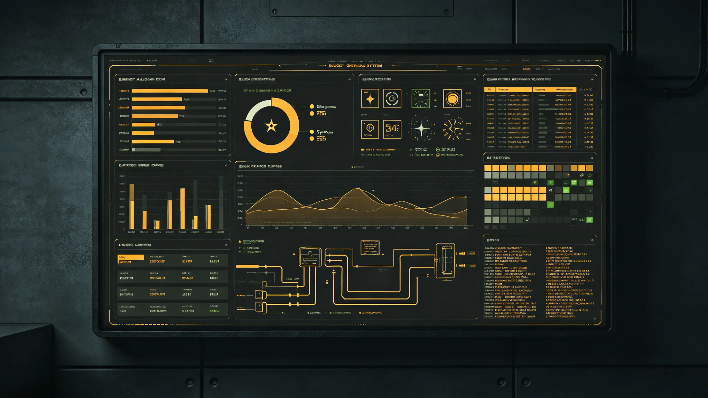

# 三恒星系文明联合体财政年度与预算表决程序制度确立公报

**发布机构**：财政与预算部 / 联合体议会常设预算委员会
**发布日期**：3007年2月28日
**文件等级**：跨星系公开

---

## 一、为什么要先立法、再花钱

秘书处挂牌（GS-3001-01）后的头六年，联合体花钱一直"无定时、无定序"：各部委要钱就报，议会有空才批，三系财政年度又各不相同——比邻星b按公转年、鲸鱼座τ星按地下城市周期、太阳系按地球历年。结果是同一笔跨系基建拨款，三系账上记成三个年份，审计对不上。

财政与预算部经一年酝酿，于3007年2月将《联合体财政年度与预算表决程序法》提交议会，本公报即该法通过施行之公告。

## 二、三条核心制度

**（一）统一财政年度。** 联合体自3007年起，以"协星历"（注：联合历法正式颁行见GS-3012-01；此前先用过渡公历）的1月1日至12月31日为一个财政年度。各成员本财年可自便，但向联合体上报的一切账目，一律折算到此统一年度。

**（二）预算表决时序。** 法定时序如下，不得颠倒：

1. 每年9月底前，财政与预算部向下一年度预算草案；
2. 议会常设预算委员会10月听证；
3. 11月全体会议表决；
4. 12月15日前完成，否则按上年度预算的九折自动执行（此条为避免政府停摆的"兜底条款"，详见下文）。

**（三）表决门槛。** 预算案须获全体议员三分之二多数通过，且三系各自过半数议员赞同——即"双多数"：整体多数 + 分系多数。此设计是为防止人口最多的比邻星系单独通过不利于另两系的预算。

## 三、那条后来被反复考验的"兜底条款"

财政与预算部在立法时已预见：跨系议会极易陷入"谁都不让谁"的僵局。故写入第14条"自动续行条款"：

> 若议会未能于12月15日前通过新预算，则自次年1月1日起，自动按上一年度预算的九成执行，直至新预算通过。自动续行期间，任何部委不得新签跨系采购合同。

立法者在此明确：兜底条款不是"纵容僵局"，而是"给僵局上锁"——它让政府不至于停摆，但也不让僵局中的任何一方多花一分钱。后来的事实证明，这条条款在3016年那场四十三日停摆（GS-3016-01）中确实起了作用：政府没停摆，只是按九成挨饿。本立法当年埋的种子，日后自己发了芽。

## 四、会费比例的争议与妥协

各成员按其跨系GDP比例缴纳会费（首任秘书长施政纲领定为初期0.5%，见GS-3000-03）。立法表决时，鲸鱼座τ星系提出：三系GDP差距大，固定比例对鲸港不公。

最终妥协写进附则：
- 比邻星系按0.5%；
- 太阳系按0.5%；
- 鲸鱼座τ星系按0.3%，差额由联合发展银行（GS-2973-01）从其跨系投资收益中补足。

这一"比例不一、发展补偿"的安排，是3007年立法时最具争议、也最具妥协精神的一条。财政与预算部在此记录：它不是绝对公平，而是"在发展不平衡的现实中，尽量不让最穷的一方被制度压垮"。

## 五、审计独立的提前写入

立法第22条规定：审计长独立于财政与预算部，直接对议会负责。此条在立法时看似超前（审计长到GS-3017-01才有首任），但立法者坚持先把位置写死，免得日后"先花钱、后找人查"。

---
**附件**：法全文（存"文枢"）；三系GDP折算基数表；兜底条款第14条立法理由书。

## 六、首份按新法编制的预算案要点

3007年法施行后，首份按新时序编制的是3008年度预算案，于3007年9月28日由财政与预算部提交，11月19日全体会议表决通过，较法定12月15日截止提前二十六日。该案总盘子经双多数通过，按用途大类分列如下（单位：信用点等值，节选）：

| 用途大类 | 3008年度拟列 | 占比 |
|---|---|---|
| 八部委运行与人员经费 | 约 9,800万 | 21% |
| 跨系通信与导航基建（议会专线等） | 约 1.1亿 | 24% |
| 跨系生态与生物安全 | 约 7,400万 | 16% |
| 联合发展银行股本增资 | 约 9,200万 | 20% |
| 应急储备（未分配） | 约 8,600万 | 19% |

财政与预算部注明：应急储备19%系有意留出，不在本年度分配——跨系治理最大的不确定性，恰恰是预算编制时无法预见的那部分。

## 七、表决记录与弃权分布

3008年度预算案表决，应到议员 127 名，实到 121 名，赞成 89 票，反对 22 票，弃权 10 票。按系别核对：比邻星系过半、太阳系过半、鲸鱼座τ星系以 18 票赞成对 7 票反对过半——双多数均满足。反对与弃权票主要来自对"应急储备过高、当年不敢花钱"的异议，财政与预算部在表决后当场记录，不视为对立。

## 八、与各成员本财年的衔接成本

统一财政年度要求各成员把本系账目折算上报，第一年各成员财政部门为此额外投入工时合计约 2.3万人时。鲸鱼座τ星系因地下城市原按人工周期记账，折算了两轮才对齐。财政与预算部承认：统一账制在第一年是有摩擦的，这笔摩擦成本已计入3008年度运行经费，不另列。

## 八之二、预算公开与查阅

3008年度预算案表决通过后，除涉军事调度与安全应急的科目外，全部科目按星汇结算口径在"文枢"公开，任何联合体公民凭本人公民号可查阅大类与明细，不设查阅门槛。财政与预算部声明：公开不等于人人可评论——评论渠道在议会旁听席位（见另件GS-3020-01），不在金库账房。账可以透明，账房不接待吵嘴。
