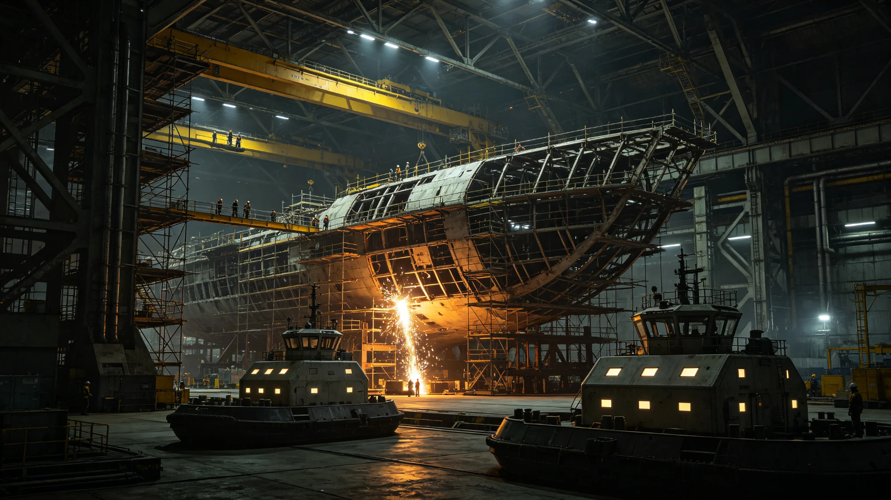

# 跨星系中继港总工程师任内工程日志与体检通报合订

**归档单位**：科技与教育合作部 / 工程人事组
**档号**：ENG-CE-3011-002
**密级**：技术公开、个人隐私部分脱敏

---

## 卷首

本卷不写"伟大工程师"。它是一个总工程师在中继港筹建期的工程日志摘页、一次体检通报与一次焊缝复检不合格单的合订。功绩在工程本身，不在本卷。

---

## 一、登记页

- 姓名：闻铁桥
- 出生：2942年，太阳系主小行星带"铸星"城市群（见GS-2061-01、GS-2198-01）
- 现任：跨星系中继港筹建总工程师（3008年受命，中继港正式开工见GS-3024-01）
- 前职：主带某轨道船坞结构主管
- 入职体检：3008年2月，焊工尘肺初筛阴性，听力高频轻度下降（长期近距焊接史）

## 二、工程日志摘页（择要）

**3008-09-14**：第一次三系结构方案比选会。鲸港方主张地下中继、比邻星b方主张轨道浮置、主带方主张就地采矿建造。会议吵了十一个小时，无结论。日志原话："三方都对，就是凑不到一块。先休会，各自回去算钢量。"

**3009-03-02**：定案。折中方案——轨道浮置为主，主带供料，鲸港做地下备件库。日志原话："不是谁赢了，是钢量算下来，谁都输不起，只好合。"

**3010-11-20**：首批主承力桁架在主带厂预拼装，复检发现一段焊缝射线探伤不合格。日志原话："拆。重焊。不赶这三天。"

**3011-05-08**：本人连续驻坞第九周。日志原话："今天头晕，明早去查。"

## 三、体检通报（公共卫生与人口部出具）

**3011-05-09**：
> "主诉头晕、失眠三日。测血压偏高152/96。建议立即停止连续驻坞，离坞休养不少于十四日。"

闻铁桥当日即离坞，按医嘱休养。工程日志停更十四天——这是本卷唯一一段空白。工程组在其休养期间按已审定方案自行推进，未出事故。日志复更当日（3011-05-23），第一句是："船没翻。"

## 四、焊缝复检不合格单（法证存照）

3010-11-20那段焊缝，复检单摘录：
> "第A-27承力段主焊缝射线探伤，发现内部未熔合约23毫米，超过规范限值。处理：整段切除重焊，重焊后二次探伤合格。责任人：施焊班组四人，记录在案，不罚——探伤制度抓出了它要抓的东西，这是制度在工作，不是人的失败。"

闻铁桥在复检单空白处手书一行："制度抓到我头上来了，好事。"

## 五、卷尾

闻铁桥至今仍在任。本卷不是终卷。工程人事组不写"功勋卓著"之类评语——中继港是否成，要到3024年开工、更晚建成时，由验收报告说话。

## 六、任内考勤与驻坞统计（门禁导出）

工程人事组依门禁与船班记录，抄录闻铁桥筹建期（3008年受命至3011年7月）考勤概要：累计应到工作日约 946 天，实到 902 天，缺勤 44 天，其中 14 天为3011年5月按医嘱强制休养，其余为跨系往返差旅。驻坞连续最长一次为九周（即3011-05-08日志所记），经本人申报、医疗组劝返后终止。人事组注明：九周连续驻坞在主带船坞旧惯例中不算罕见，但跨系中继港筹建期不得沿用旧惯例——故将此次超长时间连续驻坞写入本卷，作为今后总工程师在岗时长的反面参照。

## 七、一次与三方代表的技术分歧记录

3010年初，比邻星b方结构代表主张将主承力桁架改用本地高比强度合金，可减重约一成。闻铁桥在技术评审会上未当场否决，只要求对方提供该合金在主带真空辐照十年后的疲劳数据。对方未能提供。会议结论照录："减重一成，无十年数据，不换。"人事组注明：这不是一次"技术英雄"的坚持，而是一次把"有没有数据"摆在"轻不轻"之前的常规评审。

## 八、卷终

本卷合订至3011年7月22日归档。闻铁桥后续任内日志、体检与焊缝记录，归其后续年份卷宗。工程人事组不预测中继港成败，只确认：截至本卷归档，该同志在岗、血压已回落至138/86、听力复查无恶化。

## 八之二、与三系结构班组的往来件

筹建期内，闻铁桥与主带供料班组、鲸港地下备件库班组、比邻星b轨道浮置班组之间，累计签署跨系技术联络件 214 份。人事组抽查其中 30 份，发现一个共同点：凡涉及主承力段的改动，闻铁桥必附"是否有十年辐照疲劳数据"一行追问，无一例外。有三份班组回件在该行旁批注"无，待补"，闻铁桥在"待补"二字旁回批"那就别改"。工程人事组注明：这不是某个人的谨慎，是一个跨系工程在没有足够数据时，唯一能用的态度。

## 八之三、筹建期成本概览

截至3011年7月，中继港筹建期累计投入约 4.7 亿信用点，其中主带供料预拼装占五成，三系结构方案比选与环评占两成，人员与差旅占一成半，其余为不可预见费。工程人事组注明：这4.7亿是"花在纸上和焊台上的钱"，中继港尚未真正开工（开工见GS-3024-01）。一个跨系工程在图纸阶段就花掉近五亿，是因为三方光程一来一回就是几年，错一步，代价不是工期，是十年。

## 八之四、本卷开放范围

本卷除闻铁桥本人体检血压数值属个人隐私、不予公开外，工程日志、焊缝复检单、考勤与跨系联络件均对议会审计与监察开放。任何以"总工程师个人崇拜"为目的的调阅申请，人事组不予批准。

**归档人**：工程人事组值班员（工号ENG-3011-037）
**本人确认**：闻铁桥（签名经虹膜核验）
