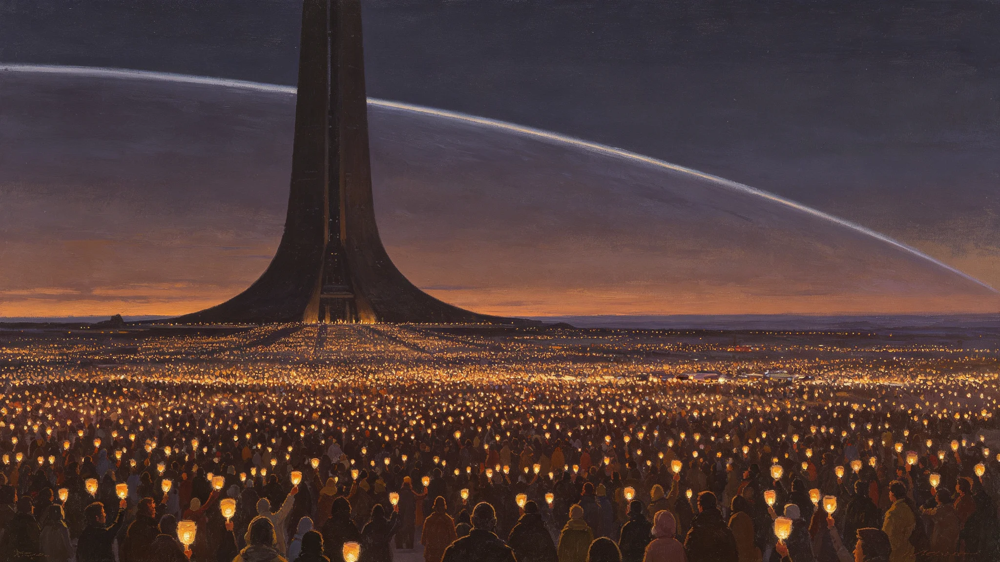

# 三恒星系联合历法"协星历"颁行与三系首次同步跨年共庆公报

**发布机构**：秘书处文化与礼宾司 / 计量与时间标准处
**发布日期**：3012年12月31日
**文件等级**：跨星系公开

---

## 一、从"几点"到"几月"

协时网（GS-3009-01）在3009年解决了三系"几点"的问题。但"几月、几年"仍乱：比邻星b按其公转年，鲸鱼座τ星地下城市按人工节令，太阳系按地球年。三份公文写同一个"年底"，在三处指三个日子。

经三年酝酿，三系历法委员会于3012年底议定联合历法，定名"协星历"，自3013年1月1日起施行。本公报即颁行与首次跨年共庆之实录。

## 二、协星历怎么定

礼宾司与计量处把技术方案译成白话：

- **年**：仍以公元纪年延续，不重订元年——公元3013年即协星历元年；
- **月日**：采用一个"中性月"，每月三十日，一年十二个月另加五日"过渡日"（闰年六日），不对应任何单一恒星系的公转；
- **本地节令保留**：协星历是"行政历"，三系各自的节庆（深呼吸日、着陆纪念日、红矮星日出节、出港纪念日等）仍按本地实际节令过，协星历只管公文、考勤、对账。

一句话：协星历是给制度用的，不是要替换谁家乡的月亮。

## 三、首次同步跨年

3012年12月31日午夜（协星标准时，见GS-3009-01），三系首次"同时"跨入新历元年。礼宾司实录：

- 新海市中央合盟广场，万人观礼，不鸣礼炮（沿用首个联合体日之简朴原则，见GS-3002-01）；
- 鲸港地下城市，因无真正的"夜"，人工照明在跨年瞬间统一调暗十秒再亮起——这是鲸港式的"守岁"；
- 太阳系地月L5轨道城市，观礼者悬于舷窗前，看地球与比邻星方向两个光点，十秒静默。

礼宾司特别记录：这次跨年没有"倒计时"——因为光程差，三系物理上本不可能"同时"看到同一刻。大家同步的，是协星标准时上的同一个数字，不是同一个物理瞬间。这正是联合历法的本质：用制度缝合物理上缝不上的东西。

## 四、不废除旧历

颁行协星历，不废三系旧历。礼宾司明确：旧历在民间生活、家信、地方志中继续使用，官方公文双轨并行十年（3013—3022），十年后视情决定是否并轨。

## 五、一处小尴尬

首次跨年，新海市某记者问礼宾司："协星历元年元旦，三系都放假吗？"礼宾司答："行政单位放假，工厂与医院不放假——联合体还没奢侈到能让生命保障系统停工一天的地步。"此言被各系媒体引用，礼宾司不删。

---
**附件**：协星历与三系旧历对照速查表；跨年观礼三系现场记录；十年双轨并轨评估时间表。

## 六、历法委员会的分歧与妥协（不讳言）

三系历法委员会三年间开过二十一次会，分歧集中在两处：其一，太阳系坚持保留"七年一闰"的旧习惯，比邻星b认为中性月不应背任何一系的闰法；其二，鲸鱼座τ星地下城市因无自然四季，主张干脆取消"月"，只用"周"。最终妥协照录：闰法采用中性规则，每四年设一个过渡日、第四年再补一个，不对应任何旧历；"月"保留为三十日一格，纯行政用，地下城市居民可在其内部另排节令，公文仍走协星月。礼宾司注明：这不是"谁妥协了"，是三系都没完全拿到自己想要的，但都能用。

## 七、跨年观礼人数与噪声

首个协星历跨年，新海市中央合盟广场实到观礼 9,812 人，鲸港地下各分区人工调暗守岁登记参与 46.3万人，地月L5及火星各定居点舷窗观礼合计约 11万人。三系无人因跨年调暗或调亮产生不适报告，鲸港医务点当夜班收到 3 起普通头疼，均与照明无关。礼宾司特别记录：此次跨年未发放任何纪念品——延续首个联合体日不发首日封的原则（GS-3002-01），跨年不是商品。

## 八、双轨十年的过渡安排

3013—3022十年双轨期内，官方公文须同时标注协星历与该系旧历，两套日期缺一不收。礼宾司与计量处承诺：过渡期内每年发布一次对照勘误表，纠正各系换算错误；第十年末（3022）由议会就是否并轨另行决议，届时本公报不预设立场。历法是给人用的，不是让人给历法磕头的。

## 八之二、首年公文双轨标注的差错统计

协星历颁行后第一个完整年度（3013），三系官方公文因双轨标注不合规被退回者合计 317 件，其中鲸鱼座τ星系退回 189 件（因地下城市旧节令与协星月换算跨度大），比邻星b退回 74 件，太阳系退回 54 件。退回原因多为"只标新历未标旧历"或"两套日期错配"，无一件系历法本身错误。礼宾司在年末公报中说明：退回不是刁难，是让所有人在十年里把两套日子都记熟——等到第十年真要并轨时，才不至于有人突然不知道自己活在哪一年。

## 九、颁行后的民间反应

协星历颁行首年，民间来信致礼宾司共 4,200 余封，多数关心"我家的生日还按哪天过"。礼宾司统一答复：家人生日照旧历过，协星历不管你哪天过生日；公文上的"3013年3月1日"才是协星历。有老人写信说"活了九十多年，又要学一遍日子怎么数"，礼宾司在公开回信里只写一句：您照旧过，错不了，公文错了找我们。
