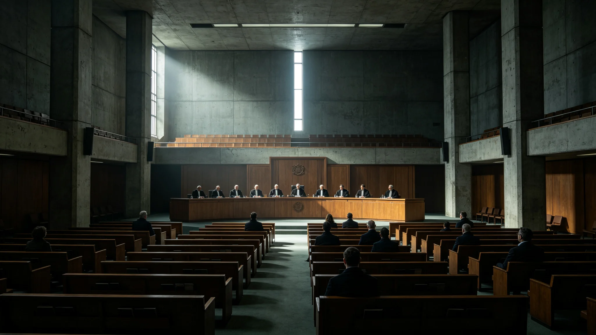

# 三恒星系文明联合体宪法法院（最高司法法院）设立与首批大法官任命公报

**发布机构**：秘书处 / 议会司法委员会
**发布日期**：3013年4月9日
**文件等级**：跨星系公开

---

## 一、法院为何设在L5而不设新海

如《联合体常驻地选址争议》（GS-3004-01）所记，三系就"首都"之争长期未解。折中案之一，是把立法（议会）、行政（秘书处）、司法（宪法法院）在空间上分离：秘书处与议会暂留新海，宪法法院设于地月L5。

3013年4月，宪法法院正式在太阳系地月L5挂牌。选址理由公开写入：司法若与行政同城，易受行政日常气场影响；置L5，则法官既不属新海、也不属鲸港，只属法律。

## 二、首批大法官构成

首批大法官九名，按"三系各三"分配，刻意避免任何一系占多数：

- 比邻星系三名；
- 鲸鱼座τ星系三名；
- 太阳系三名。

首任院长，由筹建期已主持工作近九年的沈既明（人事档案见GS-3005-01）出任。任命程序：议会司法委员会提名，全体议会三分之二通过，三系各自过半赞同（与预算表决同门槛）。

## 三、法院管什么、不管什么

法院职权，公报写清边界：

**管**：
- 各成员法律与联合体宪章是否冲突的违宪审查；
- 三系间跨系贸易、税收、公民身份（GS-2909-01）纠纷的最终裁决；
- 紧急事态（GS-3033-01）下行政权是否越界的事后审查。

**不管**：
- 各系内部民事、刑事一审——那是各系自己的法院；
- 政治分歧——法院不裁决"该不该迁都"这种政治问题，只裁决"这么做合不合法"。

## 四、一件就职仪式上不写进赞歌的事

挂牌典礼，礼宾司按去个人化原则（GS-3002-01先例）办：不立塑像、不颂词。沈既明就职发言只讲了一段，原话摘录：

"我在筹建期被记过一次诫勉谈话（见GS-3005-01）。我不以此为耻。一个会犯错、且被记录在案的法官，比一个从不犯错、因而无人敢查的法官，更适合坐在这个位置上。本法院此后判的每一个案子，都欢迎被监察——包括我自己将来写的判词。"

## 五、与旧法统的关系

宪法法院不废除三系各自既有司法体系（鲸鱼座τ星司法独立化见GS-2981-01）。它是"顶上的一层"，只裁跨系宪法争议。各系内部案件，仍归各系法院。

---
**附件**：九名大法官名册（脱敏）；法院职权清单；违宪审查首例受理流程。
