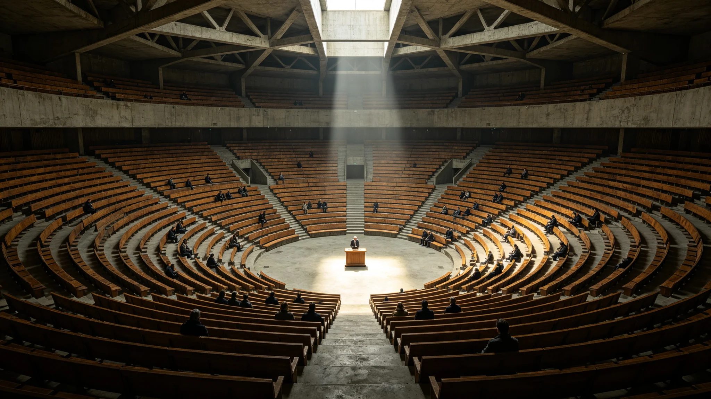

# 联合体首次预算案表决僵局致行政停摆四十三日事件全记录

**编制单位**：议会秘书处议事录组
**档案性质**：事件全过程实录（含各方立场与结果，不作裁判）
**日期**：3016年12月25日

---

## 一、事件一句话

3016年11月，3017年度预算案在议会表决中，因三系分系多数未同时达标，连续四次未获通过；至12月15日法定截止日仍未通过，触发预算法第14条"自动续行条款"，联合体行政按上年度九成运转四十三日，直至次年1月27日妥协案通过。

## 二、争的是什么

表面争的是预算盘子里一笔钱：鲸鱼座τ星系要求把跨系基建向鲸港地下城市倾斜的比例从三成提到四成；比邻星系坚持按既有比例；太阳系居中。

背后争的，是联合体到底"先扶谁"。鲸港代表在辩论中说："我们不是要多分一块，我们是要确认联合体没把我们忘了。"比邻星b代表答："比例是算出来的，不是哭出来的。"太阳系代表打圆场，未成。

## 三、四十三日怎么过的

依GS-3007-01第14条，自动续行期间：

- 政府未停摆——这正是当年立法者设计兜底条款的目的；
- 但所有部委按上年度九成运转，且不得新签跨系采购合同；
- 集中招标（GS-3014-01）春秋两期顺延；
- 跨系公务员薪酬照常发，只是不涨。

最难受的是正在筹建的中继港工程（GS-3011-01、GS-3024-01）：不得新签采购合同，主带供料只能用库存，进度被迫后挪。总工程师闻铁桥在工程日志（见其档案）中只写了一句："又等。"

## 四、如何破局

1月27日，三方在一份妥协案上签字：

- 鲸港倾斜比例从三成提到三成五（不是鲸港要的四成）；
- 鲸港在另一条——跨系移民配额（GS-2961-01）——上让步，同意暂缓一年；
- 太阳系居中作证。

这不是"谁赢了"，是三方各退半步。议事录组如实记录：僵局的化解不靠伟大演说，靠的是预算法那个当年被嫌"官僚"的兜底条款——它让僵局拖不垮政府，也让僵局中的人耗不下去。

## 五、事后的两处修正

事件后，议会对预算法补了两笔小修正：

1. 明确"自动续行"期间，应急与生命保障类支出不受九折限制（呼应3010年补给延误教训）；
2. 僵局超过六十日仍无解时，自动触发三方首脑直接会晤，不再在议员层面空转。

议事录组认为：这次四十三日，不是联合体的耻辱，而是它的制度第一次被真实压力压过——而且没断。

---
**附件**：四次表决原始唱名记录；妥协案三方签字页；僵局期间各部九成运转开支明细。

## 六、四次表决唱名概览

议事录组将四次表决唱名摘其要：第一次（11月3日）赞成 78 票，比邻星系内部以 41 票反对否决了分系多数；第二次（11月17日）赞成 81 票，鲸鱼座τ星系以 9 票反对否决；第三次（12月1日）赞成 84 票，仍未达分系双多数；第四次（12月14日，法定截止前一日）赞成 86 票，距三分之二仅差两票。四次均有人在场离席以示抗议，未发生冲撞。议事录组注明：僵局是按规则僵的，不是闹出来的。

## 七、九成运转四十三日的实际影响

僵局四十三日间，跨系集中招标两期顺延，约 1.2 亿信用点的采购计划未签订单；中继港主带供料消耗库存约三成，未断料；鲸港地下城市因未获新批倾斜款，一条计划中的主缆备线推迟半年。跨系公务员薪酬未涨，但按九成口径核算，行政运行类开支实际压缩 8.7%，未影响生命保障与应急。议事录组认为：九成不是"饿肚子"，是"把能省的事先省下来"。

## 八、社会反应与媒体记录

僵局期间，三系民间并未出现"议会无能"的大规模情绪——因政府未停摆、工资照发，民众痛感有限。新海市本地媒体有三篇评论，一篇批评议员"为一点比例吵四十三天"，两篇理解"分系多数就是要让多数人不能随便碾压少数"。议事录组不转载评论，只记：这次僵局没有催生街头运动，这本身说明兜底条款起了作用。

## 九、事件定性

议事录组最终将本事件定性为"制度压力测试合格"，不是危机。四十三日之后，预算法两处修正（应急不受九折、六十日触发首脑会晤）即写入。下一次僵局若再发生，规则已经比这次多了两道保险。

## 九之二、僵局期间未发生的事

议事录组特地补记"没发生的事"：无人上街，无部委职员罢工，无跨系班船停航，无生命保障系统降配，无一名公务员因政府按九成运转而被欠薪。三件没发生，比三件发生了，更能说明这次僵局的边界在哪里——它僵在预算数字上，没僵到普通人的日子里。议事录组认为：能把僵局关在预算案里，是这套制度设计上最值钱的一处。

## 十、四十三日的数字小结

从11月3日首次表决失败到次年1月27日妥协通过，共四十三日。其间议会召开全体会议七次、预算委员会听证十一次、三系工作组私下会晤十九次。妥协案最终赞成票 93 票，较僵局前最高一次（86票）多 7 票，未达三分之二上限，但满足了分系双多数。议事录组把这 93 票原样入档，不分析"谁转了向"——转向是议员的权利，记录只记结果。
