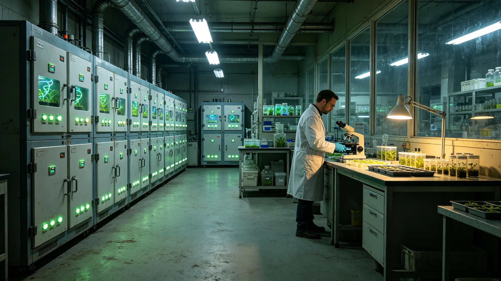

# 三恒星系联合种质资源库"百种方舟"扩建与跨系互备公报

**发布机构**：生态与环境事务部 / 农业资源处
**发布日期**：3018年3月15日
**文件等级**：跨星系公开

---

## 一、为什么要"跨系互备"

人类在三系各带了一套地球作物种质（GS-2155-02方舟母本系、GS-2943-01深空辐射育种），比邻星b、鲸鱼座τ星、太阳系各自也建了自己的种子库。但各库各管各的：一旦某一系遇灾（比邻星b飓风GS-2904-01、火山GS-2998-01；鲸港恒星耀斑GS-2983-01），那套种质就有全毁之险。

联合体遂将三系种质库联网互备，总称"百种方舟"：任一份种子在三系各存三份，一系全毁，另两系可复活。

## 二、扩建内容

- 新海市主库扩建恒温-40℃种质柜三层；
- 鲸港地下库新增"人工生态适配株"专区（种植经鲸港地下闭环驯化数百年的特殊品系）；
- 太阳系地月库作灾备冷存；
- 三库量子联网，种子目录实时一致。

## 三、不只是"存种子"

农业资源处强调：百种方舟不只存"死种子"，还存"活系谱"——每一份种质附一份跨系栽培记录，写明它在哪个星系、哪套光周期、哪类土壤下表现如何。将来若要在某一新定居点复育，不是光撒种子就行，得连栽培经验一起带去。

## 四、首年互备运行

3018年入库互备种质合计：地球原乡作物系3,127份、比邻星b驯化系486份、鲸港人工闭环系132份。三系各存三份后，任一份实际有9份（三库×三复本）。农业资源处称：冗余即保险。

## 五、与生物安全的边界

种质跨系互备受生物安全检疫（GS-3008-01）严格约束：互备的是"种子与冷冻材料"，不是"活的外来植株"。把种子从鲸港存到新海库，不等于把鲸港活植物种到新海地里——后者须等3025年跨系物种交换实验（GS-3025-01）专项审批。

---
**附件**：三库布局；互备种质目录摘要；栽培系谱索引；与生物安全检疫接口规程。

## 六、三库温湿度与能耗

新海主库恒温-40℃、鲸港地下库恒温-22℃、地月冷存库恒温-80℃。三库合计年耗电约 0.21 亿度，由所在系电网平价供电。三库各配一台备用冷机，主机故障时七十二小时内切备，不影响种质活性。农业资源处注明：种子库最怕的不是冷，是断电后温度回升——故三库均与所在系生命保障电网分路，不与民用空调抢电。

## 七、首年发芽抽检

互备入库后，农业资源处按季度随机抽测发芽率：地球原乡作物系抽 412 份，平均发芽率 96.4%，较入库前仅下降 0.8 个百分点；比邻星b驯化系抽 88 份，发芽率 95.1%；鲸港人工闭环系抽 24 份，发芽率 97.9%。两株发芽率低于七成的样本，经复核系入库时标签错位，更正后复测合格，未报废种质。农业资源处认为：标签错位比种子坏了更危险——存一万份对不上号的种子，等于没存。

## 八、互备经费与人力

本期扩建三库恒温柜与联网系统，合计支出约 1.8 亿信用点，由3018年度生态与环境事务部预算列支。三库在编管理员合计 96 人，其中具备植物学背景者 61 人。首年无人员工伤。农业资源处声明：百种方舟不是某一系的方舟，三库经费与人力按三系分摊，不搞"谁出钱多谁说了算"。

## 八之二、一次标签错位的整改

首年发芽抽检中那两株标签错位样本，经溯源系新海主库一名管理员在-40℃冷柜前连续工作六小时后，把两批同形标签贴反。农业资源处未追究个人，只把冷柜前单次连续在岗时长改为不超过三小时、每三小时强制轮换，并在标签上加印二维码与肉眼编号双重识别。该管理员在整改记录上签字："不是我不认账，是这个工位本身就不该让人连站六小时。"农业资源处将此案例写入操作规程，不再提其姓名。

## 八之三、与深空育种的接口

百种方舟互备入库的种质中，有 147 份系经深空辐射诱变后筛选的育种材料（承接GS-2943-01深空辐射育种传统）。这些材料不直接用于大田复育，只作为"未来可能用得上"的预备系谱存档。农业资源处注明：存它，不是因为现在就要种，是因为五百年后某个新定居点的人可能需要一个扛得住那种辐射的品种——我们这代人没见过那种环境，但我们有义务把种子先存下。

## 九、百年后还要不要这些种子

百种方舟在设计之初就写了一条容易被忽略的规程：每份种质每五十年须复育一次、更新一代，不能只靠冷冻存死种子——冷冻也会有活性衰减。首期三库已排定 3068 年前后的首轮复育计划。农业资源处注明：一个计划要五十年后才执行的制度，最难的不是技术，是让今天的人相信五十年后还有人记得这件事。把规程写进公报、存进文枢，就是为了让那时候的人查得到"我们当年为什么存、该怎么更新"。

## 十、与个人收藏的边界

百种方舟只收"公共域种质"，不收某家族私藏的百年传家种子——那种东西仍归私人。农业资源处说明：公共种子库不是来和个人收藏家抢东西的，它只存一旦丢失就找不回来的、跨系都可能用得上的那部分。私人珍藏的种子愿意无偿捐入者欢迎，不愿捐的，绝不征。
