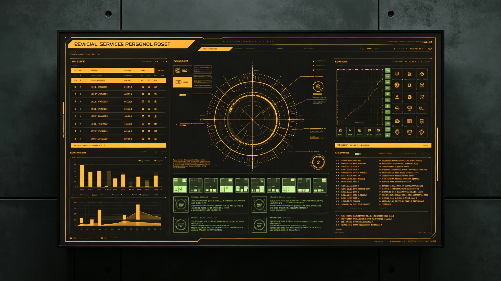

# 三恒星系文明联合体公务员统一考任、编制与跨系轮岗制度公报

**发布机构**：秘书处人事与档案总目组
**发布日期**：3019年5月20日
**文件等级**：跨星系公开

---

## 一、从"借调"到"考任"

3001年挂牌（GS-3001-01）时，联合体官员多是从三系各单位"借调"来的。借调制运行十八年，问题攒了一堆：有人借调十几年，既不算联合体正式编制、也回不去原单位；三系借调标准不一，比邻星b考进来的人，鲸港不认其资历。

人事组遂推动公务员统一考任：凡联合体正式岗位，一律三系统一考试、统一录用、统一编制。

## 二、三条核心

- **统一考试**：三系同卷（经语言与文化差异本地化），量子信道同步开考，不看背景、不看推荐；
- **三系配额**：按人口与发展水平加权，鲸港名额适当上浮（呼应会费补偿）；
- **跨系轮岗**：公务员在新海、鲸港、地月L5间轮换任职，每任不超过六年，防止任何人在某一系扎根成"本地派"。

## 三、不考什么

人事组明确：统考只考岗位所需能力，不考"忠诚表态"、不考意识形态。一个鲸港考生不必背诵任何"盟歌"——盟歌至今未立（GS-3002-01）。

## 四、首年录用

3019年首次统考，三系报考合计41万人，录用1,247人（与3001年首批启动编制数同，象征"借调期结束、正式期开始"）。首年即有鲸港考生考到新海市岗位，也有比邻星b考生考到鲸港岗位——轮岗制从入职第一天就开始。

## 五、与借调期老人的衔接

对3001—3019年间借调的老人员，人事组给三条路：考任转正、回原单位、或带工龄退休。不强求、不赶人。

---
**附件**：统考大纲（本地化说明）；三系配额表；借调老人衔接三选一细则。
