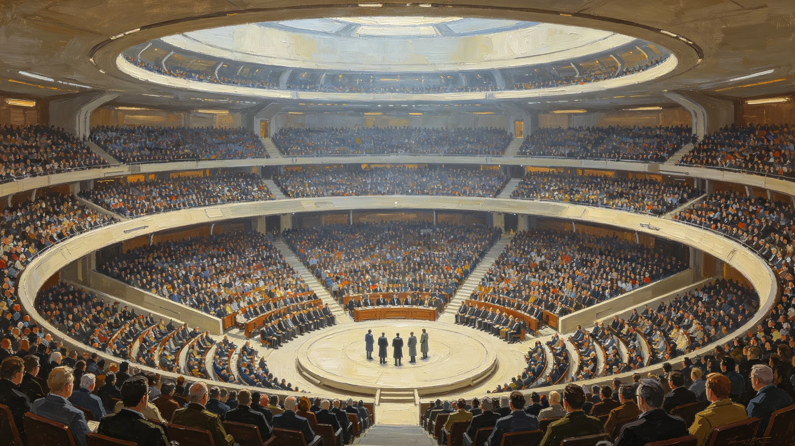

# 三恒星系文明联合体议会首次公开议事日与公民旁听席位制度公报

**发布机构**：议会秘书处 / 礼宾司
**发布日期**：3020年10月11日
**文件等级**：跨星系公开

---

## 一、为什么要"开门"

议会此前的辩论，公民只能事后看纪要。透明是透明了一半——看完纪要，人已经散了，你不知道那句话是谁在什么表情下说的。

议会秘书处遂设"公开议事日"：每月择一上午，议会大厅旁听席对三系公民开放，可现场看辩论、散场可提问十分钟。

## 二、旁听规则

- **不控场**：旁听者不得鼓掌、不得喝倒彩，只准听；
- **可提问**：散场后议员须留十分钟，谁站出来问都答；
- **不录像**：现场不录像，只做文字速记——议会认为"被镜头盯着的辩论"会变成表演，不如纸笔老实；
- **远程旁听**：鲸港与太阳系公民通过量子信道看文字直播，不能现场鼓掌，但能在留言板提问。

## 三、首次公开议事日实录

3020年10月11日首次开放，现场旁听公民86人（新海市本地），远程留言提问314条。

当日辩论议题是"是否给鲸港倾斜份额"（正是GS-3016-01僵局的余波）。散场后，一名鲸港远程旁听公民提问："你们在新海市大厅里讨论我们的命运，我们听得到，可我们离你们还有十一年光程——这算真的听见我们吗？"

主持议员当场未答好，只说："这个问题比我们今天辩论的事更难，我们回去接着想。"秘书处把这句原话原样入档。

## 四、不开放的部分

涉及国家安全（GS-3035-01维和舰队相关）与个人隐私的议程，不公开。议会明确：透明不是把一切摊开，是把该让公民看见的，摊开。

---
**附件**：首次旁听86人名册（脱敏）；314条远程提问分类表；主持议员"回去接着想"的后续答复进度跟踪。

## 六、86名现场旁听者构成

首次现场旁听86人，凭公民号提前三天预约，按先到先得分配。职业构成：工人与技术岗 31 人，教师与学生 18 人，医疗卫生岗 12 人，公务员 9 人，其余 16 人为退休与自由职业。三系比例：新海市本地 61 人，地月L5及火星经量子信道预约转现场者 17 人，鲸港 8 人（系专程乘班船抵新海，往返光程不允许其参加当日远程，故专程到场）。礼宾司特别记下这 8 名鲸港旁听者：他们是真的坐了十一年光程来听这场辩论的。

## 七、314条远程提问分类

当日远程留言提问 314 条，秘书处分类如下：问预算分配者 107 条，问跨系公民权利者 73 条，问三系光程下如何议事者 58 条，其余为对议员个人言行的质询。秘书处当日未逐条回答，只把分类表公开，由议会常设委员会在下次公开议事日择要回应。礼宾司注明：314条里最尖锐的，不是骂人的，是那个问"十一年光程算不算真的听见我们"的——这类问题，不是一次公开议事日能答完的。

## 八、不录像的代价与坚持

不录像只做文字速记，首年就有人批评"你们这是怕留下把柄"。礼宾司回应：正因为怕，才用纸笔——文字速记可以删改语气，但删不掉事实；录像可以剪，但镜头一开机，议员就开始演。秘书处宁可让辩论粗糙，也不让它好看。首年公开议事日共办九场，文字速记全部当日公开在"文枢"，任何人可调阅原文。

## 九、后续

首次公开议事日之后，旁听席位预约长期处于满额状态，候补名单最长排到六个月后。秘书处考虑增设下午场，但暂不扩容——旁听席贵精不贵多，先把每月一场办稳。

## 九之二、那个"十一年光程"问题的后续

秘书处把鲸港旁听公民那句"十一年光程算不算真的听见我们"列为长期跟踪议题。到3020年末，议会常设委员会的书面答复进度为：已起草答复草案，承认"现场旁听与远程留言在光程上不对称"，并提出两项技术性折中——在鲸港设一处"异步议事厅"，将新海市辩论文字逐句延时传回，鲸港公民可在自己的时间里读完后留言，留言再延时传回新海市，由议员在下次公开议事日答复。这不是解决，是承认问题存在后给出的第一步。礼宾司注明：一个答不好的问题，被记下来慢慢答，比当场糊弄过去，更接近透明。

## 九之三、旁听秩序记录

首年九场公开议事日，现场旁听者无一次鼓掌或喝倒彩，无一人中途被请出。唯一一次纪律事件，是一名新海市本地旁听者在散场后追着议员提问超过十分钟，被礼宾员礼貌请到走廊继续。秘书处认为：旁听秩序不是靠训话维持的，是靠公民知道"门开着"就够了。

## 十、公开议事日与法院独立的分工

议会秘书处特别说明：议会公开议事，不等于宪法法院（GS-3013-01）也公开。法院审理不公开，只判词公开——辩论是政治，要让公民看着；判案是司法，要让它不受围观压力。一处开门，一处关门，看起来矛盾，其实是两件事。秘书处不打算把"公开"推广到法院去。

## 十一、本档封存

首次公开议事日的文字速记、86人旁听名册、314条远程提问，全部封存"文枢"，保存期不少于一百年。秘书处认为：一个议会敢把自己的辩论原样留给一百年后的人看，比当场说了什么漂亮话更要紧。
