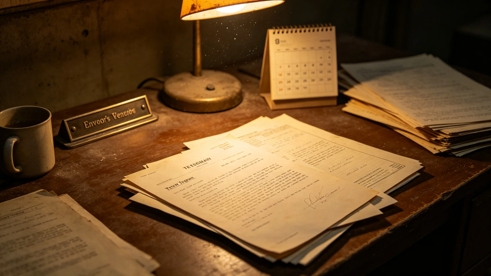

# 鲸鱼座τ星驻联合体首任代表任内电文稿与考勤表合订

**归档单位**：秘书处礼宾组 / 鲸港代表处
**档号**：DIP-WT-3023-003
**密级**：电文稿部分公开、考勤内部

---

## 卷首

她不是"鲸港之光"，是一个在地下城市习惯了回声、到新海市露天广场被风吹得慢半拍的代表。本卷只收她的电文稿摘句与考勤。

---

## 一、登记页

- 姓名：岑听潮
- 出生：2957年，鲸鱼座τ星地下城市"深庭"（地下城市体系见GS-2917-01）
- 任职：鲸港驻联合体首任常驻代表（3000—3023）
- 入职体检：3000年，地下城市出身，初到新海市露天时对强光不适，三个月后适应

## 二、电文稿摘句（三句，不改字）

1. 3004年驻地争议（GS-3004-01）时发往新海市："我们不是反对新海，我们是反对永远只有一个中心。"
2. 3016年预算僵局（GS-3016-01）中："倾斜不是恩赐，是三系一起活下去的保险。"
3. 3022年表决迟延（GS-3022-01）后："六天没吵成的架，回到鲸港我们用十一年才吵完——这就是我们住得远的代价。"

## 三、考勤表（任内汇总）

| 年度 | 应到 | 实到 | 备注 |
|---|---|---|---|
| 3000-3010 | 约2,400 | 2,371 | 全勤倾向 |
| 3011-3020 | 约2,400 | 2,298 | 后段因腰椎问题断续请假 |
| 3021-3023 | 约720 | 689 | 渐退，准备交接 |

无迟到违纪。她的"缺勤"几乎全是病假——地下城市出身的人，到露天行星住二十多年，骨骼与关节先扛不住。

## 四、一次被记录的"慢半拍"

3002年首个联合体日（GS-3002-01），鲸港民谣合唱在新海市露天场地上慢半拍。岑听潮事后在致礼宾司的电文中写："不是我们唱错了，是地下的回声在我们耳朵里住了太久。慢慢来，给我们点时间。"礼宾司把这句原样回放进了当年公报。

## 五、卷尾

岑听潮3023年卸任回鲸港。代表处不办欢送会——地下城市的人不擅长露天告别。卷止于此。

## 六、任内电文稿总量与分类

岑听潮任内（3000—3023，共二十三年），代表处累计发出跨系电文稿 1,847 份，其中就驻地争议、会费比例、预算倾斜、物种交换等事项向秘书处正式函件 412 份，日常工作报文 1,203 份，私人性质短笺（致礼宾司等）232 份。本卷只摘三句，其余存"文枢"。代表处注明：一个代表二十三年只被摘出三句话，不是因为她话少，是因为大多数电文都是"收到、照办、转呈"这类例行公事。

## 七、腰椎问题的病程

3011年起，岑听潮因腰椎间盘问题断续请假，人事组调取其体检摘要：3011年首次就诊，3015年加配腰托，3020年后每周理疗两次。她仍坚持到新海市中枢出席公开场合，唯长时站立改为坐姿发言。代表处未因此要求其提前卸任——按公务员轮岗制度，她本可在3020年后申请调回鲸港，但她选择再守三年，把交接办完。3023年正式卸任回鲸港时，体检血压与骨密度按鲸港地下城市标准复测，全部正常。

## 八、继任与交接

继任鲸港代表由鲸港方面自行选派，未经联合体考任——常驻代表系各成员派驻，非联合体公务员。岑听潮交接时，移交电文稿档案、代表处印章、与秘书处礼宾组的联络名册。交接清单共 17 项，逐项点验。她在交接清单末页签字后，未留"寄语"，只对继任者说了一句："新海市露天风大，多带件外套。"代表处将此句入档。

## 九、任内住房与生活

岑听潮驻新海市二十三年，按常驻代表标准分配新海市中枢东翼公寓一套，未申请更大住房。代表处记录：她习惯了地下城市恒定温湿，初到新海市露天，常在阳台上把遮光帘拉上一整天，三年后才习惯拉开。她在新海市从未参加任何私人宴请——不是架子大，是她在地下城市养成的作息，让她在露天傍晚总犯困。礼宾组曾劝她出席一次社交晚宴，她回电："我去了也听不懂你们露天的笑话，不如在住处把电文稿写完。"

## 十、离任时的行李

岑听潮回鲸港时，行李除个人衣物外，只带了一箱任内电文稿手抄本——她不习惯全靠电子档，总要手留一份。代表处按跨系行李限额为其办理托运，未用公务舱位。她拒绝了礼宾组提议的任何"纪念礼品"，只带走一本新海市气象台印发的历年露天日出日落时刻表——"回去以后，给地下城市的人讲讲，地上的太阳是怎么每天出来的。"

## 十一、本卷的不完整处

本卷只摘三句电文、一张考勤表、一次慢半拍、一次腰椎、一箱行李。它不是岑听潮的传记，也远不是鲸港二十三年驻联合体史的全部。代表处声明：更多电文存"文枢"，任何人可调阅，但代表处不组织人去"整理"成一篇赞词——她活着的时候不接受被写成传奇，她卸任以后也不接受。

## 十二、继任代表的到任

继任代表于3023年9月到任，较岑听潮年轻二十岁，习惯露天，初到新海市即能出席晚间社交活动。代表处按规程为其办理了与岑听潮完全不同的生活配置——新代表不需要遮光帘，反而需要更多露天行程。代表处注明：两任代表的差异，不是谁更合格，是鲸港自己这二十多年也在变——下一代地下城市出生的人，已经不那么怕露天了。

**归档人**：鲸港代表处值班员
**本人确认**：岑听潮（签名经核验）
