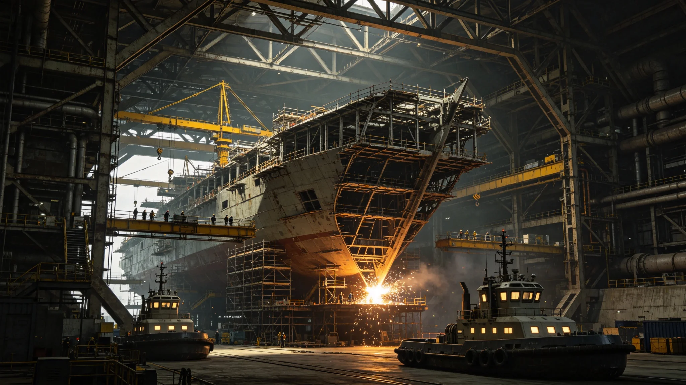

# 跨星系中继港与联合船坞首批基建工程开工与联合发展银行拨款公报

**发布机构**：跨星系贸易与产业部 / 联合发展银行
**发布日期**：3024年2月14日
**文件等级**：跨星系公开

---

## 一、从筹建到开工

闻铁桥（工程档案见GS-3011-01）自3008年主持筹建，历时十六年：方案比选、钢量核算、主承力桁架预拼装、焊缝复检——3024年2月14日，跨星系中继港与联合船坞首批工程正式在主带轨道总装锚地开工。

这不是一座港，是三系共用的"中途之家"：跨系班船不必再直飞新海或鲸港，可在主带中转补给、维修、换人。

## 二、钱从哪来

工程总投资经议会核定，由三部分构成：

- 联合发展银行（GS-2973-01）跨系基建长期贷款，占六成；
- 三系按会费比例出资，占三成；
- 集中招标（GS-3014-01）节约下来的钱，注一成。

结算用星汇（GS-3006-01），不用某一系本币。

## 三、谁来建

主带供料（就近采矿建造，GS-2085-02经验）、新海市出设计、鲸港做地下备件库——正是3009年闻铁桥日志里那个"谁都输不起、只好合"的折中案。

## 四、不开工的部分

工程分期。本期只建中继港核心段与一个联合船坞泊位。完整港城要到更晚。公报明确：不追求一口气建成三系最大港，先让中转能转起来。

## 五、进度风险提示

贸易与产业部如实写：跨系工程受光程约束，主带与新海市之间设计变更往返要数年，工期极易拖延。本工程立项时已预留"跨系工期冗余"，不承诺按时。

---
**附件**：拨款合同（脱敏）；分期建设总图；三系分工矩阵；工期冗余说明。
