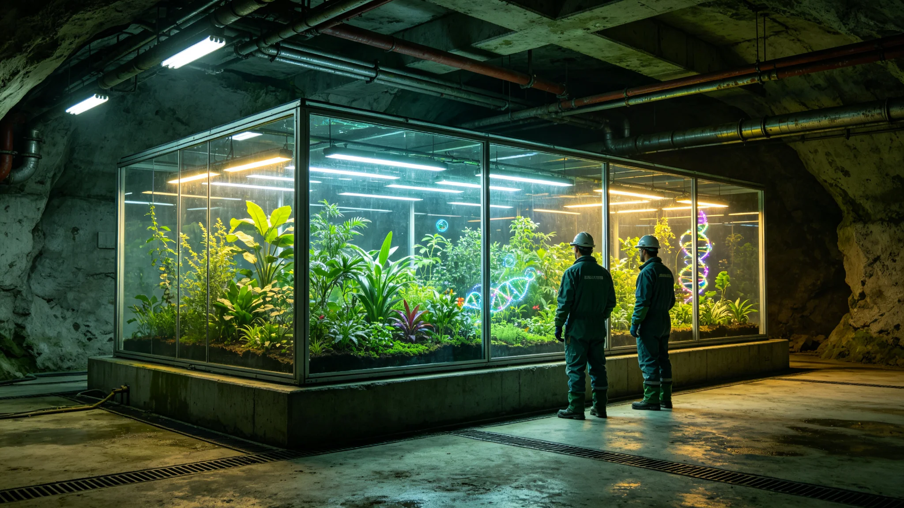

# 鲸鱼座τ星地下城市生态舱与比邻星b生态圈首次跨系物种交换实验公报

**发布机构**：生态与环境事务部
**发布日期**：3025年5月6日
**文件等级**：跨星系公开

---

## 一、从"存种子"到"换活物"

百种方舟（GS-3018-01）互备的一直是死种子与冷冻材料。生态与环境事务部想做更进一步的事：把鲸港地下城市驯化数百年的某些微生物与植物，小规模引入比邻星b的受控生态圈试验舱；反过来，把比邻星b露天成熟生态圈的某些固氮菌引入鲸港地下舱，看两套独立演化的小生态能不能"对话"。

这是生物安全检疫（GS-3008-01）施行十七年来，首次主动"放行"活体跨系交换。

## 二、严格受控

实验不露天、不入野：

- 双方各建独立封闭实验舱，与本系大生态物理隔离；
- 交换物种仅限低等微生物与若干蕨类、地衣，不引入动物、不引入高等植物；
- 任一方监测到异常定殖迹象，立即灭活整个实验舱，不留情。

## 三、首期结果

实验满一年（3025年），公报结论：

- 鲸港驯化微生物引入比邻星b受控舱后，存活但繁殖率低于预期——比邻星b露天大气虽已可呼吸（GS-2900-01），但对地下驯化株仍偏"野"；
- 比邻星b固氮菌引入鲸港地下舱后，与本地菌群和平共存，未发生排斥，地下舱土壤熟化速率提升约一成；
- 无一起逃逸定殖，无一起污染事故。

## 四、意义与边界

生态与环境事务部把话说满的风险压住：这次成功只说明"两套小生态可以受控对话"，不说明"可以大规模跨系引种"。真正的大规模生态互锁，要到五十年总评估（GS-3050-01）才敢谈。

---
**附件**：双方实验舱布局；交换物种清单（仅低等）；异常监测日志；灭活应急预案演练记录。
