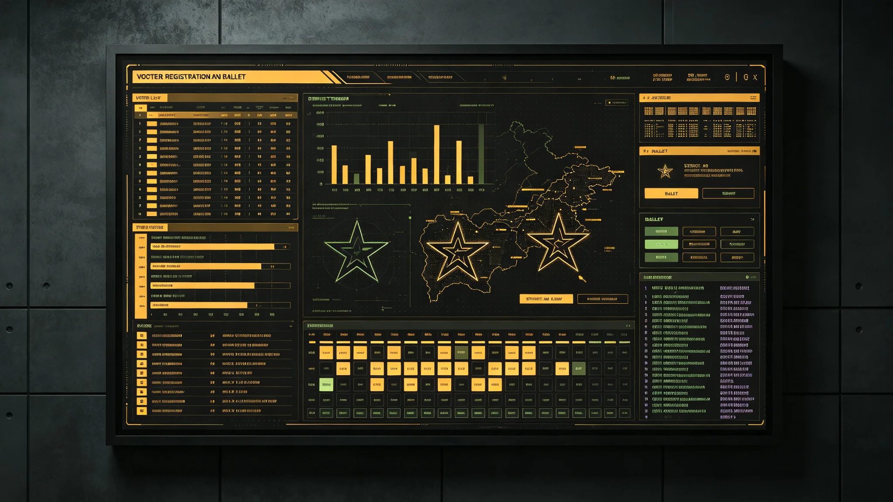

# 三恒星系文明联合体议会代表直选制度首次落地与三系选民登记首年公报

**发布机构**：秘书处选举事务署
**发布日期**：3026年11月8日
**文件等级**：跨星系公开

---

## 一、从"选派"到"直选"

此前议会代表，多由三系各自政府选派。选派的好处是稳，坏处是公民觉得"议会里的人不是我选的"。经多年争论，3026年首次实行议会代表直选：凡持有跨系公民身份（GS-2909-01）者，直接投票选本系议席代表。

## 二、光程怎么投

三系光程差十一年，"同日投票"在物理上不可能。选举事务署的办法：

- 三系各自在本系时间窗口内投票，结果经量子信道瞬时汇总；
- 投票用身份与虹膜核验，防止重复投票；
- 不追求"同一物理时刻"，只追求"同一协星标准时窗口内"完成。

## 三、首年登记与投票

| 系 | 登记选民 | 投票率 |
|---|---|---|
| 比邻星系 | 约21亿 | 61% |
| 太阳系 | 约18亿 | 54% |
| 鲸鱼座τ星系 | 约9亿 | 68% |

鲸港投票率最高——选举事务署解读：离得最远的人，最想在议会里有自己的声音。这与3020年那位鲸港旁听公民的提问（GS-3020-01）一脉相承。

## 四、直选带来的变化

直选后，议员开始对选民负责，而不只对本系政府负责。第一届直选议会中，出现了几位主打"三系桥梁"而非"本系利益"的新议员。选举事务署不评论好坏，只记录这一变化。

## 五、不完美

首年即有两起投票身份争议，经宪法法院（GS-3013-01）裁定，未酿成危机。选举事务署认为：能闹到法院、且法院能裁，就是制度在工作。

---
**附件**：三系登记与投票统计；两起身份争议裁定；直选议席分配规则。
