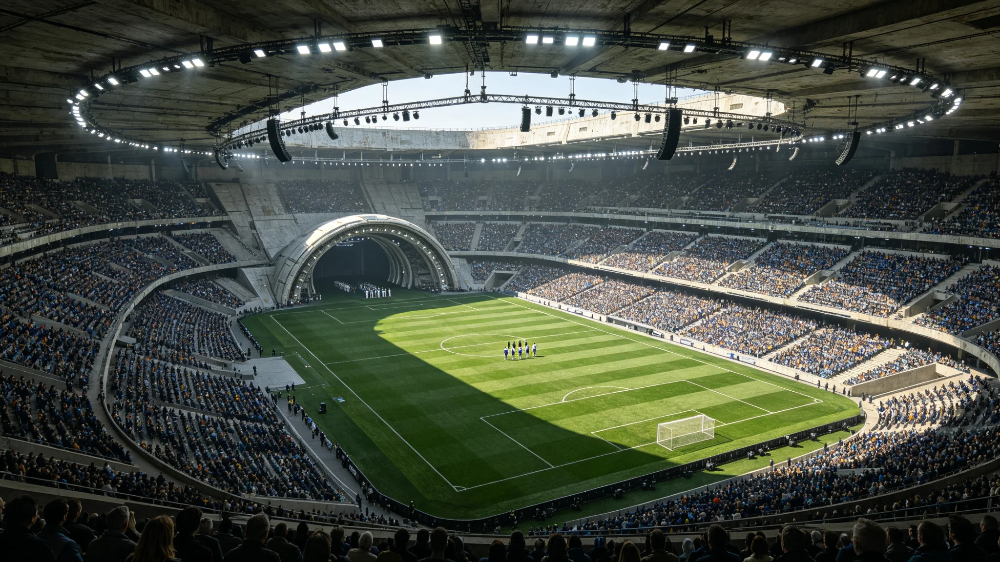

# 首届三恒星系联合运动会在新海市举办暨跨系代表队名册公报

**发布机构**：文化与礼宾司 / 联合体文体委员会
**发布日期**：3027年9月16日
**文件等级**：跨星系公开

---

## 一、为什么办运动会

联合体谈了二十七年制度、协议、预算，公民之间却没一起比过一场赛。文化与礼宾司认为：光签条约不叫一家人，能在同一条跑道上互相看见，才开始像。遂办首届三系联合运动会。

## 二、因地制宜的项目

三系重力与环境不同，强行同赛不公平。文体委员会特设：

- **微重力项目**：在地月L5无重力馆比，三系派适应低重力的选手；
- **比邻星b露天重力项目**：1.07g下比，地球系选手初到需适应；
- **鲸港地下项目**：封闭馆内比耐力与反应，无露天太阳。

各项目按各自环境分组，不比"谁更强"，比的是"不同世界的人各自把自己的身体练到多好"。

## 三、代表队名册（摘）

三系各派一队，名册经文体委员会脱敏：

- 比邻星系队：114人，多露天重力项目选手；
- 太阳系队：131人，微重力项目优势；
- 鲸鱼座τ星系队：89人，地下耐力项目突出。

## 四、一件被记住的事

运动会不设"盟旗升旗仪式"（沿用GS-3002-01去个人化原则）。开幕式上，三系选手共同绕场一周，不奏统一盟歌——仍无盟歌。一名鲸港选手赛后受访说："我们赢了几块牌不重要，重要的是我们终于在同一个场地上了，哪怕这个场地在新海市。"

## 五、后续

第二届定于四年后，主礼地轮值（呼应联合体日轮值原则）。

---
**附件**：三队名册（脱敏）；各项目成绩表；开闭幕式流程。

## 六、项目与奖牌分布

首届运动会共设项目 27 项，其中微重力项目 9 项、比邻星b露天重力项目 11 项、鲸港地下耐力项目 7 项。奖牌不设"团体总冠军"，只按项目发奖。太阳系队在微重力项目上获奖牌 21 枚，比邻星系队在露天重力项目上获奖牌 19 枚，鲸港队在地下耐力项目上获奖牌 14 枚。文体委员会说明：不同环境下练出来的身体，没有横向可比的"强弱"，奖牌只记录各自项目里的名次。

## 七、选手适应记录

三系选手跨环境参赛，普遍需要一至两周适应期：太阳系选手初到比邻星b露天 1.07g，多名田径选手反映腿沉；鲸港选手到新海市露天，对强光与开放空间不适应；比邻星b选手到地月L5微重力馆，多名失去方向感。文体委员会在所有跨环境项目前，强制安排三日适应训练，不允许选手"下了船就上场"。首届运动会期间，因适应不良退赛者 7 人，无重伤。

## 八、经费与观赛

首届运动会总支出约 1.9 亿信用点，由文化与礼宾司预算列支，不接受商业冠名。现场观赛合计约 8.7 万人次，量子信道远程观赛登记约 4,300 万人次。不发售高价票，现场门票按成本价发售，远低于三系常见赛事。文体委员会注明：运动会是给公民看的，不是给赞助商办的。

## 九、不设的项目

首届运动会刻意不设"对抗性团队项目"（如三队同场球类对抗），理由是跨系对抗项目最容易把体育变成"系与系较劲"。文体委员会把对抗性项目留到第二届以后、且须先经文化委员会评议。第一届只比各自环境下的个人与小团体成绩，不比"谁压过谁"。

## 十、一名选手的故事（档案体）

太阳系微重力体操选手，在L5无重力馆完成一套动作后落地不稳，未获奖牌。赛后她在采访中说："我在地球上练了十二年，到这里才发现，我的身体在没有重力的地方不知道往哪儿使劲。"文体委员会将此句入档，未加评论。这句话比任何奖牌都更接近办运动会的初衷：让不同世界的身体，承认自己在另一个世界里的笨拙。

## 十一、下届安排

第二届定于3031年，主礼地轮值至地月L5轨道城市，项目侧重微重力。第三届再回鲸港。文体委员会注明：四年一届，不是为了赶节庆，是为了让三系选手有时间在另一个环境里重新适应——四年太短则来不及，太长则运动会成了遥远的回忆。

## 十二、运动会未办成的部分

首届运动会，原计划邀请三系民间业余队伍与专业队同场，最终因赛程与场地限制，只办了专业队。文体委员会在公报中注明：业余同场是下一届的目标。他们不承认第一届已经"圆满"——它只是第一次办成了，离三系公民真正能一起下场，还差得远。

## 十三、运动会的食物与住宿

三系选手与随队人员，统一住在新海市联合运动员村，餐饮按三系饮食禁忌分厨供应：鲸港选手餐食不含露天晒制食品，太阳系选手按地球习惯配餐，比邻星b选手按本地口味。文体委员会注明：让三系选手在赛场外还能吃惯家里的饭，比在赛场上让他们"为国争光"更重要——一个吃不好饭的选手，跑不快。运动会期间，三系选手村未发生任何一起饮食冲突，分厨供应平稳。
