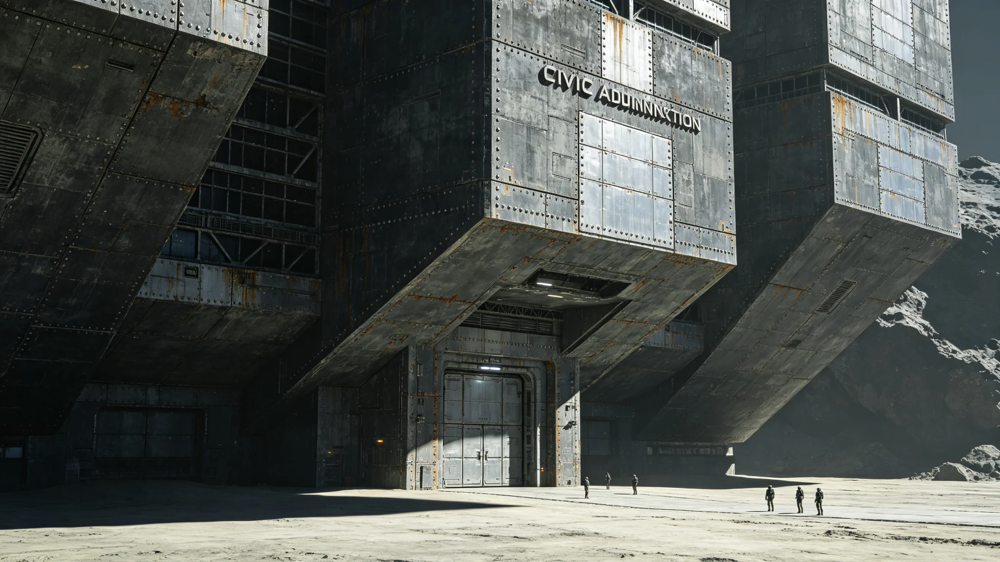

# 主小行星带某自治体拒缴会费引发首次宪政危机与仲裁记录

**编制单位**：秘书处法务室 / 宪法法院书记庭
**档案性质**：危机全过程与仲裁记录（不作裁判预断）
**日期**：3030年12月1日

---

## 一、事件

主小行星带某自治城市群联合体（其自治地位见GS-2198-01、GS-2382-01），自3029年起连续两个年度，拒绝按GS-3007-01比例向联合体缴纳会费，理由是"我们工业自给、不靠联合体，凭什么上缴"。

会费一断，联合发展银行（GS-2973-01）对鲸港的补偿性拨款（GS-3007-01附则）随之吃紧。危机浮现。

## 二、为什么是"宪政危机"而非普通纠纷

主带自治体不是不交钱那么简单——它同时主张：联合体对主带无管辖权，会费协议本身无效。这是对联合体宪章（GS-2999-01）管辖范围的正面挑战。若宪法法院支持主带主张，联合体对三系的法权根基就裂了。

## 三、仲裁过程

案件诉至宪法法院（GS-3013-01）。三方立场：

- 秘书处：会费系宪章明文，主带自治不等于退出联合体义务；
- 主带自治体：我们自愿加入，如今不愿继续被抽成；
- 鲸港与太阳系：居中，怕事态升级影响航道。

法院未当庭施压。用了一年半时间，逐一调阅主带自治史、联合发展银行拨款流向、主带享受的跨系公共服务（导航信标GS-2555-01、航道巡逻GS-2979-01）记录。

## 四、裁决要点（3030年底）

宪法法院裁定（摘）：
1. 主带自治体既享跨系公共服务之利，即负会费义务，不得"只享受、不缴费"；
2. 但其发展水平特殊，会费比例应重新核定，不宜与比邻星b同比例；
3. 限其三年内补缴差额，比例另行协商。

这不是"压服主带"，而是"确认义务、调整比例"。主带代表当庭表示接受——它要的从来不是对抗到底，而是"被重新对待"。

## 五、事后

此次危机促成议会启动对宪章管辖与义务条款的首次审查，为GS-3041-01宪章修正案铺路。秘书处认为：能闹到法院、法院能裁、双方都接受，是联合体宪政在成长，不是在失败。

---
**附件**：主带自治体拒缴声明原文；宪法法院裁决全文；会费比例重核委员会名单。
