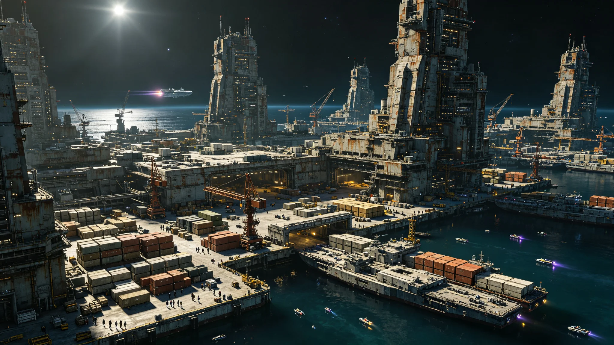

# 三恒星系内部零关税区（关税同盟）建成首年贸易决算公报

**发布机构**：跨星系贸易与产业部
**决算年度**：协星历19年（3032）
**日期**：3032年12月31日

---

## 一、从"有税"到"零税"

跨系贸易此前一直有关税——各系用关税保护自家产业。三十年前（GS-2976-01）先签了税收协定分摊税源，二十年前集中招标（GS-3014-01）把大宗买成了整单。3032年，三系迈出关键一步：相互之间大宗与标准品零关税，对外仍各自定税。

## 二、首年贸易量

| 流向 | 较上年增幅 |
|---|---|
| 比邻星b → 鲸港 | +23% |
| 太阳系 → 新海 | +18% |
| 鲸港 → 主带 | +31% |

零关税后，鲸港稀有金属、比邻星b高值工业品、太阳系主带结构件，跨系流通成本大降。

## 三、谁吃亏了

贸易与产业部不粉饰：零关税让鲸港本地一些落后小厂被比邻星b价廉物美的工业品挤垮约一成。补偿机制随附——用联合发展银行（GS-2973-01）贷款帮鲸港小厂转产，而非用关税把国门重新关上。

## 四、外部关税仍各自

同盟只管内部零关税。三系对外部（暂无非人类外部贸易对象，主要是各系对其内部次区域）关税仍自主。贸易与产业部强调：这不是"统一对外的贸易战同盟"，是"内部少收税"。

---
**附件**：首年贸易流向表；鲸港受冲击小厂转产帮扶清单；对外关税差异清单。

## 五、首年关税减免规模

零关税前，三系内部大宗与标准品平均关税率约 4.2%。零关税首年，三系合计让渡关税收入约 11.7 亿信用点，由联合发展银行跨系投资收益与星汇结算业务收入补足，未追加各成员会费。贸易与产业部注明：让渡的关税不是"损失"，是把三系之间原本被层层抽走的成本，直接让给了买货人和卖货人。

## 六、鲸港受冲击小厂转产帮扶

首年约一成鲸港本地小厂被比邻星b工业品挤垮，其中 63 家获得联合发展银行转产贷款，转型为给鲸港地下城市闭环生态做配套零部件，而非与比邻星b正面竞争。贸易与产业部未用关税保护这些小厂——那只是把它们继续关在鲸港市场里；贷款帮它们转到新的生态位，才是真正的帮扶。

## 七、走私与漏税

内部零关税首年，跨系走私举报较上年下降 34%——因为正经做生意不再有税可逃。但出现一种新型"转口"：某厂商把比邻星b工业品经鲸港转口，企图规避太阳系对特定品类的外部关税。反走私（见GS-3047-01）与税务部门联合查处 7 起，补税并处罚。贸易与产业部注明：内部零税不等于对外免税，这条边界要守一辈子。

## 八、首年未达成的部分

原计划首年实现跨系农产品零关税，因鲸港地下城市农产品产能敏感，推迟至3035年再议。贸易与产业部不讳言：零关税不是一步迈完的，迈一步算一步，剩下的留给下一届。

## 九、首年贸易总额与结构

3032年三系内部零关税贸易总额，较上年增长 22%，合计约合 1,840 亿信用点等值。其中，鲸港稀有金属与初级制品占 34%，比邻星b高值工业品占 29%，太阳系主带结构件与地球原乡保护区外农产品占 37%。贸易与产业部注明：三系贸易结构互补，而非同质竞争——鲸港卖原料，比邻星b卖加工品，太阳系卖结构件与农产品，这正是零关税能跑通的基础。

## 十、对各系物价的影响

零关税首年，三系跨系流通商品平均物价下降约 3.1%，其中鲸港下降最明显（进口工业品成本下降带动本地物价），比邻星b下降约 2.2%（本地高值工业品对外竞争压力略增），太阳系下降约 2.8%。工资水平未同步下降，实际购买力普遍提升。贸易与产业部认为：零关税的红利，最终落在买东西的人身上，不是落在政府账上。

## 十一、未参与的"外部"

零关税区只覆盖三系之间。三系对地球原乡保护区内部各次区域、对主带各自治体之间的贸易，仍按各系内部规则。贸易与产业部注明：零关税区不是把三系焊成一个国家，只是把三系之间的关税拆了——三系内部次区域的贸易，仍归各系自管。

## 十二、首年关税让渡的弥补

零关税让渡的 11.7 亿信用点，由联合发展银行跨系投资收益补足。首年联合发展银行对鲸港、主带的跨系基建贷款收益，恰好覆盖这一缺口，未动用应急储备。贸易与产业部注明：让渡的关税不是"亏了"，是把三系之间的交易成本降下来，让贸易量涨上来——首年贸易量涨了 22%，增量部分带来的星汇结算业务收入，已超过让渡额。

## 十三、首年贸易争端

零关税首年，三系厂商间发生贸易争端 7 起，主要集中在商品质量标准与交货期。争端全部通过跨系贸易仲裁（见另件）解决，无一升级为政治事件。贸易与产业部注明：零关税不等于零争端——争端少了关税这个借口，反而更容易在商业层面解决。首年 7 起争端中，有 5 起在仲裁后双方握手言和，2 起在次年通过修订合同条款解决，无一升级为政治事件。
