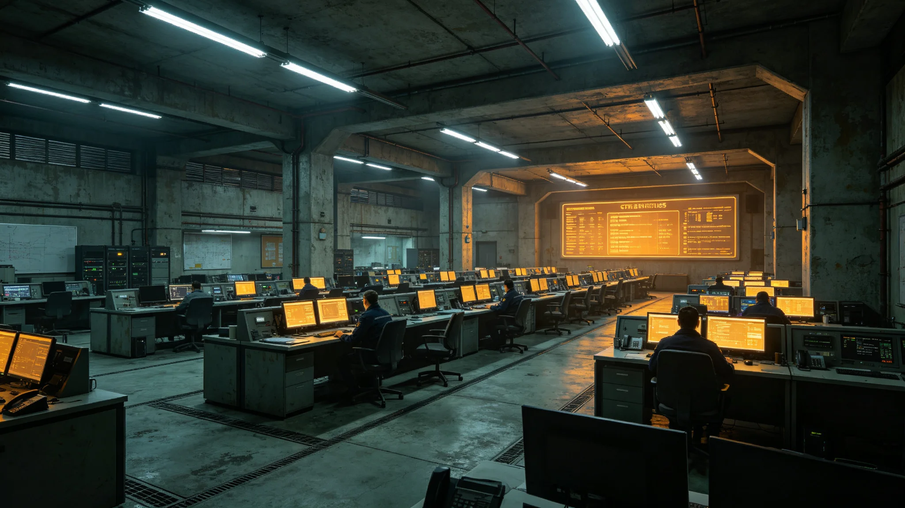

# 跨星系紧急事态与戒严权行使程序法颁布暨首次联合演练公报

**发布机构**：安全与应急协调部 / 秘书处法务室
**发布日期**：3033年6月15日
**文件等级**：跨星系公开

---

## 一、为什么要给"紧急权"立程序

联合体这些年遇过飓风（GS-2904-01）、耀斑（GS-2983-01）、补给延误（GS-3010-01）、通信闪断（GS-3022-01）。每次应急，行政部门都得临时扩权救人——但"紧急时谁有权下令、扩权扩到哪、事后谁来查"，一直没写死。

安全与应急协调部遂立本法：紧急时可以快，但快要有程序。

## 二、程序三条

- **分级授权**：一般应急（局部）由部委自行处置；重大应急（跨系）须经议会常设委员会事后追认；极端应急（生存级）可先动、四十八小时内报议会；
- **限时**：紧急状态不得自动延长，到期自动解除，再延须重新表决；
- **事后审查**：紧急期间的一切越权行为，宪法法院（GS-3013-01）事后可审，违法可撤销、可追责。

## 三、首次演练

3033年6月15日，三系联合演练"某系通信中断+补给短缺"复合应急：

- 新海市按程序四十八小时内报议会；
- 议会在通信受限下用量子信道异步追认；
- 宪法法院观察员全程记录，事后确认"程序未被滥用"。

## 四、不希望用上的法

安全与应急协调部明确：本法越用得少越好。它是为"万一"备的，不是为"常用"立的。

---
**附件**：法全文；首次演练脚本与复盘；三系应急授权矩阵。

## 五、首次演练复盘

3033年6月15日首次演练，脚本设定：鲸港地下城市主缆故障叠加通信闪断。演练中，新海市应急指挥部在41小时内完成"先动、报议会、异步追认"全流程，较法定四十八小时上限提前七小时。议会用量子信道异步追认，三系议员分系投票，全程无一人在通信受限下越权自行下令。宪法法院观察员在复盘记录中写："程序跑通了，但跑不快——应急程序若每次都要四十八小时，真到了生存级事件，可能来不及。"此意见写入下次修订。

## 六、紧急状态下公民权利的保留

本法明确：紧急状态可限制集会、可临时征用房舍，但不得限制跨系公民跨系迁徙权之外的任何权利——紧急期间公民仍有权向宪法法院事后申诉，紧急状态不得追溯既往。安全与应急协调部注明：紧急权是为了救人，不是为了让任何人在紧急期间变成不能说话的人。

## 七、首年实际启用次数

本法颁布首年（3033下半年至3034年中），实际启用一般应急级别 3 次（均为局部补给短缺与舱压异常），重大应急 0 次，极端应急 0 次。三次一般应急均由部委自行处置，未上升至跨系。安全与应急协调部认为：一部法一年只用了三次小应急，是它最好的成绩单。

## 八、不希望它变成常态

协调部在公报末尾重申：本法越用得少越好。它是为"万一"备的，不是为"常用"立的。若未来某一年本法启用次数突然增多，议会应首先追问：是灾难变多了，还是有人开始喜欢上紧急状态的权力了？

## 九、首次演练的具体流程

演练脚本设定：鲸港地下城市主缆故障，同时通信闪断，三系交通与物流中断。新海市应急指挥部于事发后第 2 小时启动二级应急，第 8 小时决定先动（调动就近中继港备件），第 41 小时向议会完成事后追认申请。议会在通信受限下用量子信道异步表决，第 43 小时完成追认。宪法法院观察员全程记录，事后确认："先动"范围限于备件调动，未扩大到限制公民权利，程序合规。

## 十、三系应急授权矩阵

本法附表明确三级授权：一般应急（局部舱压异常、单点补给短缺）由部委自行处置，事后报备；重大应急（跨系多城市同时受影响）须议会常设委员会事后追认；极端应急（生存级威胁）可先动，四十八小时内报议会，逾期未追认自动解除。三系各自应急部队在紧急状态下由安全与应急协调部统一调度，但不脱离本系指挥链——紧急时统一行动，紧急后归建。

## 十一、本法与3010年补给延误的对照

3010年补给延误（GS-3010-01）时，无紧急事态法，应急调拨走常规合同流程花了四十天。本法颁布后，同款事件可在"先动、后补"程序下十二天内完成调拨。安全与应急协调部注明：一部好的应急法，不是为了让紧急状态更可怕，是为了让紧急状态结束得更快。

## 十二、首次演练的不足

复盘指出：首次演练中，议会在通信受限下异步追认，三系议员分系投票用了约 2 小时，较预期慢。原因是三系议员对异步表决格式不熟悉。协调部已安排次年增加三次议会异步表决演练。安全与应急协调部注明：首次演练不是满分，是"能跑通但跑得慢"——下次跑快一点，真出事时才来得及。

## 十三、本法与公民自由的边界

紧急状态下，公民迁徙、集会、言论自由均可被临时限制，但限制范围须限于"为处置紧急事态所必需"，且紧急状态结束后自动解除。宪法法院在首次演练观察员报告中写："紧急状态是一面放大镜，它放大行政权的同时，也必须放大对行政权的监督。"安全与应急协调部将此句写入法的实施细则。
