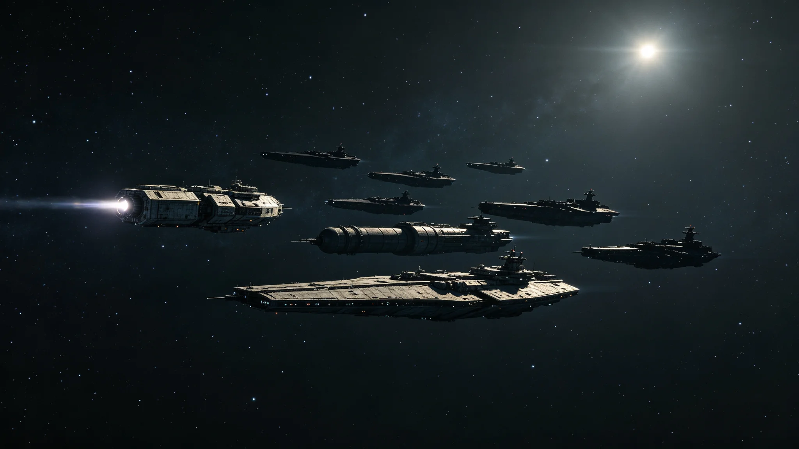

# 三恒星系跨星系维和舰队正式组建与三方力量整编移交公报

**发布机构**：安全与应急协调部
**发布日期**：3035年10月1日
**文件等级**：跨星系公开

---

## 一、从"协调"到"整编"

霍守疆（档案见GS-3029-01）主持了二十余年的"协调舰队"，一直是各系部队凑起来临时协同的班底。随着跨系航道（GS-2979-01）、中继港（GS-3024-01）、宪政危机仲裁（GS-3030-01）多了起来，临时凑班底不够用了。

3035年10月1日，三方正式把各自一部分安全力量整编为一支跨星系维和舰队。

## 二、它不是常备军

公报开门见山：这不是违反首任秘书长"不设常备军"承诺（GS-3000-03）。整编后的舰队：

- 不隶属任何单一系，直接对联合体议会负责；
- 章程写明其唯一任务：航道护航、搜救、反海盗、灾害应急，**不用于对内武力**；
- 动用须经议会常设委员会批准，极端情况按紧急事态法（GS-3033-01）程序。

## 三、三方移交

| 来源 | 移交力量 |
|---|---|
| 比邻星系 | 护航艇若干 |
| 太阳系/主带 | 巡逻与搜救船若干 |
| 鲸鱼座τ星系 | 近港防卫艇若干 |

霍守疆在移交后卸任——他从协调者变成"交班人"。新司令由三系联合推选，本公报不具名。

## 四、第一件任务

组建后首项任务不是打仗，是"净航"（见GS-3047-01）：护航航道、清剿走私。舰队从护航而非战争开始其生涯。

---
**附件**：舰队章程；三方移交清册；动用审批流程图。

## 五、整编后的总规模

三方移交后，维和舰队在编舰船合计约 47 艘，在编人员约 3,200 人。这一规模，较三系原有各自安全力量总和小约四成——因为整编不是把三系舰队堆在一起，而是把重叠部分裁掉。舰队章程写明：任何时候在编舰船不得超过议会核定上限，扩编须议会三分之二通过。

## 六、首任新司令的遴选

新司令由三系联合推选，非议会任命。遴选过程：三系各提名两名候选人，议会从中投票选出一名。当选者来自太阳系主带某自律城市群，未在原系任军政一把手。公报不具名，按去个人化原则——舰队归章程，不归司令。

## 七、首次编队巡航

组建后首项任务"净航"（GS-3047-01），舰队首次编队巡航航道，三个月内完成跨系航道巡查两轮，未发生交火。巡航期间护航商船 217 艘次，无一艘受袭。舰队日志记："商船按点靠港，比我们自己的编队队形整齐更让我们安心。"

## 八、与"不设常备军"的边界

公报再次明确：维和舰队不是常备军。它不驻在任何一系的母港，而是以主带锚地为母港；它不从事征服，只护航搜救；它的军费由三系按会费比例分摊，不另设跨系税收。议会每五年对其章程复审一次，任何一次复审中三系均可提议解散——这支舰队从组建第一天起，就带着"可以被解散"的条款。

## 九、三方移交的具体装备

比邻星系移交护航艇 12 艘、舰载机 24 架；太阳系/主带移交巡逻与搜救船 18 艘、医疗船 2 艘；鲸星系移交近港防卫艇 17 艘、补给船 3 艘。所有装备统一刷涂舰队标识，不保留原系涂装。移交后，原系船员中约 60% 转入舰队编制，40% 回原系退役。安全与应急协调部注明：移交不是"借人"，是"换人"——入了舰队编制，就不再是某一系的兵。

## 十、首任新司令的到任与交接

新司令于3035年10月1日移交当日到任，与霍守疆完成交接。交接清单：舰队编制名册、装备清册、航道巡逻图、与三系安全部门联络名册。霍守疆未向新司令推荐任何用人意见，只交了一卷3018年第一次操演时三支部队"鸡同鸭讲"的录音（见GS-3029-01）。新司令听完录音后说："我知道我们一开始是什么样了。"

## 十一、首年巡航记录

舰队组建后首年（3035年10月至3036年9月），累计完成跨系航道巡航 18 轮，护航商船 412 艘次，搜救遇险船只 3 艘，无一伤亡。舰队日志记："商船按点靠港，比我们自己的编队队形整齐更让我们安心。"首年未发生任何交火，安全与应急协调部认为：这是舰队最好的首年成绩单。

## 十二、舰队驻地与生活

舰队母港设于主带轨道锚地，常驻人员 3,200 人，其中约半数为轮换人员，每十八个月换一批。锚地设有生活舱段、食堂、医疗站、健身区，不设家属随军——跨系航线太长，家属随军成本过高。舰队人员按三系轮值，任何一系人员不得连续驻锚地超过三年。安全与应急协调部注明：一支不驻在某一系母港的舰队，才是三系共同的舰队。

## 十三、首年军费

维和舰队首年军费约 4.2 亿信用点，由三系按会费比例分摊。其中人员经费占 52%，舰船维护占 31%，训练与补给占 17%。议会在审议首年军费预算时，曾有人主张削减训练经费，被安全与应急协调部驳回："一支不训练的舰队，比没有舰队更危险。"最终军费全额通过。议会在军费审议记录中写："舰队不是用来打的，是用来让大家敢出门做生意的——这比一支随时能打的舰队便宜得多。"
