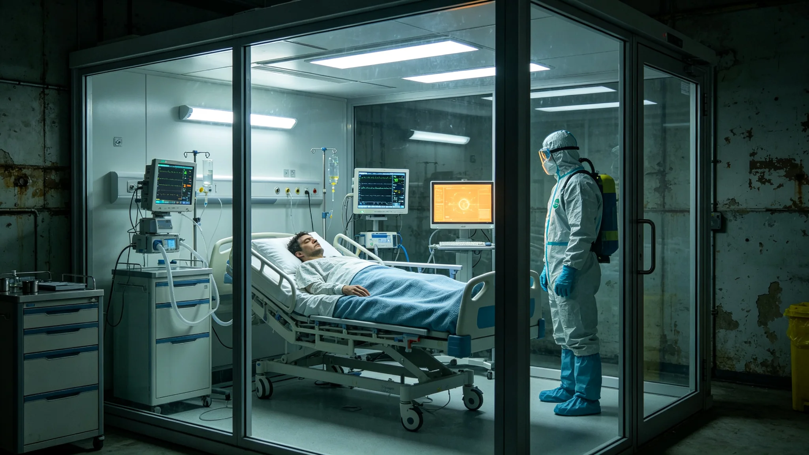

# 跨星系移民船检疫疏漏致密闭舱发热聚集事件与公共卫生处置公报

**发布机构**：公共卫生与人口部 / 生态与环境事务部
**发布日期**：3038年5月19日
**文件等级**：跨星系公开

---

## 一、事件

3038年4月，一艘跨系移民船抵新海市港。入境三级检疫（GS-3008-01）时，一名移民在途中即有低热，船医判为常见晕动，未上报。入境二级采样时，该移民所在密闭舱空气样本检出异常微生物聚集，舱内十一人相继出现轻微发热。

公共卫生与人口部立即启动隔离。

## 二、为什么会疏漏

复盘：三级检疫制度在，但船医"凭经验"把途中低热归为晕动，没触发二级采样的"途中异常上报"环节。制度有洞——制度要求抵达港采样，没强制要求途中异常必须先报。

## 三、处置

- 该移民船全舱十九人就地负压隔离；
- 异常微生物采样比对，确系普通跨系定植菌在密闭舱空调系统中聚集繁殖，非新病原体；
- 全员治疗，三日退热，无一重症；
- 空调系统整舱更换。

## 四、根因与整改

不是生物恐怖，是"人凭经验漏报"。整改：

1. 船医途中任何发热必须先报，不得自行判断为晕动；
2. 密闭舱空调系统列为入境必检项；
3. 事后追溯该船前二十航次同舱乘客，无一发病——证实未外泄。

## 五、不夸大战功

公共卫生与人口部明确：这次没死人，不是因为我们高明，是因为微生物本来就不危险。真正可怕的是"凭经验不上报"——制度不能假设人永远谨慎。

---
**附件**：该船航次记录；十九人隔离治疗表；微生物鉴定报告；三项整改令。

## 六、隔离期间的安排

十九人就地负压隔离期间，公共卫生与人口部为其安排了独立生活舱段，伙食按三系饮食禁忌供应，不得与外界接触。隔离期间，十九人情绪总体稳定，仅一名移民因思念家属出现焦虑，由随船心理辅导师每日通话疏导。三日退热后，全员复检阴性，解除隔离。公共卫生与人口部注明：隔离不是惩罚，是保护——隔离期间的人应得到和平时一样的尊重。

## 七、船医的处置

船医途中判低热为晕动，事后认定为判断失误，未追究刑责，但按《船医执业规程》记工作过失一次，暂停跨系航次执业六个月，重新培训后复岗。公共卫生与人口部注明：不追究不是纵容，是这次事故没死人、微生物也不危险；若下次因同样的漏报导致真病原体外泄，处置将完全不同。

## 八、事后追溯

该船前二十航次同舱乘客合计约 380 人，事后逐一追溯，无一发病。空调系统同舱更换后，微生物聚集繁殖的源头被清除。公共卫生与人口部在事后报告中写明：这次事件没有造成任何长期后果，是运气，也是隔离及时——两者都不能依赖。

## 九、整改的落实

三项整改（途中发热必报、空调必检、事后追溯）于3038年底全部落实。途中发热必报已写入船医执业规程，空调系统列为入境必检项，事后追溯机制纳入生物安全数据库。公共卫生与人口部注明：制度上一次洞，补一次；不指望一次补完所有洞，只指望下一次洞出现时，人知道该怎么补。

## 十、对其他移民船的排查

事件处置后，公共卫生与人口部对同期抵港的另外三艘移民船进行了回溯排查，均未发现同类微生物聚集。三艘船空调系统均按新规程提前更换。排查未造成任何停航，也未引起移民恐慌。公共卫生与人口部注明：排查是为了确认没有第二个漏网，不是为了把所有船都扣下——后者才是真正的公共卫生事故。

## 十一、移民安置

十九名隔离人员解除隔离后，按原计划前往新海市各安置点。其中 14 人按原目的地分配，5 人因隔离期间情绪波动，调整至离港较近的安置点。安置点按移民配额制度（GS-2961-01）分配，未因检疫事件歧视任何一名移民。公共卫生与人口部注明：检疫是为了保护人，不是为了把人挡在门外——解除隔离后，他们就是普通新海市居民。

## 十二、事故对跨系移民信心的影响

事件后，三系移民申请量未下降，反而在三个月内回升并略高于事件前。公共卫生与人口部认为：这说明公民相信制度能处理事故——怕的不是事故，是事故被隐瞒。这次事件公开处置、公开整改，反而增强了跨系移民对联合体检疫制度的信任。

## 十三、对船医制度的修订

事件后，《船医执业规程》新增一条：船医在航途中发现乘客体温异常，须在 2 小时内上报入境检疫港，不得自行判断为晕动或常见疾病。违反者吊销执业执照。公共卫生与人口部注明：这条规定看似苛刻，但它把"是否上报"的决定权从船医个人手里拿走，交给了制度——船医凭经验漏报一次，就可能让一个密闭舱的人全部隔离。

## 十四、事件对检疫制度的长期影响

事件后，跨系移民船检疫流程增加了"途中健康上报"强制环节，所有船医在航途中每 72 小时须向入境港报送一次乘客体温摘要。首年新增报送约 1.2 万次，均为常规健康数据，无一次触发额外隔离。公共卫生与人口部注明：这 1.2 万次例行报送，是用一次小事故换来的常规——它不刺激，但它让下一次事故发生时，入境港不是从零开始排查。
