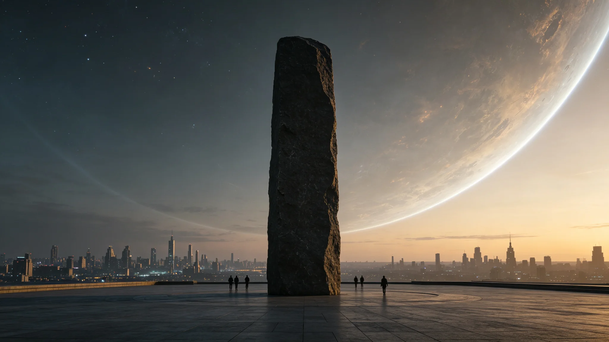

# 三恒星系文明联合体宪章签署四十周年纪念典礼与"盟石"纪念碑揭幕公报

**发布机构**：秘书处文化与礼宾司
**发布日期**：3039年12月30日
**文件等级**：跨星系公开

---

## 一、四十年了

2999年宪章签署（GS-2999-01），至3039年整整四十年。礼宾司按"周年不大庆"的原则筹备本次纪念，规模不超过普通联合体日（GS-3002-01）。

## 二、盟石揭幕

首个联合体日（GS-3002-01）时，广场立了一块无铭文"盟石"，并约定"五十年后再议是否刻字"。如今四十年，礼宾司决定先揭幕——不是刻字，是把石头从工地上"正式安放"到广场中央。

刻字仍不刻。礼宾司认为：四十年还太短，等真正满五十年（GS-3049前后）再议。

## 三、典礼

按去个人化原则（GS-3002-01、GS-3012-01）：

- 不颂词、不立塑像、不奏盟歌（仍无盟歌）；
- 三系代表各献一块本地石头，与中央盟石并列——新海市一块比邻星b玄武岩、地月一块月岩、鲸港一块地下沉积岩；
- 不阅兵——维和舰队（GS-3035-01）只在港内低调执勤，不开进广场。

## 四、一句被记下的话

首任秘书长韩星河（GS-3000-03）此时已退休，应邀观礼。礼宾司实录其只说了一句："四十年，我们没散，也没变大到让自己人不认识。这就够了。"

## 五、不搞大庆

礼宾司拒绝了"四十周年大庆"的提议。公报结尾：纪念是让公民记得，不是让公民看表演。

---
**附件**：三块本地石头来源登记；观礼名册（脱敏）；"刻字问题"延后至五十年再议的决议。

## 六、三块本地石头的来历

新海市献石取自比邻星b第一大陆架玄武岩，距今约四亿年；地月献石取自静海某陨石撞击坑边缘，月岩标本；鲸港献石取自地下城市最深沉积舱段，系地下闭环生态运行数百年后自然沉积的矿化物。三块石头在广场中央盟石旁并列，不按大小排座次——新海玄武岩最大，月岩最小，鲸港沉积岩居中。礼宾司注明：石头大小不代表文明大小，只代表它在原地躺了多久。

## 七、观礼人数与花费

四十周年纪念典礼现场观礼 7,342 人，较首个联合体日（12,417人）少约四成。礼宾司认为：四十周年不是全民节庆，是制度的周年纪念，来的人多是对联合体有直接关心的公民。典礼总支出 11.2 万信用点，仅为普通联合体日的三分之一。不发纪念品，不办晚宴，典礼后广场照常开放。

## 八、首任秘书长的身体与观感

韩星河此时已退休，年逾百岁（生于2935年，3039年时104岁），按比邻星b医疗标准仍可步行观礼，但需人搀扶。他在观礼席上坐了全程，未上台讲话，只在散场前对礼宾司说了那句"四十年，我们没散"。礼宾司未安排他发表长篇演说——他已退休，不该再被典礼拽出来当道具。

## 九、不刻字的理由

盟石已立四十年，仍无铭文。礼宾司在公报中写明：四十年里，宪章已经修订过一次（GS-3041-01尚在酝酿），若现在刻字，刻的内容必然随修订而过时；不如等五十年，让石头替后人决定该刻什么。一块不刻字的石头，比一块刻了又被改的石头，更像一个还在成长的联合体。

## 十、四十周年的制度回顾

四十年间，联合体从八部委挂牌（GS-3001-01）到议会直选（GS-3026-01），从星汇结算（GS-3006-01）到维和舰队（GS-3035-01），从预算僵局（GS-3016-01）到宪法法院裁决（GS-3030-01）。礼宾司在纪念册中只列了这些事件的档案编号，不写任何评价——制度做了什么，档案自会说话；纪念册只负责提醒后人，这些事真的发生过。

## 十一、不办阅兵的理由

礼宾司拒绝了"四十周年阅兵"的提议。理由：维和舰队刚组建四年（GS-3035-01），阅兵容易被解读为"炫耀武力"。四十周年纪念是给公民的，不是给舰队的。舰队在港内低调执勤，不开进广场。礼宾司注明：一个联合体的四十年，不需要用舰船排成方阵来证明自己存在过——它存在过，因为三系公民还在同一个议会里投票。

## 十二、对五十年纪念的预告

五十年纪念（约3049年）时，盟石将正式讨论是否刻字。礼宾司在此预告：若五十年时宪章已趋稳定，盟石可考虑刻上宪章序言首段；若宪章仍在修订，继续不刻。礼宾司注明：一块石头刻什么，不该由今天的人替五十年后的人决定——五十年后的人若觉得该刻，他们自会决定刻什么。

## 十三、典礼后的广场开放

典礼结束后，合盟广场照常向公民开放。三块本地石头旁设了一块小型说明牌，只写石头来源，不写评价。公民可自由在盟石前献花、合影、静坐。礼宾司未安排专人值守，只在广场角落设了一个环卫点。礼宾司注明：纪念不是把广场围起来收门票，是让公民随时可以来看看这块石头——它不挡路，也不说话。

## 十四、典礼的媒体记录

四十周年纪念典礼，未邀请任何商业媒体直播，仅由各系公共频道录播。录播全程 47 分钟，无剪辑，无配乐。礼宾司注明：一个四十年的纪念，不需要配乐煽情——三系公民自己会知道为什么该站在这块石头前。录播存档"文枢"，任何公民可调阅。
