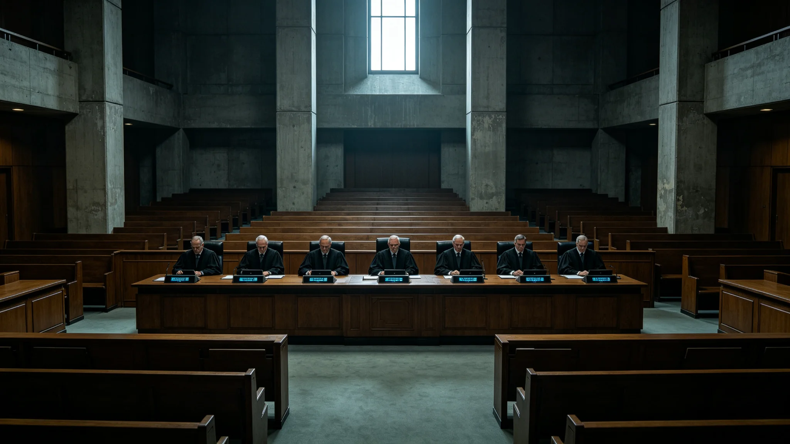

# 三恒星系文明联合体宪章首次修正案（延时治理条款）三系表决通过公报

**发布机构**：秘书处法务室 / 宪法法院
**发布日期**：3041年5月30日
**文件等级**：跨星系公开
**卷号**：法修-3041-〇一
**存卷**：修正案全文、三系表决记录、《异步议事操作细则》俱存"文枢"（见 GS-3015-01），任何人可调阅。

查联合体运行四十一年，反复撞上同一堵墙：光程。表决迟延（GS-3022-01）、预算僵局（GS-3016-01）、宪政危机仲裁（GS-3030-01），根子都是一处——三系相隔十余年光程，旧宪章按"同地同时议事"设计，不够用了。宪法法院与议会联合提出宪章首次修正案，核心即"延时治理条款"。兹将三系表决结果与修正案要目公布如下。

## 一、修正案三条（照录条文）

1. **异步议事合法化**：跨系议会允许"异步对答"，不要求三系同时在场辩论。
2. **分级授权**：日常事务下放各系本地处置，只把真正跨系的事上交联合体——减少"为一句话吵十年"。
3. **紧急与日常分流**：紧急事务按 GS-3033-01 快程序；日常事务允许慢，但慢得有明文时限。

条文三页，页缝压骑缝章，编号连号。

## 二、三系计票存根（物证登记）

修正案须三系各自公投或议会分别通过。3041年5月，三系先后表决：

| 系 | 通过比例 | 存根 |
|---|---|---|
| 比邻星系 | 64% | 计票存根第一张，开票监督签认 |
| 太阳系 | 71% | 计票存根第二张，开票监督签认 |
| 鲸鱼座τ星系 | 78% | 计票存根第三张，开票监督签认，纸面一处折痕，票箱转运所致 |

三张存根右上角各压骑缝章，同日归档。鲸港比例最高——延时治理事实上是承认"远方的人有自己的时间"，对鲸港最有利。

## 三、修的是什么，没修的是什么

法务室明确：本次只改"怎么议事"，不改"谁有权议事"。前者可以让步，后者不能。

未触及者：三系平等、三系一票否决权、宪法法院独立地位（GS-3013-01）、不设常备军原则、盟石不刻字惯例。

这是对物理硬墙的让步，不是对原则的让步。

## 四、《异步议事操作细则》要点

修正案通过后，议会制定《异步议事操作细则》：三系议员在各自时间窗口内阅读法案文本，14 个协星标准日内提交书面意见；议会秘书处汇总，交法案起草方修改；修改稿再交三系 14 日书面表决。全程无"同地辩论"，只有"书面往返"。

细则明定：14 日窗口不得缩短。给远方议员足够时间，是延时治理的前提。

## 五、分级授权清单

| 下放各系本地处置 | 上交联合体 |
|---|---|
| 各系内部教育课程 | 跨系贸易规则 |
| 各系内部医疗标准 | 跨系航道安全 |
| 各系内部治安 | 跨系公民身份 |
| — | 跨系紧急事态 |

法务室注一行：下放不是"分家"，是把各系自己能办好的事还给各系；联合体只办三系单独办不好的事。

## 六、辩论记录（一页，两句话均入档）

> 鲸港代表：我们住得最远，我们等得最久。延时治理不是迁就我们，是承认我们本来就在另一个时间里。
> 比邻星b代表：我们承认。但你们也要承认，异步议事不是慢——是换了一种快法：不必同地，也能议事。

书记员页末勾选一行：两句话均入档。

## 七、首年运行台账（3041—3042）

| 项 | 数 |
|---|---|
| 处理跨系法案 | 23 件，全部走异步书面往返 |
| 平均每件自提出至表决完成 | 约 47 个协星标准日 |
| 修正案前"同地辩论"模式 | 因光程等待平均约 120 日 |
| 缩短 | 约 60% |
| 因光程延误者 | 无 |

台账每行有秘书处经办人签认。书面往返的每一句话都进了"文枢"，可调阅；当面辩论的话，说完就散了。

## 八、三系议员的适应

比邻星b议员适应最快——他们习惯了慢。鲸港议员次之。太阳系议员最初不适应：过去习惯同地辩论，改书面后一度觉得"少了当面交锋"。首年报告照录此语，未加评。

## 九、公民反应

三系公民反应平淡。没有庆祝，也没有抗议。新海市街头咖啡馆里，有人听到消息后只说了一句：

> 早该改了。

一个宪政修正案能平淡地通过，说明它改的是技术问题，不是情感问题——三系公民早就习惯了异步议事，只是宪章一直没承认。

## 十、签署

修正案全文与三系表决记录已存档"文枢"（GS-3015-01）。本公报自发布之日起生效。特此公布。

**秘书处法务室（印）**　**宪法法院（印）**
**经办人**：法务室条令组　**记录人**：（签名略）
**日期**：3041年5月30日

> 法务室按语：修正案通过，不意味着光程消失。它只是让三系承认：我们再也不能假装住在一个屋子里了。这是宪章四十一年来第一次被修改。档案记到此为止。
