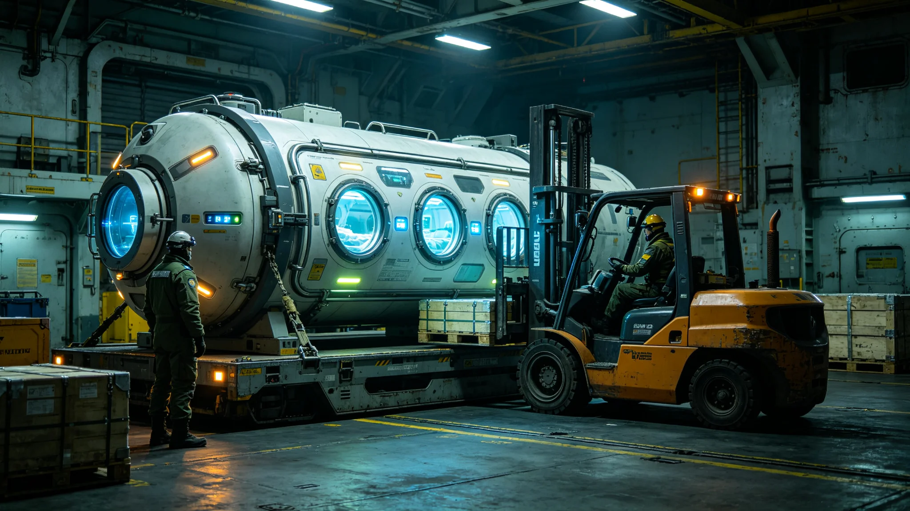

# 跨星系紧急医疗后送真空舱标准与三系医疗中继站网建成技术报告

**编制单位**：公共卫生与人口部 / 跨系医疗工程组
**报告编号**：MED-3042-033
**密级**：内部公开

---

## 一、问题

跨系班船或前哨站有人急病重伤，怎么办？光程十余年，病人等不及送回本系大医院。3038年移民船检疫事件（GS-3038-01）更暴露：途中发病，医疗后送无标准、无网络。

医学工程组建"跨星系紧急医疗后送真空舱标准"与三系医疗中继站网。

## 二、真空舱是什么

一种封闭加压、可在跨系班船上直接装载病人、维持生命体征并稳定病情的标准医疗舱。不是"救护车拉走"，是"把病人在途中稳住，到站再治"。

## 三、中继站网

在跨系航道关键节点（含主带中继港GS-3024-01）设医疗中继站，舱内设备、药品、远程会诊（量子信道瞬时）三系统一。任一站可对接标准真空舱。

## 四、建成首年

3042年，后送网处理跨系紧急后送17例，无一例途中死亡。医学工程组强调：这是"途中稳住、到站救治"，不是"隔空治病"——真正的治疗仍在目的地医院。

## 五、与检疫的接口

后送舱过入境港时，仍受生物安全检疫（GS-3008-01）约束，不因紧急而免检。医学工程组明确：救命和防疫不冲突，紧急后送也按规程来。

---
**附件**：真空舱技术标准；三系中继站布局；17例后送记录（脱敏）。
