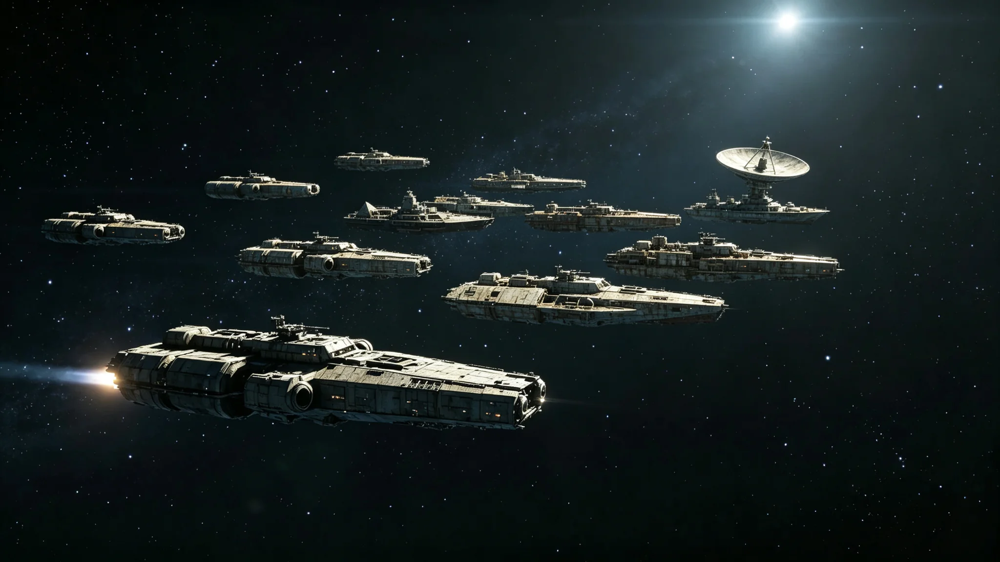

# 维和舰队首次跨三恒星系机动联演"合脉-01"行动公报

**发布机构**：安全与应急协调部
**发布日期**：3044年11月11日
**文件等级**：跨星系公开

---

## 一、从"港内执勤"到"跨系机动"

维和舰队3035年组建（GS-3035-01）后，一直在主带附近港内护航执勤。组建近十年，三系力量还没真正"一起动过一次"。3044年11月，首次跨三系机动联演，代号"合脉-01"。

## 二、联演内容

- 比邻星b方向护航艇、主带方向巡逻船、鲸港方向近港艇，在量子信道指挥下同步机动；
- 演练"某跨系航道突发海盗/迷航/遇险"的协同处置；
- 全程不开火，只练"喊齐、靠拢、识别、引导"。

## 三、暴露的问题

安全与应急协调部如实记录：

- 三系船舰的无线电口令仍各成体系，"合脉"时需翻译层；
- 跨系机动的空间天气（GS-3034-01）预警接入有半分钟延迟；
- 编队中，同型梭形飞船偏多——按视觉与操作规范，已要求下次联演掺入不同形态工程船。

## 四、结论

"合脉-01"不求完美，求的是"第一次一起动"。安全与应急协调部称：能在一张量子指挥网下听同一套口令，就是成功。下次联演改"合脉-02"，再补短板。

## 五、不针对谁

公报明确：联演不针对任何外部对象——三系之外暂无敌对。它只针对"三系自己喊不齐"这个内部问题。

---
**附件**：联演编队序列；口令统一对照表；三项暴露问题整改清单。

## 六、联演编队与时长

"合脉-01"联演历时 72 小时，参演舰船合计 19 艘（比邻星b方向 6 艘、主带方向 8 艘、鲸港方向 5 艘），参演人员合计 842 人。编队从主带锚地出发，经跨系航道模拟巡逻，在三个模拟遭遇点完成协同处置。全程量子信道指挥，不开火，只练协同。

## 七、三项暴露问题的整改

口令各成体系：已编制《三系舰队统一口令对照表》，3045年起新入舰人员须背诵；空间天气预警延迟半分钟：已要求"天警"（GS-3034-01）将预警接口直接接入舰队指挥系统，不再经人工转发；编队同型舰偏多：下次联演将掺入不同形态工程船，避免视觉与操作规范单一化。三项整改均有时限，不拖延。

## 八、联演的实际成效

安全与应急协调部认为："合脉-01"的最大成效，不是练了什么战术，是让三系舰员第一次在同一张量子指挥网下听同一套口令。联演结束后，三系舰员在锚地共同聚餐，无人再问"你是哪一系的"。协调部注明：一次联演不能让三系变成一家人，但至少让三系水兵知道，对方的舰员和自己一样，吃饭也抢着喝汤。

## 九、下一次联演

"合脉-02"定于3047年，主练"跨系应急搜救"。协调部注明：下次联演不追求规模更大，只追求把这次暴露的三个问题改完。一次联演改三个问题，比一次联演搞十个花样有用。

## 十、联演的指挥与通信

"合脉-01"全程由主带锚地指挥中心经量子信道统一指挥，三系舰员在各自舰船接收指令。指挥延迟约 1.4 秒，可接受。联演中，三系舰员需用各自母语与翻译层沟通，偶尔出现指令理解偏差 3 次，均在 30 秒内纠正。安全与应急协调部注明：一支舰队第一次一起动，听不懂彼此的话是正常的；但我们有翻译层，有纠错机制，30 秒能改过来——这就够了。

## 十一、联演后的三系舰员交流

联演结束后，三系舰员在锚地共同聚餐，约 842 人参加。聚餐无敬酒、无致辞，只吃饭。席间，比邻星b舰员教主带舰员辨认比邻星b星图，主带舰员教鲸港舰员辨认主带碎片带。安全与应急协调部注明：一次联演不能让三系变成一家人，但至少让三系水兵知道，对方的舰员和自己一样，吃饭也抢着喝汤。

## 十二、联演的成本

"合脉-01"联演总成本约合星汇 1,800 万，主要用于舰船燃料、量子信道带宽、锚地补给。议会在审议联演经费时全额通过。安全与应急协调部注明：一次联演花 1,800 万，换来三系第一次在一张量子指挥网下听同一套口令——这笔钱花得值。

## 十三、联演的民间反响

"合脉-01"联演公报发布后，三系公民反应平淡。新海市咖啡馆里，有人问："舰队又去演习了？"另一人答："嗯，没开火。"前者说："那就好。"安全与应急协调部注明：联演没人欢呼，说明公民觉得舰队干的是它该干的事——一支舰队存在的意义，不是被欢呼，是被忘记。

## 十四、联演档案的归档

"合脉-01"联演全部记录归档"文枢"，包括编队序列、口令对照表、三项整改清单。协调部注明：第一次联演不会完美，但它的记录要留着——下次联演时，对照看看改了几个。"合脉-01"结束后，三项暴露问题均已列入整改清单，限期次年三月前完成。联演全程未开一炮，无人员伤亡。参演舰船 19 艘，人员 842 人，历时 72 小时。联演总成本约 1,800 万，议会全额通过。联演记录已归档"文枢"，供下次联演对照。"合脉-02"定于3047年，主练跨系应急搜救，不追求规模更大，只补短板。联演不针对任何外部对象，只针对"三系自己喊不齐"这个内部问题。
