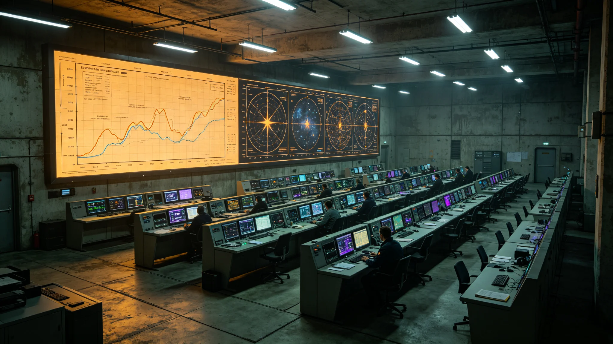

# 三恒星系能源互济调度网与聚变—光伏配额互济机制建成公报

**发布机构**：跨星系贸易与产业部 / 能源处
**发布日期**：3045年4月22日
**文件等级**：跨星系公开

---

## 一、为什么能源能"互济"

三系能源结构不同：比邻星b靠地热与聚变（GS-2400-01、GS-2965-01），鲸港靠地下核电与有限光伏，太阳系主带靠戴森云与聚变。各系余缺不均——比邻星b有时过剩，鲸港地下城市一到维护期就紧张。

但电不能跨光年送。能源互济的不是"电"，是"配额与调度优先级"：某系缺能时，联合体优先调配其跨系生产、跨系用能的节奏，而非真把一束电从新海送到鲸港。

## 二、机制

- 三系能源余量实时上屏；
- 缺能一方，跨系耗能活动（如主带熔炼GS-2085-02）临时错峰，把能源让给缺能方；
- 聚变—光伏按各系禀赋设"配额互济额度"，不用现金结算，用星汇（GS-3006-01）记一笔。

## 三、首年运行

3045年，鲸港地下城市两次设备维护期缺能，经调度网错峰主带跨系耗能，平稳度过，未发生GS-2963-01式电网崩溃。能源处称：互济不是"送电"，是"在缺的时候让一下"。

## 四、不万能

能源处明确：光程下的能源互济，救不了真正的物理断电。它是调度智慧，不是魔法。

---
**附件**：三系能源余量曲线；两次错峰调度记录；配额互济额度表。
