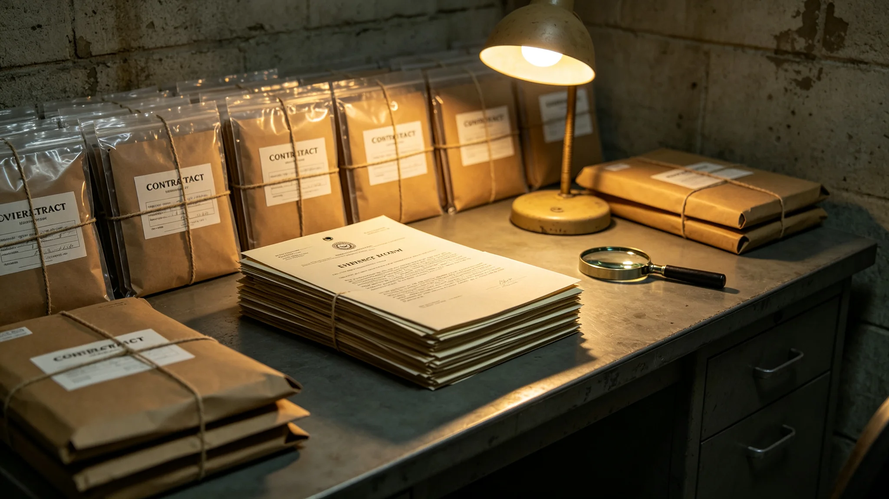

# 监察专员查办首起跨星系招标串标案与责任人处分公报

**发布机构**：监察专员办公室 / 秘书处法务室
**发布日期**：3046年6月8日
**文件等级**：跨星系公开（责任人姓名按惯例隐去，职位与处分公开）

---

## 一、案起何处

3014年集中招标首年（GS-3014-01），贸易与产业部已注意到个别比邻星b厂商与太阳系厂商在开标前"似乎已通气"，但证据不足，监察专员当时只记了一笔观察。

三十二年后的3045年，一笔跨系建材采购再次出现异常报价曲线。监察专员据此立案，回溯三十余年旧卷，终于拼出链条。

## 二、案情（脱敏）

某跨系建材采购中：

- 比邻星b一厂商与太阳系一厂商，在多次集中招标中"轮流中标"——你中标这单，我中标那单，报价曲线呈人为协调；
- 中间通过一个跨系中间人传话；
- 未涉及武力、未涉及安全，纯商业串标。

## 三、处分

- 两家厂商：取消其跨系集中招标资格十年，没收违法所得；
- 跨系中间人：移送宪法法院，按跨系商法裁处；
- 采购方经办人员：未查实收受利益，但负"未察觉串通"之管理责任，诫勉。

## 四、为什么拖了三十二年

监察专员不讳言：这案子从3014年有苗头到3046年才查实，因跨系证据调取受光程所限，旧卷分散在"文枢"（GS-3015-01）三系副本中，拼接极慢。能查出来，靠的正是档案统一存储后可跨系调取。

## 五、制度的回应

案后，集中招标（GS-3014-01）增补：开标前厂商报价曲线自动比对，异常即预警。监察专员称：一个案子拖了三十二年，但制度把它办了——这就够了。

---
**附件**：两家厂商中标轮次对照；中间人移送卷宗；报价曲线比对图；开标预警增补令。

## 六、案情细节（脱敏）

两家厂商在3014—3045年间，共参与跨系集中招标 47 次，其中"轮流中标" 31 次，中标总金额约合星汇 8.7 亿。串标手法简单：每次开标前，两家厂商通过一个跨系中间人电话通气，约定这次谁让、谁报价略高。中间人从中抽取约 1% 的佣金。监察专员调取"文枢"存档的 47 次开标记录，比对报价曲线，发现 31 次中标方之间存在系统性"互补"——你低我就高，你高我就低。

## 七、证据调取的困难

跨系证据调取受光程所限，两家厂商分别在比邻星b与太阳系，中间人在主带。监察专员从3045年立案到3046年查实，用时约十四个月，其中十个月在等待三系证据经量子信道往返。若"文枢"未建成（GS-3015-01），证据分散在三系各自档案馆，这案子可能永远查不出来。监察专员注明：这案子拖了三十二年，但最终能查出来，靠的正是档案统一存储——技术进步，让旧案终于能被翻出来。

## 八、处分的执行

两家厂商取消跨系集中招标资格十年，没收违法所得约合星汇 1.2 亿。跨系中间人移送宪法法院，按跨系商法裁处罚金。采购方经办人员未查实收受利益，但负"未察觉串通"之管理责任，诫勉谈话，记入档案。监察专员注明：处分不是"杀人立威"，是让所有厂商知道——跨系招标不是可以轮流坐庄的牌局。

## 九、制度的改进

案后，集中招标增补"开标前厂商报价曲线自动比对"系统：若同两家厂商在三次招标内出现"互补"报价，系统自动预警，监察专员介入。首年预警触发 7 次，其中 6 次系正常竞争，1 次系新苗头，已立案观察。监察专员称：一个案子拖了三十二年，但制度把它办了——下次再有，系统自己就会报警。

## 十、两家厂商的后续

两家被取消资格的厂商，在十年禁入期内不得参与任何跨系集中招标。两家厂商在本系内部的经营不受影响——跨系串标只禁跨系招标，不判其本系死刑。监察专员注明：处分不是"让谁破产"，是"让谁在跨系牌桌上坐十年冷板凳"——够痛，但不致命。

## 十一、对中间人的裁处

跨系中间人移送宪法法院后，按跨系商法裁处罚金约合星汇 4,000 万，并终身禁止从事跨系中介业务。中间人未上诉。监察专员注明：一个中间人能在两家厂商之间传话三十多年而不被发现，说明过去的监管有盲区；现在盲区补上了。

## 十二、对采购制度的长期影响

此案后，跨系集中招标的报价曲线自动比对系统成为标配。首年预警 7 次中 1 次新苗头已立案观察。监察专员注明：一个拖了三十二年的旧案，换来了一套能自动报警的新制度——这是这案子最值钱的地方。

## 十三、对其他厂商的警示

此案公开后，三系参与跨系集中招标的其他厂商，首年主动"自查自纠"报备报价异常 9 起，均系正常竞争，无新串标。监察专员注明：这 9 起主动报备，说明案子办得有效——其他厂商知道了，串标现在有自动报警，不如自己先把话说清楚。

## 十四、本案的历史意义

这是联合体跨系招标史上第一起被查实的串标案。它不是最后一起，但它是第一起。监察专员注明：第一起案子总是最慢的——三十多年才查出来；但第一起办完，后面的就快了。
