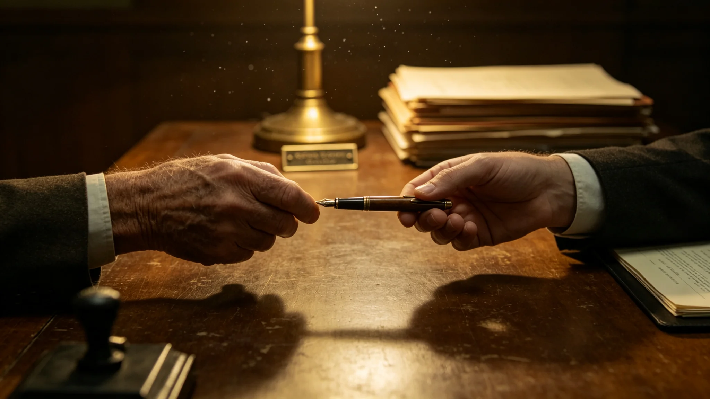

# 第二任联合体秘书长（首任卸任交接期）交接档案与考勤摘编

**归档单位**：秘书处人事与档案总目组
**档号**：POL-SG-3049-009
**密级**：交接记录公开、考勤内部

---

## 卷首

首任秘书长韩星河（GS-3000-03）任期届满，3049年交棒。本卷不写"两代伟人"，只写交接清单与两段考勤。

---

## 一、交接清单（节）

3049年6月底，韩星河向第二任秘书长交接：

- 八部委公章与保险柜钥匙；
- "文枢"（GS-3015-01）最高权限操作码；
- 未结事项清单：盟石刻字问题（GS-3039-01延后至今，恰满五十年，须今秋决议）、主带会费比例重核（GS-3030-01）收尾、"合脉"联演续办。

韩星河在交接清单末页手书："没欠账，也没留尾巴。盟石刻不刻，你们定。"

## 二、首任卸任考勤（任期末段）

| 时段 | 应到 | 实到 | 备注 |
|---|---|---|---|
| 3049上半年 | 121 | 119 | 退休前腰椎旧疾，偶请病假 |

韩星河卸任后回新海市旧居，不任顾问、不接受终身头衔。

## 三、第二任秘书长登记页（照录人事卡）

- 姓名：未在本卷公开（按秘书长惯例，交接档案先匿名，待正式就职公报另行发布）；
- 推选：经议会直选（GS-3026-01）产生；
- 入职体检：合格；
- 交接期考勤：3049年6—7月随岗熟悉，无迟到。

## 四、一处交接小插曲

交接日，韩星河把一支用了多年的旧钢笔送给继任者。继任者不收，说："您的笔您留着，我用我自己的。"韩星河没坚持。礼宾司把这细节记进交接档案——不立"权杖交接"的仪式，一支旧笔也不必传承。

## 五、卷尾

联合体不设"终身领袖"。首任走了，第二任来了，八部委照常挂牌，公文照常走"文枢"。交接完，世界没停。

**归档人**：人事组值班员
**双方确认**：韩星河、第二任秘书长（签名经核验）
