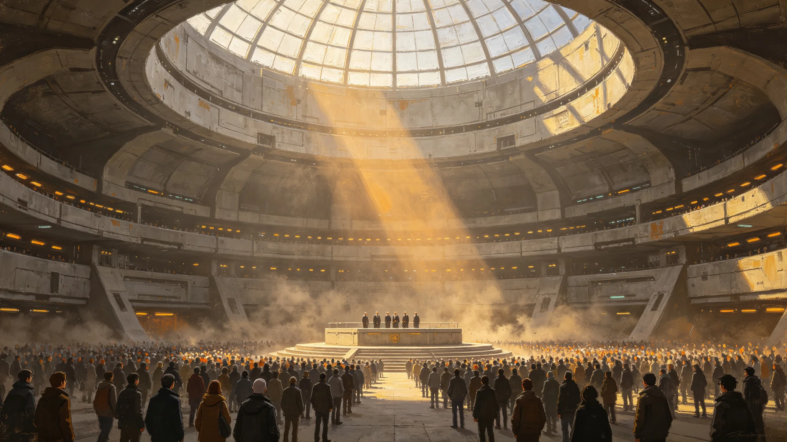

# 三恒星系文明联合体在任秘书长任期第五年考勤体检与施政进度公开档案

**归档单位**：联合体执行委员会 / 人事与监察联合处
**归档日期**：3051年4月15日
**文件等级**：跨星系公开（个人隐私栏已按《联合体公务员隐私条例》第14条遮蔽）
**卷宗号**：SEC-3051-PM-0415

## 一、卷宗说明

本卷宗为联合体秘书长（在任·第七任）第三任期第五年度的例行公开档案。依《联合体公务员法》第88条，秘书长及其办公室正副主管须于每年任期过半节点，向联合体监察院提交本年度考勤记录、体检结论与施政进度三件套，并由本处抽去可识别医疗隐私后向全星系公开。

须说明：本卷不构成对秘书长个人品行的评价，亦不载任何"历史定位"式断语。卷宗所载，仅为考勤打卡机记录、医用终端结论与进度报表三类原始凭证之汇编。凡读此卷者，应将秘书长视为一台精密运转的制度机器中一名被考勤、被体检、被签批的零件，而非其他。

## 二、考勤与出勤记录

本年度（3050年4月—3051年4月）秘书长应出勤工作日按联合体标准历为249日。打卡系统统计如下：

| 项目 | 数值 |
|---|---|
| 实际签到工作日 | 231日 |
| 因公离席（跨星系会晤、巡视） | 14日 |
| 年休核定使用 | 12日 |
| 病/事假 | 2日 |
| 迟到（超过规定签到窗口15分钟） | 3次 |
| 早退 | 0次 |

监察处备注：三次迟到均发生在新海市凌晨例行广播听证会后次日，经核查与跨星系时差调度有关——秘书长需在鲸鱼座τ星当地深夜通过量子链路旁听该地议会质询，次日签到窗口相应后延，已按《跨时区勤务补偿办法》第7条登记补休，不作违纪处理。

两次事假均为其配偶年度复诊陪同，记录在案，未影响任何待签议案。

## 三、体检结论摘要（隐私遮蔽后）

本年度体检由联合体中央医院巡回组在秘书长办公室附设诊室完成。遮蔽后可公开结论如下：

- 静态血压、静息心率、肝肾功能指标均在联合体公务员健康标准区间内；
- 骨密度T值为−1.1，较上年度下降0.04，主治医嘱其保持每周不少于三次离心环步行训练，未达离岗标准；
- 眼部调节疲劳评分较去年升高12%，与每日长时间审阅跨星系激光公文图像有关，已配发防眩光阅读镜片；
- 睡眠监测显示其深度睡眠时段稳定在当地时间02:00—05:00，与一般新海市居民作息错位，医务处建议其在跨星系时差政务高峰期后调整。

病历原文及全部检验数值依隐私条例封存于中央医院加密库，不予公开。

## 四、签批与文书痕迹

本年度经秘书长签批的跨星系公文共1,842件。监察处抽查其中60件，重点比对签名笔迹稳定性。抽查明细：

- 签名一次签成、无涂改者54件；
- 因涂改稿纸重新签署者4件，均涉及预算数字修正；
- 因激光链路传输延迟、补签者2件，均附补签说明与秘书监签。

一处可公开的文书痕迹：在关于《跨星系人员自由流动法》实施评估的一份批注中，秘书长用红笔在"建议提高家庭团聚配额"一句旁画了下划线，未写评语，仅在页脚署日期。该批注后被列入3060年修法草案的议事参考。

## 五、施政进度对照

对照其第三任期就职时公布的六大纲领，截至本节点进度如下：

| 纲领 | 承诺节点 | 当前进度 | 监察处批注 |
|---|---|---|---|
| 联合体公务员考绩法修订 | 3052年底 | 草案已三读 | 进度正常 |
| 跨星系自由贸易区零关税扩围 | 3053年底 | 已完成六成税目 | 滞后约一季，系鲸鱼座τ星产能保护争议所致 |
| 第六代聚变推进适航推广 | 3054年底 | 试运行鉴定完成（见GS-3053-01） | 进度正常 |
| 联合体统一结算币"联币"扩容 | 3055年底 | 流通平稳 | 进度正常 |
| 三恒星系态势感知网三代升级 | 3058年底 | 已验收（见GS-3058-01） | 提前完成 |
| 欠发达成员发展补助追加 | 3051年底 | 拨款已下拨 | 进度正常 |

## 六、附则

本卷宗不收录任何对秘书长个人魅力、历史功绩或"时代象征"地位的评述。此类评述若存在，应载于未来年度的民间记忆或史志类文书，而不属于本处按考勤、体检、签批三类公文物证所能出具的范围。

卷宗原件密封保存于联合体监察院档案库；本公开本供三恒星系全体公民调阅。

**归档人**：人事与监察联合处 科员（签名略）
**复核人**：监察院驻执行委员会监察专员（电子签章）
**日期**：3051年4月15日
