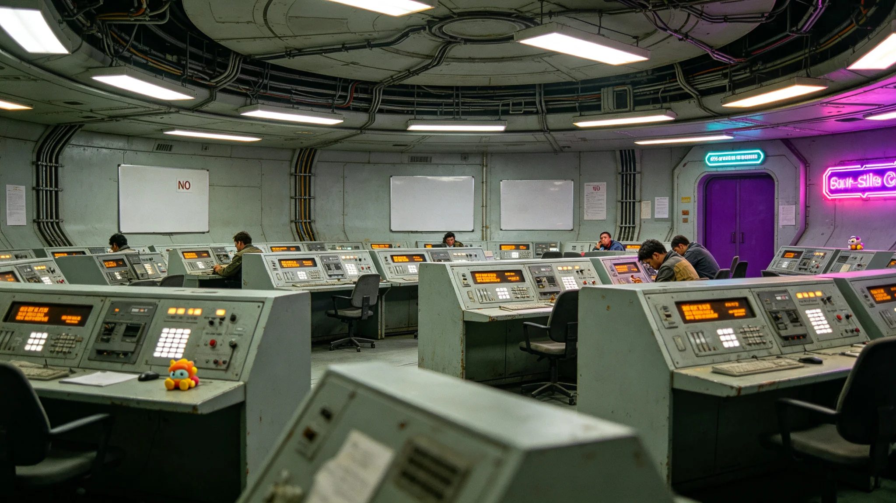

# 联合体公务员考绩法第三次修订公报

**发布机构**：三恒星系文明联合体执行委员会 / 人事局
**发布日期**：3052年6月1日
**文件等级**：跨星系公开
**公报号**：UN-PSL-3052-0601

## 一、修订缘起

自《联合体公务员法》于3001年颁行以来，公务员考绩办法历经两次修订（3018年、3034年）。随着三恒星系行政体系扩张至48亿人规模下的约1,20万公务员岗位，原考绩办法在跨星系岗位评鉴、时差岗位出勤认定、自动化行政辅助（以下称"协理机"）工作边界三处出现系统性不适用。经联合体议会司法委员会三读，第三次修订案于3052年5月28日表决通过，现予公布。

## 二、修订要点

**（一）跨星系岗位评鉴的去时长化**

原办法以"有效在岗时长"为考绩基础指标之一。但对常驻鲸鱼座τ星、需经量子链路与比邻星b本部协同的岗位而言，光时差本身不构成怠工。修订案第12条明确：跨星系岗位不再以同步在线时长计考绩，改以"可交付节点完成率"为单一核心指标。监察处据此删除了考勤系统中对跨星系岗位的"连续在线分钟数"统计项。

**（二）时差岗位出勤的补偿认定**

针对秘书长办公室、跨星系结算中心等需在成员方深夜值守的岗位，修订案第17条增设"时差补偿窗口"：凡因收听成员方议会质询、听证而致次日迟到者，不记违纪，改记补休——此即GS-3051-01卷宗中三次迟到未作违纪处理的法律依据。

**（三）协理机工作的边界**

修订案第21条首次成文规定：公务员签批的最终责任不因其使用协理机生成初稿而转移。凡公文须经有法定签名权的公务员逐条复核后署名，协理机仅承担草稿、摘要与数据归集。该条系对近年多起"机稿直签"争议的统一回应。考绩中，"独立复核率"首次列为扣分项——凡连续三份公文未对机稿提出实质修改者，考绩降一档。

**（四）隐私与考绩的隔离**

修订案第30条重申：公务员生理监测数据（骨密度、睡眠、眼疲劳等）不得作为考绩升降依据，仅用于离岗标准判定。此条直接回应3051年公开卷宗中各界对"以健康数据问责"的担忧。

## 三、过渡安排

新办法自3053年1月1日起施行。3052年6月至12月为过渡期，各成员方人事局须完成考勤系统字段改造：删除跨星系岗位的在线时长统计模块，增设可交付节点登记模块。过渡期内旧办法与新办法并行，以就高不就低原则评定当年度考绩。

## 四、附则

本公报不预设任何"更高效、更公正"的价值结论。考绩办法的每一次修订，都是对制度机器中磨损零件的更换；至于更换后是否更合用，由3053年起的运行数据回答。

**签发人**：人事局局长（签名略）
**日期**：3052年6月1日

## 五、修订前后考绩结果对比

3051年度（旧办法）考绩结果：甲等 8.2%、乙等 31.7%、丙等 48.3%、丁等 11.8%。新办法施行首年（3053年）预计甲等比例略升——因跨系岗位不再以时长计考绩，一批常驻鲸港的公务员从丙等升至乙等。人事局注明：这不是"放水"，是把原来被光程冤枉的人，从考绩分数里放出来。

## 六、协理机边界的执行

修订案第21条施行后，首年"机稿直签"争议降为 0。凡使用协理机生成初稿的公文，公务员须逐条复核并署名，连续三份未提实质修改者考绩降一档。首年有 3 名公务员因此降档，均为新入职者。人事局注明：协理机是工具，不是签名人——签了名，就是你的责任。

## 七、过渡安排的执行

3052年6月至12月过渡期，各系人事局完成考勤系统字段改造：删除跨系岗位在线时长统计，增设可交付节点登记。过渡期内旧办法与新办法并行，就高不就低。3053年1月1日新办法正式施行，旧办法废止。人事局注明：一次考绩法修订，改的是字段，不是人心——字段改了，人心自然跟着走。

## 八、修订后的首年考绩结果

新办法施行首年（3053年），三系公务员考绩结果：甲等 9.1%、乙等 34.2%、丙等 47.5%、丁等 9.2%。较旧办法，甲等比例上升 0.9 个百分点，丁等下降 2.6 个百分点。人事局注明：这不是"放水"，是把原来被光程冤枉的人从分数里放出来后，分布自然回归正常。

## 九、对协理机的后续监管

修订案第21条施行后，人事局建立协理机使用日志审计：每月抽查 10% 公务员的协理机使用记录，检查其是否对机稿提出实质修改。首年抽查发现 3 起"机稿直签"，均已按考绩降档处理。人事局注明：协理机是工具，用它不丢人；但签了名不看一遍，丢人。

## 十、修订的历史定位

这是《联合体公务员法》颁行 51 年来第三次修订。前两次分别在 3018 年（跨系岗位初设）和 3034 年（时差岗位初现）。第三次修订的核心，是承认"协理机已经在替公务员写初稿"这件事。人事局注明：每一次考绩法修订，都是对制度机器中磨损零件的更换——协理机出现了，考绩法就得跟着改。

## 十一、修订的后续

新办法施行后首年（3053年），三系公务员考绩分布回归正常，"机稿直签"争议降为 0。人事局注明：一次修订，把跨系岗位从光程冤枉里放出来，把协理机从"责任真空"里拉出来——这两件事，一件是对人的公道，一件是对制度的公道。
