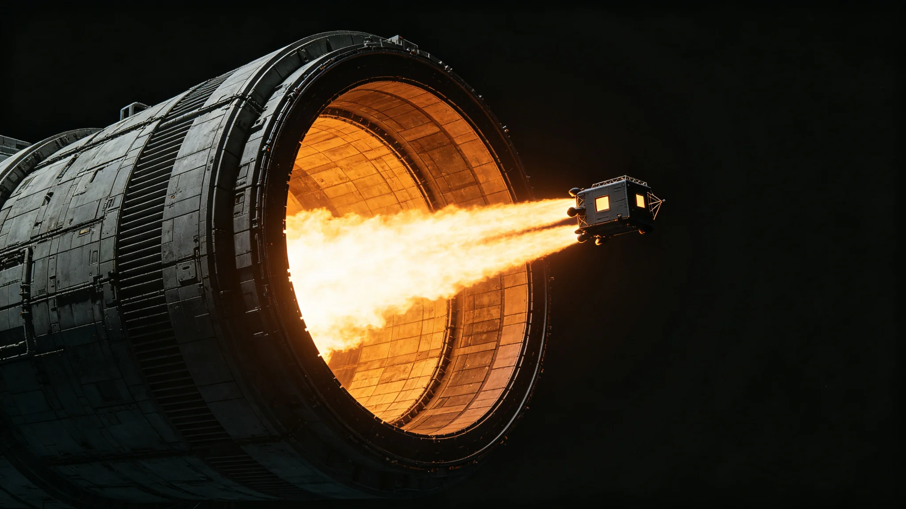

# 第六代聚变推进系统长航程试运行鉴定报告

**编制单位**：联合体推进工程研究院 / 外缘试车锚地总装处
**报告日期**：3053年9月20日
**文件等级**：跨星系技术公开（涉及推力曲线的核心密级段落已按保密条例第9条删节）
**报告号**：PE-3053-LT-0920

## 一、试验对象与目的

第六代聚变推进系统（工程代号"长庚-Ⅵ"）在第四代（见GS-2932-01）基础上，将主燃烧室的磁约束位形从环箍式升级为仿星器式稳态约束，目标是把单次连续点火时长从第四代的400小时提升至2,000小时量级，以支撑跨星系定期航线的中途不再补燃。本次为其首次长航程（满推力连续运行）试运行，共进行三次试车，时长分别为620、1,100、2,010小时。

## 二、试验台与工况

试车在太阳系外缘"玄冥"系试车锚地进行。主喷口朝向星际介质稀薄方向，单一硬光源来自试车时自持的聚变羽流与远方恒星；背光面在纯黑深空中呈雕塑状剪影。测量系统由三组独立遥测链路冗余采集，任一组失效不致结论悬空。

## 三、关键数据

| 项目 | 第四代实测 | 长庚-Ⅵ本次实测 | 设计目标 |
|---|---|---|---|
| 单次连续点火时长 | 400 h | 2,010 h | ≥2,000 h |
| 平均比冲 | 2.1×10⁶ s | 2.9×10⁶ s | ≥2.8×10⁶ s |
| 第一壁热斑峰值温度漂移 | ±4% | ±1.1% | ≤±2% |
| 2,000小时后第一壁厚度剩余 | 91% | 96.4% | ≥95% |
| 试车后需更换的烧蚀件数 | 17件 | 3件 | ≤5件 |

第三次试车满推力连续运行2,010小时后主动停堆。拆检显示第一壁烧蚀均匀，未出现局部热斑贯穿；仿星器位形的磁场笼稳性在长时工况下保持设计裕度。

## 四、发现的问题

鉴定组在拆检中记录三项未达预期：

1. **工质泵密封件温漂**：第三次试车后段，两台工质泵机械密封件出现超出设计值0.3℃/千时的温升趋势，建议在适航型号中改为双通道冗余密封；
2. **辐射屏蔽层活化**：试车舱壁内侧中子活化剂量较第四代同工况高8%，需在载人型号中加厚0.4m的水层屏蔽；
3. **遥测光纤疲劳**：连续点火2,000小时工况下，贴壁布置的测量光纤出现微弯损耗，建议改用悬浮式走线。

上述三项均不构成拒试理由，但须在适航鉴定前完成整改并复测。

## 五、结论

鉴定组一致认为：长庚-Ⅵ第六代聚变推进系统达到长航程试运行阶段的主要设计目标，第一壁寿命与连续点火时长两项关键指标通过考核。在完成第四节所列三项整改并经复测后，可提交联合体适航委员会进行跨星系航线适航鉴定。

本报告不宣称该系统"开启了新的时代"。它只是推进工程线上一颗又一颗试车数据中的一颗；它是否配得上其代号，由此后数十年航线日志自行回答。

**主笔工程师**（签名略）
**鉴定组长**（电子签章）
**日期**：3053年9月20日
