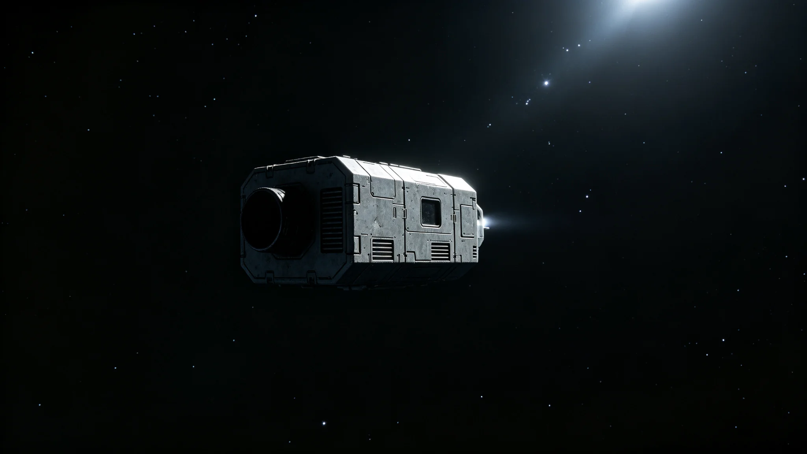

# 跨恒星系客运船"恒心-12"中段舱压异常应急返航事件公报

**发布机构**：联合体航行安全委员会 / 跨星系航段应急处
**发布日期**：3054年3月8日
**文件等级**：跨星系公开
**公报号**：SA-3054-0308

## 一、事件经过

3054年2月19日04时12分（航道标准时），跨恒星系定期客运船"恒心-12"自比邻星b驶往鲸鱼座τ星、航至中点过界后第三日，第3气密舱段自动监测发出舱压缓降告警。当班乘务长按第31号预案，于告警后4分钟内完成：

1. 第3舱段62名乘客就近转移至相邻第4、第5加压舱段；
2. 第3舱段隔离加压，启动应急补压；
3. 向最近的联合体中继站发送SOS与舱压曲线遥测；
4. 经与航道调度协商，决定放弃原定中段航线、启动应急返航程序。

从告警到全体乘客就位、舱段隔离完毕，用时11分钟。全程无一人暴露于失压环境，无一人因转移受伤。

## 二、原因初查

返航靠泊比邻星b轨道船坞后，法证组对第3舱段气密层进行拆解。初查结论：舱段内壁一处用于检修开口的密封垫圈，在经历约1,900次加压循环后出现疲劳微裂，属材料疲劳，非制造缺陷，亦非维护疏漏——上次年检距事发仅4个月，该项指标当时合格。

法证组同时检查了同型"恒心"系列其余在册船只的同类垫圈，未发现批量性缺陷。

## 三、处置与整改

1. 对事发62名乘客：依《跨星系客运服务规程》发放全额退票与航程补偿，全员接受了一次免费的着陆后体检，结果无异常；
2. 对第3舱段密封垫圈：全批次更换为耐疲劳循环次数提高一倍的新型垫圈；
3. 修订年检规程：将该项垫圈的耐压循环寿命检查从"目视"改为"超声探伤"，检查周期由4个月缩短为3个月；
4. 当事当班乘务长：按预案处置得当，不予追责，亦不记"表彰"——其本人在事后陈述中表示"这是规程要求做的事，做了而已"。

## 四、时间线

| 时刻（航道标准时） | 事件 |
|---|---|
| 04:12 | 舱压缓降告警 |
| 04:16 | 启动第31号预案，乘客转移开始 |
| 04:23 | 第3舱段隔离、应急补压启动 |
| 04:26 | 向中继站发出SOS与遥测 |
| 05:02 | 航道调度批准应急返航 |
| 2月22日 | 靠泊比邻星b轨道船坞，法证拆检 |
| 3月8日 | 本公报发布 |

## 五、附则

本事件无人伤亡，未产生需要"英雄"的局面。规程有效、执行到位、整改落地，即为一次合格的应急。船员、乘客与公众从本事件中应得的唯一教训是：密封圈会疲劳，而疲劳可被超声探伤提前发现——如此而已。

**签发人**：跨星系航段应急处处长（签名略）
**日期**：3054年3月8日

## 六、对62名乘客的后续

62名乘客返航后接受免费体检，全部无异常。其中 14 名乘客在接受采访时表示"当时有点慌，但乘务长处置得很稳"，无一人提出投诉。全票退票与航程补偿已在返航后 72 小时内发放完毕。航行安全委员会注明：一次应急返航，补偿到位、体检无异常、无投诉——这是规程有效的证明。

## 七、对同型船的排查

事发后，法证组对同型"恒心"系列其余在册船只的同类垫圈进行超声探伤排查，共检查 23 艘，发现 2 艘同类垫圈已出现早期疲劳微裂，立即更换。排查未造成任何停航。航行安全委员会注明：一次小事故，换来了对全系列的超声探伤——这比一次大事故后再查，便宜得多。

## 八、乘务长的事后陈述

当事乘务长在事后陈述中表示："这是规程要求做的事，做了而已。"委员会未对其记"表彰"，也未追责。乘务长事后继续在"恒心-12"服役，未调离。航行安全委员会注明：规程要求做的事，做好了不表彰——表彰了，下次别人就会为了表彰而冒险。

## 九、对同型船的长期跟踪

全批次更换新型垫圈后，同型"恒心"系列 23 艘船在随后 12 个月内未再发生同类舱压异常。超声探伤改为 3 个月周期后，累计检出早期疲劳微裂 4 起，均在失压前更换。航行安全委员会注明：一次小事故，换来了 23 艘船的全批次更换和 3 个月周期的超声探伤——这比一次大事故后再查，便宜得多。

## 十、乘客的事后反馈

62 名乘客中，58 人在返航后填写了反馈表，其中 52 人表示"下次还坐恒心系列"，6 人表示"暂时不想坐了"。无一人投诉。航行安全委员会注明：62 个人里有 6 个暂时不想坐了，这是正常的——一次舱压异常，总会让人暂时不想上船。

## 十一、事件的历史定位

"恒心-12"事件是"恒心"系列运营以来首次中段舱压异常返航。此前"恒心"系列已安全运行约 30 年，累计运送乘客约 2.4 亿人次。航行安全委员会注明：一次小事故，不是"恒心"系列不行了，是密封圈到了寿命——这就是规程存在的意义。

## 十二、事件对航线的影响

"恒心-12"返航后，该航线未停航，由"恒心-13"替补运行。62 名乘客在 72 小时内完成退票与补偿。航行安全委员会注明：一艘船返航，另一艘顶上——这就是定期航线的意义，不因一艘船故障而停摆。

## 十三、事件的长期教训

密封圈会疲劳，而疲劳可被超声探伤提前发现。航行安全委员会注明：一次小事故，无人伤亡，规程有效，整改落地——这就是一次合格的应急。船员、乘客与公众从本事件中应得的唯一教训是：规程不是纸上的字，是在 11 分钟内把 62 个人转移到安全舱段的那套动作。
