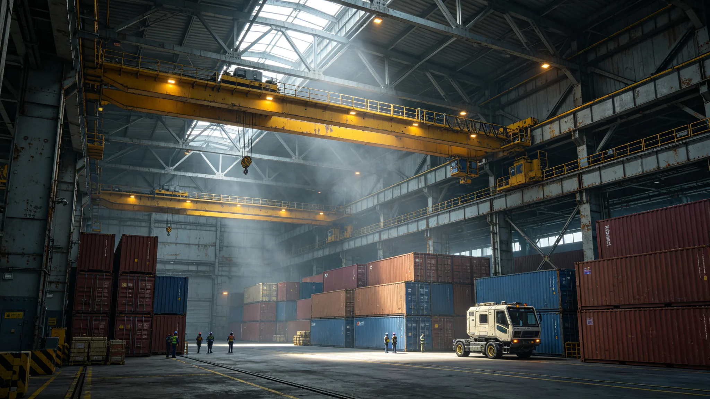

# 三恒星系自由贸易区全面零关税首年决算公报

**发布机构**：联合体经济理事会 / 贸易与关税处
**发布日期**：3056年11月30日
**文件等级**：跨星系公开
**公报号**：EC-3056-1130

## 一、决算背景

继3053年完成六成税目零关税（见GS-3051-01进度表）后，三恒星系自由贸易区于3056年1月1日起对剩余税目全面取消关税。本公报为运行首年（3056年1月—11月）决算。

## 二、主要数据

| 指标 | 3055年（过渡期） | 3056年（零关税首年） | 同比 |
|---|---|---|---|
| 跨星系贸易总额 | 基线100 | 137.2 | +37.2% |
| 三成员间贸易占比 | 61% | 74% | +13个百分点 |
| 鲸鱼座τ星出口额 | 基线100 | 129.8 | +29.8% |
| 主带工业品过境量 | 基线100 | 144.1 | +44.1% |
| 比邻星b入境旅游购物消费 | 基线100 | 118.5 | +18.5% |

## 三、税源变化与补偿

零关税后，三成员间关税收入较上年减少约合星元410亿。依《联合体税收协定》（GS-2976-01）所定税源分配框架，缺口由两途补足：

1. 联合体对跨星系过境货物按统一标准征收0.8%的"航道维护费"，收入全额归联合体发展基金；
2. 欠发达成员（鲸鱼座τ星）由联合体发展基金按其关税减收额的90%予以补偿，为期三年，逐年递减。

决算显示，鲸鱼座τ星当年虽关税收入下降，但其出口额增长带来的所得税收增量已超过关税损失，净财政收入不降反升6%。

## 四、争议与遗留

1. **非关税壁垒残留**：部分成员方仍以"检疫""认证"为名对特定品类设置程序性延迟。经济理事会已列出17项待清理清单，要求3057年底前消除；
2. **转运套利**：个别商号借零关税通道，将第四恒星系方向货物经主带中转后冒充三成员原产，已查实11起，依《原产地规则》补税并公示；
3. **小航运价**：零关税后小批量跨境货运需求激增，现有跨星系小船舱位紧张，运价上浮。经济理事会已要求主带航运协会3057年增投小型货船12艘。

## 五、附则

本公报不宣称零关税"带来了繁荣"。贸易额上升37%是事实，原产地套利11起也是事实。制度放开门后，进来的既有货，也有钻空子的人——后者已被记录、补税、公示，仅此而已。

**签发人**：贸易与关税处处长（签名略）
**日期**：3056年11月30日

## 六、航道维护费的收入

3056年首年，0.8%航道维护费合计收入约合星元 32.8 亿，全部归联合体发展基金。其中约 40% 用于跨系航道维护，30% 用于鲸港发展补助，30% 留作应急储备。贸易与关税处注明：这不是"新关税"，是"航道使用费"——用了航道，交点维护费，合理。

## 七、鲸港的财政变化

鲸港当年关税收入下降约 410 亿中的约 180 亿，但出口额增长带来的所得税收增量约 191 亿，净财政收入不降反升 6%。鲸港政府在首年报告中注明：零关税对鲸港不是"亏了"，是"换了个收税方式"——从收关税，变成收所得税。

## 八、小航运价的后续

零关税后小批量跨境货运需求激增，运价上浮约 12%。经济理事会已要求主带航运协会3057年增投小型货船 12 艘。首年小运量需求约 4.2 万 TEU，现有舱位仅能满足约 78%。贸易与关税处注明：需求涨了，舱位少了，运价自然涨——这不是坏事，是在告诉航运业：该造船了。

## 九、原产地套利的查处

首年查实转运套利 11 起，均系个别商号将第四恒星系方向货物经主带中转后冒充三成员原产。依《原产地规则》补税并公示。11 起中，8 起系初犯，3 起系惯犯。贸易与关税处注明：零关税通道一开，就有人想钻空子——查实了、补税了、公示了，仅此而已。

## 十、非关税壁垒的清理

经济理事会列出 17 项待清理清单，要求 3057 年底前消除。首年已清理 6 项，剩余 11 项在推进中。贸易与关税处注明：零关税不等于零壁垒——关税拆了，检疫、认证这些程序性壁垒还得慢慢清。

## 十一、首年决算的总结

零关税首年，跨系贸易额上升 37.2%，鲸港净财政收入不降反升 6%，小运量运价上浮 12%。贸易与关税处注明：制度放开门后，进来的既有货，也有钻空子的人——后者已被记录、补税、公示，仅此而已。

## 十二、对小运量的后续

经济理事会已要求主带航运协会 3057 年增投小型货船 12 艘，预计 3057 年底前交付。届时小运量舱位紧张将缓解，运价预计回落 8—10%。贸易与关税处注明：需求涨了，舱位少了，运价自然涨——这是市场在告诉航运业：该造船了。

## 十三、首年决算的历史定位

这是三系自贸区全面零关税的首年。贸易与关税处注明：从 3032 年内部零关税区初建，到 3056 年全面零关税，用了二十四年——关税不是一天拆完的，拆完了，还要慢慢清非关税壁垒。首年决算已归档"文枢"，供次年对照。贸易额上升 37.2% 是事实，原产地套利 11 起也是事实。0.8% 航道维护费首年收入约 32.8 亿，全额归联合体发展基金。鲸港净财政收入不降反升 6%。小运量运价上浮约 12%，主带航运协会将增投 12 艘小船。非关税壁垒 17 项待清理，已清理 6 项。转运套利 11 起已补税公示。首年跨系贸易总额较基线上升 37.2%，三成员间贸易占比从 61% 升至 74%，鲸港出口额较基线上升 29.8%，主带工业品过境量上升 44.1%，比邻星b入境旅游购物消费上升 18.5%。
