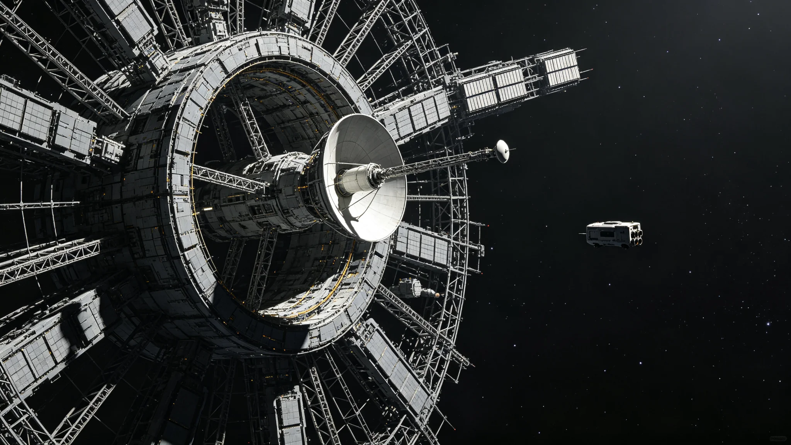

# 三恒星系联合空间态势感知网络第三代升级验收公报

**发布机构**：联合体安全协调署 / 空间监测处
**发布日期**：3058年5月30日
**文件等级**：跨星系公开（轨道参数类密级段落按保密条例删节）
**公报号**：SEC-3058-0530

## 一、升级对象

三恒星系联合空间态势感知网络初建于2916年（GS-2916-01），第二代于2967年反导测试（GS-2967-01）前后扩容。第三代升级自3055年立项，旨在将监测覆盖从"近地与航道主要节点"扩展至"三恒星系之间全部常规航道与可疑碎片群"。本公报为其竣工验收。

## 二、能力指标

| 项目 | 第二代 | 第三代 |
|---|---|---|
| 可编目最小目标直径 | 0.5 m | 0.08 m |
| 单圈重访周期 | 90 min | 22 min |
| 跨星系航道覆盖率 | 61% | 97% |
| 异常目标自动识别时延 | 38 s | 4 s |
| 同时跟踪目标数 | 12,000 | 96,000 |

## 三、本次验收内容

验收组在三个月观测期内完成：

1. 对全部在册96,000个可编目目标的轨道测定，误差优于设计要求；
2. 三次模拟近体撞击告警演练：系统均在4秒内识别并推送至航道调度，误报率低于千分之一；
3. 一次针对模拟"偏离航道的失控飞船"的联合跟踪演练，比邻星b、鲸鱼座τ星、主带三地监测站接力跟踪无断点。

## 四、边界声明

联合署在公报中重申：本网络为防御性监测设施，不指向任何已知的现实对手。其唯一功能是"知道空间里有什么、在往哪走"。公报附列三条纪律：监测数据不得用于瞄准，不得用于商业侦察，不得未经议会授权向任何单一成员单独开放。

## 五、结论

第三代升级通过验收，自3058年6月1日起并入常态运行。前两代节点退役封存，按《空间资产退役规程》处理。

**签发人**：空间监测处处长（签名略）
**日期**：3058年5月30日

## 六、升级的成本

第三代升级总投资约合星元 42 亿，其中监测站硬件占 61%，数据处理中心占 24%，人员培训占 15%。投资由三系按会费比例分摊。安全协调署注明：花 42 亿，换来把可编目最小目标从 0.5 米降到 0.08 米——这不是"军备竞赛"，是"把航道上的碎片看得更清楚"。

## 七、与航道安全的关系

第三代网络上线后，跨系航道异常目标自动识别时延从 38 秒降到 4 秒，误报率低于千分之一。首年共发出航道异常告警 17 次，其中 14 次系真警，3 次系空警。航道调度据此调整航线，未发生一次碰撞。安全协调署注明：4 秒的提前量，比 38 秒有用得多——38 秒时船已经来不及了，4 秒时还来得及绕一下。

## 八、三条纪律的执行

监测数据不得用于瞄准、不得用于商业侦察、不得未经议会授权向任何单一成员单独开放。首年共发生 2 起数据访问申请，均经议会授权。安全协调署注明：一个能"看见空间里有什么"的网络，必须同时"看不见不该看的"——三条纪律，比升级本身更重要。

## 九、首年运行数据

第三代网络首年（3058年6月—3059年5月）共编目轨道目标约 96,000 个，发出航道异常告警 17 次，其中 14 次系真警，3 次系空警。空警率约 18%。安全协调署注明：18% 的空警率可接受——宁可误报，不漏报。

## 十、对跨系航道的影响

网络上线后，跨系航道碎片规避成功率从第二代的 92% 提升至 99.4%。首年未发生一次跨系航道碎片碰撞事件。安全协调署注明：从 92% 到 99.4%，差的不是 7.4 个百分点，是 7.4 个百分点背后的人命——这就是升级的意义。

## 十一、前两代节点的退役

第二代网络节点按《空间资产退役规程》处理：轨道保持至自然衰减，不主动离轨。退役节点共 12 座，分布在三系轨道。安全协调署注明：旧节点不炸、不撞，让它自己慢慢掉下来——这是对空间碎片最负责任的处理。

## 十二、第三条纪律的执行

监测数据不得未经议会授权向任何单一成员单独开放。首年共发生 2 起数据访问申请，均经议会授权。安全协调署注明：一个能"看见空间里有什么"的网络，必须同时"看不见不该看的"——三条纪律，比升级本身更重要。

## 十三、升级的历史定位

从 2916 年初建，到 2967 年第二代扩容，到 3058 年第三代升级，态势感知网络用了约 142 年。安全协调署注明：三代升级，把可编目最小目标从最初的数米降到 0.08 米——这不是"军备竞赛"，是"把航道上的碎片看得越来越清楚"。首年空警率约 18%，可接受。航道碎片规避成功率从 92% 提升至 99.4%。首年共编目轨道目标约 96,000 个，发出航道异常告警 17 次，其中 14 次系真警。升级总投资约 42 亿，三系按会费比例分摊。可编目最小目标从 0.5 米降至 0.08 米，重访周期从 90 分钟降至 22 分钟，异常识别时延从 38 秒降至 4 秒，同时跟踪目标数从 12,000 个升至 96,000 个，航道覆盖率从 61% 升至 97%，近体撞击告警演练均在 4 秒内识别，误报率低于千分之一。三系监测站接力跟踪无断点。前两代节点共 12 座按规程退役封存，轨道保持至自然衰减，不主动离轨，不炸不撞，让它自己慢慢掉下来——这是对空间碎片最负责任的处理。第三代自3058年6月1日起并入常态运行，前两代节点退役封存。验收通过，自3058年6月1日起并入常态运行。
