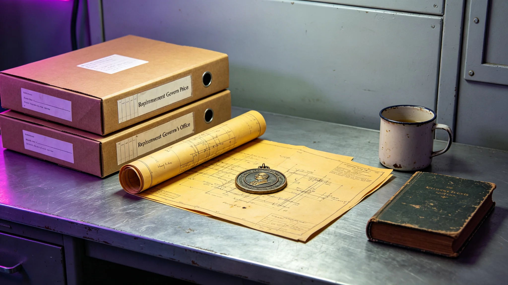

# 鲸鱼座τ星退休总督跨星系调令与个人物品封存档案

**归档单位**：鲸鱼座τ星下都行政署 / 人事档案室
**归档日期**：3059年2月11日
**文件等级**：公开（个人隐私栏遮蔽）
**卷宗号**：GOV-3059-RR-0211

## 一、调令全文（节录）

> 兹依《鲸鱼座τ星自治宪章》（GS-2931-01）第七章，总督任期届满、本人申请退休获准。自3059年1月1日起，免去图们·柯罗诺夫下都总督职务，转任下都行政署荣誉顾问，不参加行政表决。退休待遇按《跨星系公务员退休条例》办理。其任内一切公务文件依《档案法》移交本档案室；个人物品依清单封存，俟本人选定养老星后启封转运。
>
> 下都行政署印 · 3059年1月1日

## 二、履历物证摘录

图们·柯罗诺夫，2997年生于鲸鱼座τ星地下城市"下都"，为该城本土出生第二代。2997年其父母自地球经第三艘世代航线抵达，他是下都出生名册上第4,812名。

其人事卡可公开栏：

| 项 | 记录 |
|---|---|
| 学历 | 下都地下城市理工学院（今下都大学）结构工程，3019年毕业 |
| 初职 | 下都第三掘进段支护工程师，3019—3031 |
| 转行政 | 3031年下都行政署工程科科员 |
| 当选总督 | 3047年，任期两届（3047—3059） |
| 退休前体检 | 骨密度T值−1.8，主因下都常年0.38g低重力，医嘱转至高重力星养老 |

## 三、个人物品封存清单（节录）

依《公务员离任物品交接规程》，封存下列非公务物品：

1. 工程科时期（3020年代）亲笔绘制的第三掘进段支护草图三张，纸质，泛黄；
2. 一枚其父自地球带来的冷铸金属小章（见GS-2392-01同类物），刻地球大陆轮廓；
3. 下都红矮星日出节（GS-2956-01）首届庆典的一枚旧徽章，别针已锈；
4. 退休前一日未读完的《下都地下城市总建筑师作品集》（GS-2960-01），夹有一张其本人3020年代的工程安全帽照片。

清单末尾由其本人签名："以上均为私物，勿公开展览。"

## 四、任内三件可公查事

1. 任内完成下都第四代生命保障系统升级的前期论证（工程后来见GS-3068-01）；
2. 主导通过了鲸鱼座τ星司法独立（见GS-2981-01后续）在下都的落地细则；
3. 任内有一次因在议会质询中打瞌睡被记过——该记过依《考绩法》存档，未销。

## 五、附则

本卷宗不写"伟大的总督"。他是一个在下都低重力里长大、学结构工程、画支护图、当过两任总督、退休时骨密度只剩−1.8的普通人。他选了比邻星b新海方舟退休，那里重力1.07g，适合骨头。如此而已。

**归档人**：人事档案室 科员（签名略）
**日期**：3059年2月11日
